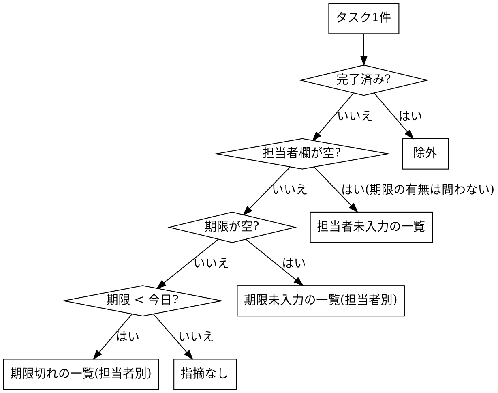

# Auditing C-HUB Task Gaps

## Overview
C-HUBのタスク管理を巡回し、「期限切れ」「期限未入力」「担当者未入力」の3種類の抜け漏れを、コメント由来の備考つきで一覧化する。**閲覧専用**。C-HUB上のデータは一切書き換えない。
URL: https://chub.ailesys.co.jp/
同梱ファイル:
- `audit-helpers.js` — ブラウザ内で分類・パネル巡回を行う部品。画面を1枚ずつ読まずに済み、実行時間とトークンが大きく減る
- `render-report.mjs` — 結果JSONから自己完結のHTMLレポートを生成する(Node.js)

## When to Use
- 週2回の定例で、タスクの抜け漏れ(期限・担当者)を確認したいとき
- 対象外: タスクの作成・更新・担当者の割り当て、催促メッセージの送信、完了済みタスクの集計・分析

## 前提
- ログインは利用者が事前に行う。ログイン画面が出たら中断して利用者に依頼する。パスワード・トークンをスキル側で入力・取得しない
- ブラウザは Claude in Chrome(ログイン済み)を使う。`list_connected_browsers` が空なら接続待ちを利用者に依頼する(拡張機能の導入・同アカウントでのサインイン・Chrome再起動)。使えない場合のみ内蔵ブラウザで開き、ログインを利用者に依頼する。URLは利用者に聞かず上記を使う
- 「今日」は実行日(システム日付)。期限切れ = 期限日 < 今日。画面の「今日/昨日/明日」は相対表記
- 認証トークンの取り出し・API直叩き・fetch は禁止。ページのDOMを読むJSは可

## Core Pattern

対象の決め方と分類ルール:
- 対象プロジェクト: 左メニュー「タスク管理」のうち、**「マーケ」セクション以外**の全プロジェクト(テンプレート用も含む。「アーカイブ済み」は対象外)
- 対象タスク: 未完了のみ(ステータスが「完了」以外。保留・失注なども未完了として扱う)。サブタスクは考慮しない(一覧に出ている行のみ)
- 「担当者」は担当者欄のみ。コラボは担当者とみなさない。一覧で頭文字アバターまたは写真アイコンなら担当者あり、「--」なら空



1タスクは1つの一覧にだけ載せる(重複させない)。

## Quick Reference

| 見る場所 | 内容 |
|---|---|
| 左メニュー > タスク管理 > プロジェクト名 > リスト表示 | 全メンバー分のタスク。行: タスク名・担当者(頭文字/写真、未設定は「--」)・ステータス・期限(空欄=未設定) |
| タスク名の文字をクリック(右に詳細パネル) | 担当者(フルネーム)・期限・コメント。閉じるは「パネルを閉じる」 |
| マイタスク | 自分の担当分のみ。棚卸しには使わない |
| 期限の表記 | `今日` `昨日` `明日` `9/25` `2027/4/1`(年つき) `明日~10/2`(範囲は終端で判定) |

## Implementation(軽量版)

1. 接続確認後、`https://chub.ailesys.co.jp/` を開き、`audit-helpers.js` の中身を `javascript_tool` で1回注入する(ページ再読み込みで消えるので、リロードしたら再注入)
2. 左メニューのセクションとプロジェクトを列挙し(「マーケ」除外)、巡回対象を利用者に示す。プロジェクト名は省略表示なので `textContent` で全文を取る
3. プロジェクトごとに:
   1. 左メニューのプロジェクトを**座標クリック**で開く(サイドバーはスクロールが必要。テキスト検索でクリックしない: 同名のチャット・セクション見出しに当たる)
   2. `await window.__go()` を実行。リスト表示にして分類し、期限切れ・期限未入力の行だけ詳細パネルを自動巡回する(件数だけ返る)
   3. 件数 ÷ 1(件/秒)ほど待ち、`window.__done` が true になったら `window.__sum(0,30)` で結果を読む。30件超は範囲をずらして分割取得する
   4. 担当者未入力は `window.__uList(0,25)` でタイトルだけ取る(パネルは開かない・備考は空欄)
   5. `window.__chk()` で全セクションの「全行/表示行」が一致するか確認。差があれば折りたたまれているので展開して再実行
4. 完了済みセクションだけのプロジェクト(`__list()` が空で全行が完了)は1回の確認で次へ進む
5. 結果を JSON にまとめ、**HTMLファイル**として出力する(下の「HTML出力」)。担当者名は詳細パネルの表記に合わせる(頭文字からの推測はしない。同姓の別人がいる)。チャットには要約(件数と担当者別件数の上位、HTMLのパス)だけ返し、全件のテキスト一覧は貼らない

## HTML出力

1. 巡回結果を、途中経過ファイルと同じ scratchpad に `chub-audit-result.json` として書く。形式は `render-report.mjs` の冒頭コメントを参照(overdue/nodue は担当者別、unassigned はプロジェクト別)
2. `node <スキルフォルダ>/render-report.mjs chub-audit-result.json chub-audit-YYYYMMDD.html` を実行する
3. 出力先は、利用者が指定した場所。指定がなければ作業ディレクトリ直下の `chub-audit-YYYYMMDD.html`。同名があれば上書きせず連番を付ける
4. 生成されるHTML: 件数カード3枚(期限切れ/期限未入力/担当者未入力)、担当者別(件数の多い順)・プロジェクト別の折りたたみ一覧、検索ボックス、備考、巡回プロジェクト一覧。外部通信なしの自己完結ファイル。ダークモード・印刷に対応
5. 生成後に `件数` をレンダラーの出力(`overdue= nodue= unassigned=`)と突き合わせ、集計した件数と一致することを確認して報告する
6. 利用者が共有を希望したときだけ、Artifact として公開する(既定はローカルファイルのみ。社内タスク情報なので勝手に公開しない)

### 参考: 従来のテキスト形式(チャットに出す場合)
利用者がテキスト出力を求めたときは、次の形式にする。担当者は指摘件数の多い順。

```
■ 期限切れ(担当者別)
【山田】 2件
 - [プロジェクト名] タスク名(期限: 9/25) 備考: 顧客回答待ちのため延期
 - [プロジェクト名] タスク名(期限: 9/28) 備考:
【佐藤】 1件
 - ...

■ 期限未入力(担当者別)
【山田】 1件
 - [プロジェクト名] タスク名 備考:

■ 担当者未入力
 - [プロジェクト名] タスク名(期限: 10/3) 備考:
```

末尾に、巡回したプロジェクト数と各一覧の合計件数を1行で添える(HTMLではカードとヘッダに出る)。

### 出力の圧縮ルール(テキスト形式のとき。HTMLは全件載せてよい)
- 担当者未入力が1プロジェクトで10件を超えるときは、タスク名を短縮して1行にまとめてよい(BUG番号の連番は範囲表記)
- 同じ期限・同じ担当者で件数が多い塊(例: 7/14期限が20件超)は、先頭数件+件数でよい。ただし全件の件数は必ず載せる
- 備考は、期限・担当者に触れるコメントがあるタスクだけ書く。ヒットしたコメントが試験報告などで期限・担当の話でなければ空欄

## 途中経過の保存
プロジェクトが多いので、5プロジェクトごとに結果を scratchpad のMarkdownへ追記する(コンテキスト消失・再読み込み対策)。

## Common Mistakes

| 失敗 | 対処 |
|---|---|
| マイタスクだけ見て他メンバー分を見落とす | プロジェクト単位のリスト表示を開く |
| 完了済みタスクが混ざる | 完了を除外してから分類する |
| 担当者未入力のタスクを期限の一覧にも載せる | 分類の優先順位どおり、担当者未入力の一覧のみ |
| **`ref` 指定で行のボタンをクリックし、完了チェック丸を押して完了にしてしまう** | 行を開くときは `.task-manager-task-title`(タイトル文字)のみクリック。行ボタン・チェック丸・`ref` クリックは使わない。行を開く前に、その行のチェック丸の位置と離れているか確認する |
| 完了チェックや期限入力など、データを書き換えてしまう | 詳細パネルの入力欄・チェック丸に触れない。閉じるだけ。誤って変えたら直ちに中断して利用者に報告し、自分で戻さない |
| 「2027/4/1」など年つきの期限を「期限なし」と誤判定 | 期限の表記(上表)を全形式で判定する。`audit-helpers.js` は対応済み |
| 写真アイコンの担当者を「担当者なし」と誤判定 | 担当者なしは「--」のみ。写真アイコンは文字が無いだけで担当者あり |
| プロジェクト名のテキストクリックがチャット画面へ飛ぶ | 座標クリックにする。チャットに移ってしまったら左端の「タスク管理」で戻る(何も送信・編集しない) |
| 読み込み前に分類して「0件」になる | `__go` は4秒待つが、大きいプロジェクトは足りないことがある。0件なら `__getRows().length` を確認して再実行 |
| 2つの巡回ループを同時に走らせ、互いに邪魔して極端に遅くなる | 1度に走らせるのは1ループ。詳しくは下の「実行時の注意」 |
| `get_page_text` で非表示のチャット本文などを拾う | 画面内の読み取りは `__getRows()` / `__sum()` のJSで行う |
| 認証トークンを取り出してAPIを直接叩く | 画面操作・DOM読み取りの範囲で完結させる |

## 実行時の注意(javascript_tool / Claude in Chrome)
- 1回の応答は約2000字で切れる。長い出力は `__sum(a,b)` の範囲指定で分割して取る
- 出力に `=` `?` `&` を含む長文(URLやクエリに見える文字列)は `[BLOCKED: Cookie/query string data]` になる。`audit-helpers.js` は置換済み。自作の出力にも入れない
- 1回の実行は45秒でタイムアウトする。`__go` は起動後すぐ返る(裏で巡回)ので、`computer` の `wait` で待って `__done` をポーリングする。重いプロジェクトでタイムアウトしても、ループは裏で続いている場合がある。再起動する前に `__done` と `__R.length` を確認する
- 詳細パネル巡回は約1秒/件。ページ再読み込みで実行中のループを止められるが、ヘルパーも消える
- タブが背景扱いだとタイマーが遅くなる。待つときは低倍率のスクリーンショット(`scale` 0.1)を挟むと進みが安定する
- `scroll_amount` は最大10
