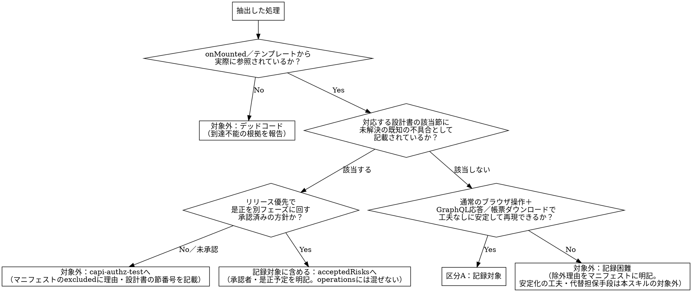

# campus-playwright

## Overview

今回のリニューアルは「画面の表示内容・操作方法を変えず、内部APIだけを作り直す」方針であるため、現行ソースコードの挙動そのものが規約である。このスキルは、現行実装（Vue.js＋GraphQL呼び出し）を解析して「今どのロールが何を呼び、どう分岐しているか」を抽出し、画面単位のマニフェスト（対象・除外を明記した git管理JSON）で分母を確定したうえで、セルフチェックを経てPlaywrightの特性テスト（ゴールデンマスターテスト）を生成する。

**本スキルが生成するテストは、人が実機を操作して画面を確認する作業の代替（スモークテスト）を目的とする。網羅的なQA（境界値・異常系・全分岐の完全カバレッジ）を目的としない。** 記録対象は**正常系を基本**とする。ロールや表示モード（タブ・ラジオボタン等、ロールに依存しないUI操作による表示切替を含む）によって挙動が変わる場合はその組み合わせぶんだけ正常系シナリオを用意する。加えて、必須入力フォームを持つ操作に限り「必須項目あり（成功）／必須項目なし（バリデーションエラー）」の2パターンのみの異常系チェックを行う（ステップ3）。それ以外の異常系・境界値（0件/1件/複数件等）・null/空などは対象外でよい。これらが必要な場合は`dev-test`（実装ソースコードからテスト仕様書を作る、意地悪なテストケースを作るスキル）や`spec-test`側で扱う。

記録の対象は**画面表示・内部データ（APIレスポンス）・帳票出力（PDF/CSV）の3点**とする（`capi-regression-test`が現行版・新版の比較で使う3軸照合とそろえるため）。生成するテストコードは実行環境（`baseURL`等）を外部から差し替えられる形にしておく。記録したテストは、`capi-regression-test`が現行版・新版の比較実行にそのまま使う入力になる。

そのため記録対象は**通常のブラウザ操作＋GraphQL応答（帳票ダウンロードを含む）で完結する処理（区分A）のみ**とし、タイミング依存・外部SSO遷移・デスクトップ連携など安定した自動記録に工夫や代替の担保手段が要る処理は、無理に安定化・記録を試みず対象外とする（ステップ2）。人手による実機操作でしか担保できない範囲を無理に自動化しようとしないことが、このスキルの信頼性を保つ前提である。

**さらに、区分Aと確定した処理も一律に同じ厳密さで扱わない。** ロールガードのみの単純な操作（工期見積のC-1・C-2相当、対象の大半）は軽量な手順で済ませ、担当範囲・複合条件等の行レベル制御を伴う操作（C-3・fileout・career相当、今回のインシデントと同種のリスクが集中する範囲）にだけフルの手順を投じる（記録深度の判定。ステップ2）。全操作に高い厳密さを均一に投じることは、限られた予算（`campus専用API_工期見積.md`E-2）の下では非現実的であり、かつリスクの低い操作にまで手間を割くことで本当に手厚くすべき範囲が薄まる。

## 基本原則

**本スキルのテストは、仕様の検証ではなく現行実装の挙動の再現（特性化）を目的とする。** これは通常のテスト設計の原則（実装ではなく仕様を正とする）の意図的な逆転である。今回の是正が「内部APIだけを作り直し、外部から見た挙動は変えない」方針である以上、現行実装こそが検証すべき仕様そのものになる。

ただし逆転してよいのは表示内容・データ取得範囲についてのみである。**認可・アクセス制御に関わる既知の不具合は特別扱いとする**（ステップ2）。原則は除外して`capi-authz-test`へ送るが、リニューアルのリリースを優先し是正を別フェーズ（リリース後）に回す方針を採る場合は、現状の（不具合を含む）挙動を記録対象に含めてよい。ただしその場合も「意図した設計」として`operations`に紛れ込ませるのではなく、`acceptedRisks`として承認者・是正予定を明記した記録にする（ステップ2・ステップ6）。

**「今の挙動と完全に一致すること」が目標なのは、今回の修正内容と関係しない従来の動作についてのみである。** 表示内容・操作方法は不変を保証する対象とするが、以下の2種類は意図した変更であり、一致しなくてよい（一致しないこと自体が是正の成功を意味する）。

- 認可是正によって意図的に変わるアクセス可否（担当外授業へのアクセスが新たに拒否される、等）
- Payload設計規則（`campus専用API_構成図.md`6章）による意図的なデータ形状の変更（フィールド削減・フラット化・一覧/詳細の分割等）

これらの意図した差分の当否は`capi-regression-test`側の「意図した差分」判定で扱う。記録時に注力すべきは、どこが「修正と関係ない」領域か（＝完全一致を保証すべき範囲）を見誤らないことである。

なお、既知の不具合の是正自体を今回のリリースに含めず別フェーズへ意図的に先送りする場合（`acceptedRisks`。ステップ2）は話が別で、その不具合が成立する現状挙動は**今回のリリースでは変わらない前提**なので、通常どおり一致を確認してよい（むしろ意図せず動きが変わっていないかの検知に使う）。承認の跡を残さず`operations`へ紛れ込ませることだけが問題であり、記録対象に含めること自体は問題ではない。

- シナリオ数を増やすこと自体を目的にしない。同一分岐・同一データ範囲を重複して記録するシナリオを量産しない
- 応答を受け取るだけで内容を検証しないテストは、シナリオ数を増やしても特性化の役に立たない（品質契約。ステップ8）
- **カバレッジ数値による完了判定は行わない。** 対象はマニフェスト（ステップ6）とテストケース表（ステップ3）で管理し、セルフチェック済みマニフェストの`operations`/`reports`全項目に対応する正常系テストが揃い、ST環境に対して成功していることをもって完了とする（ステップ9・完了条件）

## When to Use

- ある画面のcampus専用API移行実装（`capi-changes`）に着手する前に、その画面の現行ソースコードの挙動をPlaywrightテストとして記録したいとき

**対象外（別スキルの領域）：**
- 記録したテストを新版に対して実行し、差分を判定すること → `capi-regression-test`
- 認可・アクセス制御（ロール×情報区分の正当性）の検証 → `capi-authz-test`（別スキル。**本書時点で未整備**。整備されるまでは除外理由・根拠をステップ6のマニフェストの`excluded`へ記載し、開発者へ直接申し送る）
- 新版（campus-api等）の実装に対するテスト作成
- バックエンド（Java）の単体テスト作成

**REQUIRED SUB-SKILL: capturing-playwright-evidence** — 生成したテストコードを実行し、その結果（スクリーンショット・トレース等）をエビデンスとして収集・整理する部分は、このスキルに委譲する（C-HUBに依存せずローカルに保存・受け渡しできる形にする）。

**REQUIRED SUB-SKILL: capi-saml-login** — SAMLログイン（OneLogin経由）でしか認証できないロール・環境でCookie（`campus_session`）・CSRFトークンを取得する部分は、このスキルに委譲する（詳細は後述の「ST環境テストアカウント」・ステップ8。**2026-09-16以降、本スキルの記録対象環境がSTに変わったことに伴い、通常の記録作業ではほぼ不要になった**。下記「環境体制の変更」参照）。

## Core Pattern

**Before**：メンバーが画面ごとにソースコードを都度読み、思い思いのテストを書く。何を記録し何を対象外にしたかが書く人によってばらつき、「記録した」という自己申告を誰も検証できない。

**After**：ソースコードから機械的に抽出し、画面単位のマニフェストで対象・除外を確定→セルフチェック→生成→**ST環境に対する実行結果で完了判定**、という一直線のプロセスにする。

**具体例（ポータル画面）**：`Portal.vue`は12操作を呼び、学生・教員・職員・卒業生WEB検索（同管理者）・市民開放でブロックごとに表示が変わる（「次の授業」は学生・教員のみ／「時間割」は学生本人のみ、等）。これをロール×表示ブロックの組み合わせとして洗い出し、シナリオごとにテストを生成する。

## 環境体制の変更（2026-09-16、重要）

**PT環境の向き先が変更され、以後PT環境はcampus専用API移行後の新版（新環境）を指す。** これに伴い、本スキルが記録対象とする「現行（移行前）」の挙動は**ST環境**（`https://allcweb3.local.ailesys.co.jp/campus/`、`.env.st`）を基準とする。PT環境（`https://allcweb2.local.ailesys.co.jp/campus/`、`.env.pt`）は今後、`capi-regression-test`等が新版との比較に使う「新環境」の位置づけになる。

- **旧環境（現行・移行前の記録対象）＝ST環境**
- **新環境（移行後の比較対象）＝PT環境**
- **リポジトリ対応**：ST環境＝`allcampus`リポジトリ、PT環境＝`allcampus-regression`リポジトリ。新旧比較を伴う実行（ステップ9参照）ではこの対応関係に従い`allcampus`→`allcampus-regression`の順に実行する

**この変更より前に作成されたマニフェスト・エビデンス・進捗記録（`documents/campus専用API/playwright-nightly/`等）内の「PT環境」という表記は、当時のPT環境（現在のSTに相当する環境）を指しており、遡って書き換える必要はない。** 今後新規に着手する画面については、本スキル本文中の「PT環境」という表記をすべて「ST環境」に読み替えて作業すること（本改訂で本文中の該当箇所は置き換え済み）。

**認証方式も変わる（2026-09-17実機確認済み・確定）。** `backend/api/src/main/resources/config/application-st.yml`は`use-local: true`（`application-pt.yml`は`use-local: false`）であるため、ST環境では`/login`画面がSAMLリダイレクトではなくID/パスワードのログインフォーム（`.login-id`/`.login-pass`の`el-input`、`Login.vue`）を表示する。2026-09-17にST環境専用のテストアカウントが払い出され（`C:\Users\roonawa\pw\.env`の`<ROLE>_ST_ID`/`<ROLE>_ST_PASSWORD`）、**学生・大学院生・非正規生・教員・職員・一般市民の6ロールとも`loginByLocal`系のログインフォーム操作でST環境へ実際に認証できることを確認した**（`templates/auth.ts`の`loginAsRoleLocal`、`frontend/campus/e2e/auth.setup.ts`）。これにより`capi-saml-login`（OneLogin経由のSAML）は通常の記録作業では不要になった。PT環境（新版比較時等）でSAMLが必要な場合は、`<ROLE>_PT_ID`/`<ROLE>_PT_PASSWORD`（同ファイル）と`loginAsRole`を使う。

## ST環境テストアカウント

**記録（テスト実行）は開発環境ではなくST環境を使用する。** 2026-09-17にST環境専用のテストアカウントが払い出され、以下のロールで`loginAsRoleLocal`（学生・大学院生・非正規生・教員・職員）または既存の直接ログインヘルパー（求人情報・一般市民）による認証を実機確認済み。パスワードは本ファイルに記載しない（`C:\Users\roonawa\pw\.env`の`<ROLE>_ST_ID`/`<ROLE>_ST_PASSWORD`に保存済み。テストコード・マニフェストへの直書きも禁止し、環境変数経由で読み込む）。

| 身分 | `.env`変数名 | ログイン方法 | 想定ロール |
|---|---|---|---|
| 学生 | `STUDENT_ST_ID`/`STUDENT_ST_PASSWORD` | `loginAsRoleLocal`（確認済み） | `ROLE_STUDENT` |
| 大学院生 | `GRADUATE_STUDENT_ST_ID`/`_PASSWORD` | `loginAsRoleLocal`（確認済み） | `ROLE_STUDENT`（学部生と同ロール。区分コード等で判定が分かれる操作は別途確認） |
| 非正規生 | `HISEIKI_STUDENT_ST_ID`/`_PASSWORD` | `loginAsRoleLocal`（確認済み） | `ROLE_STUDENT`（studentType='non-degree'） |
| 教員 | `FACULTY_ST_ID`/`FACULTY_ST_PASSWORD` | `loginAsRoleLocal`（確認済み） | `ROLE_INSTRUCTOR` |
| 職員 | `STAFF_ST_ID`/`STAFF_ST_PASSWORD` | `loginAsRoleLocal`（確認済み） | `ROLE_STAFF` |
| 求人情報（卒業生WEB検索・OB） | `JOB_INFORMATION_ST_ID`/`_PASSWORD` | `loginAsJobob`（直接ログイン。SAML不要） | `ROLE_JOBOB` |
| 一般市民 | `GENERAL_CITIZEN_ST_ID`/`_PASSWORD` | `loginAsCitizen`（直接ログイン。SAML不要。確認済み。PT環境で恒久的に失敗していたloginForCitizenの不具合はST環境では再現せず「市民開放授業受講者」として認証できた） | `ROLE_CITIZEN` |
| 企業担当 | `COMPANY_REPRESENTATIVE_ST_ID`/`_PASSWORD` | `loginAsKigyou`（`kyuujinEntry/MntLogin.vue`のログインフォーム。確認済み。ログイン成功後は`/campus/portal`ではなく企業担当専用の`kyuujinEntry/ManagerPortal`へ遷移する点に注意） | `ROLE_KIGYOU` |

**REQUIRED SUB-SKILL: capi-saml-login** — 上記のとおりST環境の全ロールで不要になったため、PT環境（新版比較時等）でSAMLが必要な場合のみ使用する（詳細はステップ8）。

「想定ロール」列は設計書の記述からの対応付けであり、実機のロール表示と食い違う場合は実機側を正とする。担当授業・担当部局・担当グループが必要なシナリオ（教員の「担当授業あり」等）では、上記アカウントが実際にどの授業・部局に紐づくかをST環境側のデータで都度確認する（アカウント自体は固定でも、紐づくデータの状態はシナリオによって異なりうる。**ST環境はPT環境と別データベースのため、紐づく授業・部局・履修データ自体がPT時点の記録と異なる可能性がある**）。

## 全体フロー

```text
[ソース解析]
  ↓
[記録容易性判定（記録対象／対象外）]
  ↓
[記録観点抽出・テストケース表作成]
  ↓
[分岐対応確認]
  ↓
[既存テストとの重複確認]
  ↓
[画面マニフェスト作成]
  ↓
[レビューとセルフチェック]
  ↓
[テストコード生成]
  ↓
[実行確認]
  ↓
[結果報告]
```

セルフチェックを完了する前にテストコードを生成してはいけない。

## ステップ1 ソース解析

対象画面のVue.jsコンポーネントを読み、以下を抽出する。

- 呼び出しているGraphQL操作（query/mutation）と、その引数・戻り値の型
- 帳票（PDF/CSV）ダウンロードを伴うREST呼び出し（`DownloadFile.ts`経由の`axios`呼び出し等。`backend3/fileout`由来の`/api/download/*`系が中心。対象一覧は`campus-api_設計書.md`2.3節を参照）。GraphQL操作と同様に、引数・レスポンス（`Content-Disposition`・ファイル内容）を対象とする
- `onMounted`・テンプレートから実際に参照されている処理（デッドコード判定はステップ2）
- 画面に到達可能なロール（ルーティングガードだけでなく、テンプレート内の実際の条件分岐＝v-if等を見る）
- ロールによって表示内容・呼び出し操作が変わる分岐（`v-if` / `v-else` / `computed`内の条件 / 三項演算子）。短絡評価（`&&`・`||`によるガード表示）も分岐として扱う
- タブ・ラジオボタン等のUI操作によって表示内容・呼び出し操作が切り替わる分岐（ロールに依存しないものを含む）

読んだソース（抜粋・一部のみ渡された場合を含む）だけでは実装の詳細が断定できない箇所（例：子コンポーネントの`v-model`変更が自動的に再取得をトリガーするか、`watch`の有無）は、断定せず「要確認」としてステップ7のセルフチェック時に明記し、実装知識がなければ判断できない場合は開発者へ確認する。曖昧なまま記録対象・対象外のどちらかに決め打ちしない。

### デプロイ済みバージョンの実機確認（フル深度、または共有コンポーネント関与時は必須）

**軽量深度（ステップ2）と判定し、かつ対象操作が他画面と共有されるコンポーネント経由でない場合は、このチェックを省略してよい。** フル深度の操作、または共有コンポーネント経由の操作（軽量・フルを問わない）では必須とする。

**リポジトリのソースコードが、記録対象のST環境に実際にデプロイされているとは限らない。** 特に複数画面から使われる共有コンポーネント（例：授業選択ウィジェット等）は、対象画面とは別のタスクで先行してcampus専用API移行が進み、リポジトリ上は移行後のコードになっているが、ST環境へはまだデプロイされていない、ということが起こり得る（逆に、ST環境へ想定より先行して移行後コードがデプロイされてしまっている、という食い違いも起こり得る）。この食い違いに気づかず「読んだソースコード」を信じてモックを組み立てると、テストは通っても実機の挙動とは異なるものを記録してしまう。

- ソース解析（呼び出しGraphQL操作の抽出）が終わったら、**テストコードを書き始める前に**、対象画面をモックなしでST環境に対して1回実行し（`waitForResponse`等で観測するだけでよい。応答を差し替える`page.route`のモックはまだ使わない）、実際に発生したリクエストの`operationName`一覧をソースから抽出した一覧と突き合わせる
- 特にリポジトリ上で最近（同一スプリント・直近コミット等で）campus専用API移行が入った箇所は要注意。実機のoperationNameがソースの想定と異なる場合、`git log`でその処理のファイルの変更履歴を辿り、**該当コミットの直前のバージョン**（＝ST環境が実際に動かしているであろうバージョン）のソースを確認し、そちらを記録対象の仕様として扱う
- 移行済み・未移行のどちらを記録すべきか判断がつかない場合は、実機のoperationNameを優先する（このスキルの目的は「今実際に動いているもの」の記録であり、リポジトリの最新コードの記録ではない）
- マニフェスト（ステップ6）にはこの確認の結果（実機で確認したoperationName、リポジトリの最新コードと食い違いがあれば その旨と対応した参照コミット）を記載する

## ステップ2 記録容易性判定（記録対象／対象外）・記録深度の判定

抽出した処理を、以下のいずれかに分類する。**B区分（工夫すれば安定化できる）を経由してA区分へ引き上げる処理は行わない**。通常のブラウザ操作＋GraphQL応答で素直に安定して記録できないものは、無理に安定化を試みず対象外とする。

### 記録深度（軽量／フル）の判定

**全操作に同じ厳密さで9ステップをフル適用しない。** `campus専用API_工期見積.md`のリスク階層（C-1〜C-3）に従い、区分Aと確定した処理をさらに2段階に分ける。工数見積（E-2）は340操作＋gakumu共用131操作の回帰を6人日という限られた予算で見ており、全操作へ均一に高い厳密さを投じる余地は無い。

| 深度 | 該当条件（工期見積C-1〜C-3相当） | 適用 |
|---|---|---|
| **軽量** | ロールガードのみ・本人限定・全件参照可・公開/掲載期間限定など、**行レベルの担当範囲判定を伴わない**操作（C-1・C-2相当、全体の大半） | ステップ4（分岐網羅確認）は省略しステップ3に統合する。「デプロイ済みバージョンの実機確認」（ステップ1）は対象操作が複数画面で共有されるコンポーネント経由の場合のみ実施する。ステップ7のレビューチェックリストは★印の項目のみ確認する |
| **フル** | 担当範囲・複合条件・シラバス公開スコープ等、**行レベルの担当範囲判定を伴う**操作、または個人情報等の高リスク操作（C-3・fileout・career相当） | 本文の全ステップを省略なく実施する |

判定に迷う場合はフルを選ぶ（軽量は明確にリスクが低いと判断できる場合のみの積極的な省略であり、既定値ではない）。この判定結果はマニフェスト（ステップ6）の`operations`/`reports`各項目に`depth: "軽量"|"フル"`として記録する。

| 区分 | 定義 | 扱い |
|---|---|---|
| A. 記録対象 | 通常のブラウザ操作＋GraphQL応答（帳票ダウンロードを含む）で、待機条件の追加等の工夫なしに安定して記録できる処理 | 記録対象とする |
| 対象外（記録困難） | タイミング依存（ポーリング等）、ファイルアップロード／ダウンロード、外部SSO経由の遷移、WebView2/デスクトップ連携、真にランダムな外部要因への依存など、安定した自動記録に工夫や代替の担保手段が要る処理 | マニフェストの`excluded`に理由を明記して対象外にする（代替の手動確認手段の考案・実施記録は本スキルの対象外） |

以下も記録対象から除外し、上記の区分の議論に含めない（マニフェストの`excluded`へ理由付きで記載）。

- **デッドコード**：`onMounted`・テンプレートのいずれからも参照されていない処理（例：`Portal.vue`に残る`loadRisyuu`/`_fetchPayload`）。到達不能の根拠（参照検索の結果）を報告する
- **認可・アクセス制御に関わる既知の不具合（除外を選んだ場合）**：`capi-authz-test`の検証対象。ただしこれはデフォルトの扱いであり、常に除外するとは限らない（次項「未解決の既知の不具合が見つかった場合の扱い」を参照）

### 既知の不具合の判定方法

「認可・アクセス制御に関わる既知の不具合」は、担当者の記憶やコードを読んだ印象だけで判定しない。対象画面が属するエンドポイントに対応する設計書の該当節を必ず確認し、そこに記載された内容を判定の一次情報とする。

| 対象エンドポイント | 確認する設計書・節 |
|---|---|
| campus-api | `campus-api_設計書.md` 5章（既知の未解決IDOR・認可課題、C-HUBタスクID付き）・4.3節（情報区分別のロール×スコープ仕様表の「⚠️既知の不具合の疑い」欄） |
| campus-syllabus | `campus-syllabus_設計書.md` 4章（既知の残存ギャップ） |
| campus-login | `campus-login_設計書.md`（該当する既知課題があれば） |

設計書に記載が無い、または設計書自体が対象画面をまだ扱っていない場合は、設計書中に引用されているC-HUBタスクIDや関連タスクを確認する。それでも既知の不具合か判断がつかない場合は、その場で除外を決めず、ステップ7で「要確認」として明記し開発者に確認してから判断する（除外を先に決め打ちしない）。

なお、設計書に「既に修正済み・現在の正しい挙動として踏襲する」と明記されている過去の不具合対応（例：`campus-login_設計書.md`の`studentType: no-student`等）は、ここでいう「除外すべき既知の不具合」には当たらない。除外対象は**現時点で未解決**のものに限る。

### 未解決の既知の不具合が見つかった場合の扱い（除外 or リスク受容記録）

未解決の既知の不具合が見つかった場合、以下の2択のいずれかを選ぶ。**担当者個人の判断でどちらかを決めない**（デフォルトは除外。記録対象に含める場合は開発者・PM等の承認を要する）。

| 選択肢 | 内容 | 記載先 | テストコード生成 |
|---|---|---|---|
| A. 除外（デフォルト） | 是正をこの移行作業と同時に行う、または是正方針が未定の場合。現状挙動は記録・テストしない | マニフェストの`excluded`（`reason: known-authz-bug`） | 生成しない |
| B. リスク受容として記録対象に含める | リニューアルのリリースを優先し、認可是正を別フェーズ（リリース後）に回す方針を採った場合。現状の（不具合を含む）挙動を通常どおり記録・テストする | マニフェストの`acceptedRisks`（ステップ6） | 生成する（`operations`/`reports`と同様、通常のシナリオとして） |

Bを選ぶ場合も、`operations`へそのまま混ぜて「意図した仕様」であるかのように記載してはいけない。`acceptedRisks`へ分離し、誰が・なぜ・いつまでに是正する前提でこの判断をしたかを明記する（詳細はステップ6）。これにより「リリースを優先して現状維持を選んだ既知のリスク」と「最初からそういう仕様」を区別でき、次フェーズでの是正対象が埋もれない。



## ステップ3 記録観点抽出・テストケース表作成

区分Aとして確定した処理について、以下の観点で記録するシナリオを列挙し、表形式で出力する。**対象は正常系を基本**とし（実機確認の代替が目的であり、QAとしての境界値・異常系の網羅は目的としない）、必須入力フォームを持つ操作に限り下表の「異常系（必須項目）」を追加する。

| 観点 | 内容 |
|---|---|
| 正常系（役割・表示モード別） | 到達可能な各ロール・各表示モード（役割によって表示ブロックや操作可否が変わる場合、および画面上のタブ・ラジオボタン等のUI操作で表示内容が切り替わる場合はその組み合わせ）で、正常にデータが返り画面に表示される状態を1シナリオずつ用意する |
| 異常系（必須項目） | 必須入力項目を持つ操作（登録・更新系mutation等）についてのみ、「①必須項目をすべて入力して送信し成功する」「②必須項目を1つ以上未入力のまま送信しバリデーションエラーが表示される」の2パターンに限定して記録する。①は正常系のシナリオと共通でよく、新たに用意が必要なのは②のみ。必須入力フォームを持たない操作（参照系query・入力欄のない画面等）では本観点自体が非該当（マニフェストに理由を書く必要はない） |
| 帳票出力 | 画面が帳票（PDF/CSV）ダウンロードを伴う場合、生成されたファイルそのもの（内容・行数・カラム構成等）を記録する対象とする。検索条件・対象データは、内容の整合性を確認できるようある程度の件数が出力される状態を選ぶ（0件の帳票は記録対象として不適切）。該当する帳票出力操作が無い画面では本観点自体が非該当（マニフェストに理由を書く必要はない） |

上記の必須項目チェック（②）を除く異常系（到達不能ロールでのFORBIDDEN・未認証リダイレクト等）・データ件数の境界（0件/1件/複数件）・null/空表示などは、**実機の代替という目的の範囲外なので記録しない**。ただし以下は例外として正常系に含める。

- 認可ガード自体を画面の主要な仕様として持つ操作（例：役割ごとにブロックの出し分けそのものが画面の振る舞い）は、その出し分けを正常系の一部として記録する
- 画面の初期状態が実質的に「0件」であることがST環境の実データで再現性高く確認できる場合（例：新規アカウントのポータル）は、それも一つの正常系状態として扱ってよい

**ただし検索処理・帳票出力を伴う操作には、この「0件許容」を適用しない。** これらの操作は「返ってきたデータの内容そのもの」（内部データ・帳票の記載内容）の整合性を検証することが目的であり、0件の結果ではその検証ができず特性テストとして機能しない。検索条件・対象データの選定時にST環境の実データを確認し、**必ずある程度の件数（複数行・複数ページ分等）が表示される状態**をシナリオとして選び、それをエビデンス（画面表示・内部データ・帳票ファイル）として記録する。

テストケース表：

| ID | 対応操作 | ロール／表示モード | 期待結果 | 既存テスト対応 | 理由 |
|---|---|---|---|---|---|
| RC-001 | `getPortalNextLecture` | 教員（担当授業あり） | 次の授業が1件返り表示される | 新規 | 教員の担当授業表示を確認 |
| RC-002 | `getPortalNextLecture` | 学生（履修あり） | 次の授業が1件返り表示される | 新規 | 学生の履修に基づく表示を確認 |
| RC-003 | `getPortalUniversityInformations` | 職員 | お知らせ一覧が表示される | 新規 | 職員向け表示を確認 |

リスクは「高（個人情報・認可境界に触れる操作）」「通常」「低（表示文言のみ等）」の3段階に分類し、マニフェスト（ステップ6）に記載する。**高リスクの操作は、後述の記録容易性の区分にかかわらず、内部データ（APIレスポンス）の全量記録を省略しない**（要約・部分アサーションで済ませない）。

到達可能なロール・表示モードの組み合わせごとに最低1シナリオを対応付ける。対応するシナリオが無い組み合わせは、マニフェストに理由（対象外／後続対応）を明記する。

## ステップ4 主要分岐の正常系網羅確認（フル深度の操作のみ）

**軽量深度と判定した操作はこのステップを省略してよい**（ステップ3のテーブル作成時に、到達可能なロール・表示モードの組み合わせぶんの行があることをその場で確認すれば足りる）。フル深度の操作についてのみ、以下を別工程として実施する。

ステップ1で抽出した分岐（区分Aの範囲）のうち、**表示内容・操作可否を左右する主要な分岐**（ロール別分岐・表示モード別分岐等）について、到達可能な分岐先それぞれに対応するテストケースIDがあるかを確認する。全経路の網羅ではなく、「用意したテストケース表（ステップ3）が主要な分岐を漏らしていないか」の点検が目的である。

| 分岐 | 対応TC |
|---|---|
| `role === 'instructor'`（次の授業ブロックの担当授業表示） | RC-001 |
| `role === 'student'`（次の授業ブロックの履修表示） | RC-002 |
| `role === 'staff'`（次の授業ブロック非表示、お知らせのみ） | RC-003 |

異常系側の分岐（到達不能ロールでの拒否等）はステップ3の方針により対象外なので、ここでの確認対象にも含めない。主要な表示分岐に対応するテストケースが無い場合は、ステップ3へ戻りケースを追加する。

## ステップ5 既存テストとの重複確認

新規にテストを作成する前に、対象操作・対象ロールの組み合わせで既存の記録済みテストを検索する。同じ振る舞いを記録済みのテストがある場合は、新規作成ではなく拡張（シナリオ追加）を優先する。

| 対象の振る舞い | 既存テスト | 判定 | 対応 |
|---|---|---|---|
| 例：学生が自分の時間割を取得 | `portal.spec.ts::student sees own timetable` | 再利用 | そのまま利用 |

判定は「再利用」「拡張」「新規」のいずれかとする。

## ステップ6 画面マニフェスト

画面の記録対象・除外対象を担当者の裁量にしないため、`coverage/screens/<ScreenId>.json`を作成し、リポジトリにコミットする。

```json
{
  "screen": "Portal",
  "operations": [
    { "name": "getPortalStudentName", "classification": "A", "depth": "軽量", "risk": "通常", "scenarios": ["RC-101"], "newOperationName": null },
    { "name": "getPortalNextLecture", "classification": "A", "depth": "フル", "risk": "高", "scenarios": ["RC-001", "RC-002"], "newOperationName": null }
  ],
  "reports": [
    { "name": "/api/download/risyuuKakuninhyou", "classification": "A", "depth": "フル", "risk": "高", "scenarios": ["RC-201"], "newOperationName": null }
  ],
  "acceptedRisks": [],
  "excluded": [
    { "target": "loadRisyuu / _fetchPayload", "reason": "dead-code", "evidence": "onMounted/テンプレートから参照なし（grep確認済み）" },
    { "target": "getPortalNextLecture 教員の担当外授業判定", "reason": "known-authz-bug", "evidence": "capi-authz-test対象。campus-api_設計書.md 5章#7参照" }
  ],
  "noTargetsReason": null
}
```

`operations`はGraphQL操作、`reports`は帳票（PDF/CSV）ダウンロードを伴う操作を、それぞれ同じ形式（`name`/`classification`/`risk`/`scenarios`/`newOperationName`）で記載する。`reports`の`name`はダウンロードURL（例：`/api/download/risyuuKakuninhyou`）とし、`newOperationName`も同じ欄をそのまま使い回す（次項参照）。該当する帳票出力操作が無い画面では`reports`を空配列`[]`とする（省略しない）。

区分A（記録対象）は`operations`または`reports`に、デッドコード・既知の認可不具合（除外を選んだ場合）・記録困難として対象外にしたものは`excluded`に理由（`reason`）と根拠（`evidence`）付きで記載する。`evidence`は「確認済み」のような感想ではなく、具体的な参照（grep結果、設計書の章番号等）にする。

### `newOperationName`：capi-changes後の識別子変更に備える（GraphQL操作・帳票エンドポイント共通）

`name`は本スキルの記録時点（capi-changes着手前）の実際の識別子であり、ネットワーク応答を捕捉する際のマッチ条件としてテストコードから参照される（ステップ8）。`operations`ではGraphQLの`operationName`、`reports`では帳票ダウンロードのURLパスがこれにあたる。今回の是正はAPIを作り直す方針である以上、`capi-changes`によって識別子が変わる（リネーム・統合/分割）ことは、GraphQL操作（`capi-regression-test`のポータル画面の例：12操作→7操作に統合）に限らず、帳票ダウンロードのエンドポイント（`backend3/fileout`由来の`/api/download/*`系、`campus-api_設計書.md`2.3節）についても同様に起こり得る。`reports`側だけこの備えを欠くと、GraphQL操作名の場合と同じ「応答が来ない＝一致」という誤読（Common Mistakes参照）が帳票軸で再発する。

`newOperationName`は、`capi-changes`完了後に判明した新版側の対応する識別子（新操作名／新URLパス）を記入する欄で、**本スキルの記録時点では常に`null`のままでよい**（未知の情報を推測で埋めない）。`capi-regression-test`が新版に対して同じテストコードを実行する際、この欄が埋まっていればそちらを捕捉のマッチ条件として優先し、`null`のままなら`name`と同一とみなす。

- **分割**（1つの旧識別子が新版で複数に分かれる）：配列（例：`["getPortalNextLectureForStudent", "getPortalNextLectureForInstructor"]`）を許容する
- **統合**（複数の旧識別子が新版で1つにまとまる）：該当する`operations`／`reports`の各エントリの`newOperationName`に、統合後の同一識別子をそれぞれ設定する（例：旧`getFilteredXxxA`と旧`getFilteredXxxB`が新版で単一の`getPortalUniversityInformations`に統合された場合、両エントリの`newOperationName`を`"getPortalUniversityInformations"`で揃える）。各テストは自分のシナリオに必要な部分だけをその共有レスポンスから確認すればよく、捕捉自体は同じ値で重複してマッチしても問題ない

### `acceptedRisks`：既知の不具合をリスク受容として記録対象に含める場合

リリース優先で認可是正を別フェーズ（リリース後）に回す方針を採った場合（ステップ2「未解決の既知の不具合が見つかった場合の扱い」の選択肢B）、当該処理は`excluded`ではなく`acceptedRisks`へ記載する。`excluded`と違い、`acceptedRisks`は**通常どおりテストコードを生成し記録・実行する**（`operations`/`reports`と同じ扱い）。該当が無い画面では空配列`[]`とする（省略しない）。

```json
{
  "acceptedRisks": [
    {
      "target": "createTblBuseiseki / registTblBuseiseki / deleteTblBuseiseki の担当外授業・登録期間外での保存/削除",
      "evidence": "campus-api_設計書.md 5章#7",
      "decision": "リニューアルのリリースを優先し、認可是正は別フェーズ（リリース後）で実施する方針のため、現状の挙動を通常どおり記録対象に含める",
      "decidedBy": "（要記入：承認者名。担当者個人の判断では記載しない）",
      "decidedDate": "（要記入）",
      "scenarios": ["RC-xxx"]
    }
  ]
}
```

`decidedBy`・`decidedDate`は必須項目とする（空欄のままコミットしない）。**`operations`へ紛れ込ませてはいけない**：`operations`に載せると「意図した仕様」として扱われ、次フェーズでの是正対象だと誰も気づけなくなる。

**`noTargetsReason`キーはマニフェストに常に含める**（該当が無い通常のケースでは`null`を明記する。キー自体を省略しない）。対象がすべて除外で`operations`・`reports`の両方が空になる場合は、`null`のままにせず理由を必須で記載する。

## ステップ7 レビューとセルフチェック

マニフェスト案・テストケース表・分岐対応表を以下のチェックリストに照らして自らセルフチェックし、全項目を満たしていることを確認してからステップ8（テストコード生成）へ進む。開発者への提示・承認待ちは発生させず、ここまでを含めてフルオートメーションの対象とする。ただし「要確認」に該当する項目（実装知識が無ければ判断できない箇所、既知の不具合か判断がつかない箇所）が残る場合はその場で決め打ちせず開発者に確認する。**★は軽量深度・フル深度の両方で確認する項目。無印はフル深度のみ確認すればよい**（軽量深度の操作だけで構成される画面では無印項目を省略してよい。画面内にフル深度の操作が1つでもあれば、その画面全体について無印項目も確認する）。

```text
★ 呼び出し操作の抽出漏れがない（GraphQL操作・帳票ダウンロードの両方）
★ デッドコードの除外根拠（到達不能の確認）
★ 認可・アクセス制御に関わる既知の不具合について、除外（`excluded`）またはリスク受容記録（`acceptedRisks`、承認者・是正予定を明記）のいずれかを選択し、根拠（対応する設計書の節番号）を明記している。`operations`に紛れ込ませていない
★ 記録対象（区分A）／対象外（記録困難）の分類結果と、対象外とした処理の除外理由・記録深度（軽量／フル）の判定根拠
★ 到達可能なロール・表示モードの組み合わせごとに正常系シナリオがある（必須項目チェックを除く異常系・境界値・null/空は対象外でよい）
★ 必須入力フォームを持つ操作について、必須項目あり／なしの2パターンの異常系シナリオがある（該当操作が無い場合は非該当）
★ 既存テストとの重複確認結果（再利用/拡張/新規）
★ マニフェストがコミット対象として確定している
  対象画面が読んだソースの通りにST環境へデプロイされているか実機で確認済み（フル深度、または共有コンポーネント関与時。ステップ1参照）
  主要な表示分岐（ステップ4）に漏れがない
  高リスク操作はすべて内部データ全量記録の対象になっている
  帳票（PDF/CSV）ダウンロードを伴う操作は、ファイル実体を記録対象に含めている（該当操作が無い画面は対象外）
  ソース抜粋・断片情報だけでは断定できない実装詳細は「要確認」として明記している（曖昧なまま記録対象・対象外を決め打ちしていない）
```

## ステップ8 テストコード生成

セルフチェック済みマニフェスト・テストケース表に基づき、共通テンプレート（ロール別ログインヘルパー、ネットワーク応答キャプチャのユーティリティ、`capturing-playwright-evidence`の撮影規約（el-dialog全体撮影ヘルパー・ヘッダー非表示での撮影・`<screen>_<role>_<シナリオ>.png`命名規則）に準拠する撮影ヘルパー、あらゆる操作の後に0.2秒待機する操作ヘルパーを持つ）を用いて、テストケースごとにPlaywrightテストコードを生成する。

- **ロール別ログインヘルパーの使い分け**：ST環境では`use-local: true`のため、原則として全ロールとも画面のログインフォーム操作（学生・大学院生・非正規生・教員・職員は`templates/auth.ts`の`loginAsRoleLocal`＝`loginByLocal`系。求人情報・一般市民・企業担当は`loginAsJobob`／`loginAsCitizen`／`loginForKigyou`系）でそのままログインする（「ST環境テストアカウント」参照）。実機確認の結果、特定ロール・特定環境（PT環境での新版比較時等）でSAMLログインしか通らないことが判明した場合のみ、`capi-saml-login`または`loginAsRole`でCookie・CSRFトークンを取得しブラウザコンテキストへ設定する方式に切り替える（毎回SAMLのUI操作をやり直さない）。いずれの認証情報も`.env`等から環境変数経由で読み込み、テストコードに直書きしない
- テストコードは`operations`・`reports`・`acceptedRisks`のすべてを対象に生成する（`excluded`のみ対象外）。`acceptedRisks`のテストであることが分かるよう、テスト名やコメントに「既知のリスク（是正予定）」である旨を明記し、`operations`由来のテストと見分けがつく形にする
- 複数ロール・複数データパターンで同じ検証構造を繰り返す場合は、パラメータ化（`test.each`相当）でテストケース表を1つのテスト関数に流し込み、個別テストを乱立させない
- 各テストケースで、画面表示（スクリーンショット）とAPIレスポンス（生データ）を記録し、帳票ダウンロードを伴う操作はダウンロードされたファイル実体（PDF/CSV）も保存する
- **環境の外部化**：`baseURL`等の実行環境はテストコードにハードコードせず、Playwrightの設定（`playwright.config.ts`のprojects／環境変数）から差し替えられる形にする。同一のテストコードを現行環境・新環境の双方に向けて再実行できることが、`capi-regression-test`が本スキルの成果物をそのまま入力として使うための前提になる
- **捕捉マッチ条件の外部化**：ネットワーク応答を捕捉する際のマッチ条件（GraphQLの`operationName`、帳票ダウンロードのURLパスの両方）は、テストコード中に文字列リテラルとして直書きしない。マニフェスト（ステップ6）の該当エントリ（`operations[]`・`reports[]`いずれも）を実行時に参照し、`newOperationName`が設定されていればそちらを、無ければ`name`をマッチ条件として使う（例：`entry.newOperationName ?? entry.name`をキーにcapture用のヘルパーへ渡す。GraphQL捕捉用・帳票ダウンロード捕捉用でヘルパーは分かれていてよいが、いずれも同じ`newOperationName ?? name`の参照ルールに従う）。`capi-changes`で操作名やダウンロードURLがリネームされても、マニフェストの`newOperationName`を埋めるだけでテストコード自体を書き換えずに`capi-regression-test`側の再実行に追従できるようにするため
- **品質契約**：各テストケースについて「このテストを失敗させる変更は何か」を1つ明示できない場合、アサーションが緩すぎる（応答の有無だけの確認等）ということなので、ステップ3に戻って観点を設計し直す

共通テンプレートは`templates/`配下に別途整備する（本スキル文書には手順のみを記載し、テンプレート自体はコードとして保守する）。

### モック実装上の注意（実機検証で判明した落とし穴）

以下はいずれも「テストは正常終了/失敗するが、実際にはモックが効いておらず実データ・実ネットワークにすり替わっている」という、気づきにくい形で発現した実例に基づく。モックを使うテストを書いたら、**最低1件は診断ログ（後述）で実際にモックが適用されたことを確認してから**、残りのテストケースへ複製すること。

1. **GraphQLエンドポイントは1本とは限らない。** 既存（移行前）APIは単一エンドポイント（例：`<root>/api`。末尾が`/graphql`ではない）にオペレーションを問わずPOSTする一方、campus専用API（campus-api/campus-login/campus-syllabus）は別エンドポイント（例：`<root>/campus-api/graphql`）を使う。両方が1画面に混在し得るため、リクエスト捕捉・モックのURLパターンは両方にマッチする判定にする（`pathname.endsWith('/api') || pathname.endsWith('/graphql')`等）。片方しか見ていないと、そちらの系統のオペレーションだけ待受け/モックが永久に発火せずタイムアウトする
2. **同一ページで複数の`operationName`をモックする場合、`route.continue()`ではなく`route.fallback()`を使う。** `route.continue()`は「他に登録されている一致し得るハンドラーへ処理を渡さず、そのままネットワークへ送る」ため、2つ目以降に登録したモックだけが有効になり、それより前に登録したモックは（一見動いているように見えても）常に実ネットワークへ素通りする。この症状は「一部のオペレーションだけ実データに置き換わる」という分かりにくい形で出るため、複数モックを使うテストほど疑うこと
3. **モック応答オブジェクトは、対象コンポーネントが実際に参照するフィールドを過不足なく含めること。** 特に、同じ実体を指すが別の分岐に使われる複数のID的フィールド（例：`id`と`simpleId`が別フィールドとして存在し、「表示中の授業を特定するID」と「空/未選択判定に使うID」で使い分けられている等）に注意する。目視で「それらしいフィールド」を並べただけのモックは、コンポーネント側の`if (!!payload.simpleId)`のような分岐条件を見落として無言で失敗する。モック対象のコンポーネントのソースを実際に読み、参照されているプロパティ名をそのまま書き出す
4. **1つの操作をモックすると芋づる式に発生する後続の非同期呼び出しをすべて洗い出し、それぞれモックする。** 例：授業詳細取得→（詳細取得成功後にその中で）履修データ取得→Web履修可否判定→シラバス公開判定、のように、ある応答が返った"後"に限って発火する追加のGraphQL呼び出しがある。手前の1つだけモックして安心すると、後続がすべて実ネットワークへ飛び、実データでの上書き・エラー・タイムアウトを引き起こす。ソースを読んで「この関数が成功したら次に何を呼ぶか」を最後まで辿ること
5. **診断ログで実際の適用を確認する。** モックのルートハンドラー内に一時的な`console.log`（捕捉したURL・期待していた`operationName`・実際の`operationName`・フルフィルしたかどうか）を仕込んで1回実行し、期待通りに介入できているかをターミナル出力で確認してから本実装とする（確認後は削除する）
6. **失敗時のスクリーンショットも、テスト内で明示的に撮るスクリーンショットも、ダイアログ等（`position: fixed`のオーバーレイ）が開いている間は`fullPage`を使わない。** Chromiumのfull-page撮影はfixed要素を正しく引き伸ばして再配置できず、オーバーレイ・ダイアログが元のビューポート1画面分の帯にしか描画されない崩れたエビデンス（実機とは異なる、ダイアログが半透明に見える・UIがずれて見える等）になることが実機検証で判明した（詳細・撮影ヘルパーの正しい使い方は`capturing-playwright-evidence`スキル参照）。`playwright.config.ts`の失敗時スクリーンショットは`fullPage: false`が既定でよい（下部の描画内容の確認は7の`trace`・`video`に任せる。いずれもDOMスナップショット・実録画のためこの問題が起きない）
7. **traceは`retain-on-failure`にする。** 既定でよく使われる`on-first-retry`は、ローカル実行のように`retries: 0`の設定では初回失敗時にtraceが一切残らない。原因調査を要する開発中は`retain-on-failure`にしておく
8. **PT/ST環境はいずれも自己署名/内部CA証明書のため`ignoreHTTPSErrors: true`が必要。** 未設定だと`net::ERR_CERT_AUTHORITY_INVALID`でナビゲーション自体が失敗する
9. **SAMLログインフォームのフィールド構造は実機で確認するまで確信を持たない。** ST環境は`use-local: true`のため通常はSAMLを使わないが、SAMLが必要な場面に遭遇した場合、`capi-saml-login`のセレクタは初回実行時に実際のDOM（`id`・`name`・`type`属性）に合わせて調整が要る前提で実装し、想定外の画面に遭遇したら推測で自動突破しようとせずスクリーンショットを残して開発者に確認する（`capi-saml-login`スキル参照）
10. **環境名の思い込みで古い記録を書き換えない。** 2026-09-16のPT向き先変更より前に作成されたマニフェスト・エビデンス中の「PT環境」という表記は、当時のPT環境（現在のSTに相当）を指す。過去の記録を遡ってST表記に書き換える必要は無い（上記「環境体制の変更」参照）。今後の新規作業でのみST環境を使う
11. **あらゆる操作の後の0.2秒待機を省略する。** ダイアログの開閉時等、opacityの切り替わりの途中でUIが正しく表示されない状態のまま次の操作・撮影に進んでしまい、崩れたエビデンスや不安定な待機条件によるテスト失敗を招く。共通テンプレートの操作ヘルパーはクリック・入力・タブ切替等あらゆる操作の直後に`page.waitForTimeout(200)`等で0.2秒待機してから次に進む（`capturing-playwright-evidence`の撮影規約と共通）
12. **撮影ヘルパーでヘッダーを非表示にし忘れる。** エビデンスのスクリーンショットは画面上部の固定ヘッダーを非表示にした状態で撮影する（`capturing-playwright-evidence`の撮影規約参照）。個別テストで撮影方法を独自実装せず、共通の撮影ヘルパーを使う

## ステップ9 実行確認

**テストコード生成が完了したら、追加の確認を待たずそのまま実行に移る。** 「作成した」という自己申告では終わらせない。

### 通常の実行（対象画面の新版がまだ存在しない場合）

ST環境（`allcampus`リポジトリ）に対して実行し、結果を報告する。

- マニフェスト（ステップ6）の`operations`・`reports`・`acceptedRisks`に対応する正常系テスト、および必須入力フォームを持つ操作の異常系（必須項目あり／なし）2パターンのテストが全て存在し、ST環境に対して**成功**していることを確認する
- 数値目標（カバレッジ率）による完了判定は行わない。完了条件はマニフェストとテストケース表に基づく網羅（到達可能なロール・表示モードの組み合わせぶんの正常系シナリオ、および必須入力フォームを持つ操作の異常系2パターンが揃っていること）で判定する

### 新旧比較を伴う実行（対象画面の新版がすでに存在する場合）

対象画面について`capi-changes`が完了し新版が存在する場合は、テストコード生成後そのまま以下の順序で**同じテストコードを変更せずに**両環境へ実行する。

1. `allcampus`リポジトリ（旧・ST環境）に対して実行する
2. `allcampus-regression`リポジトリ（新・PT環境）に対して実行する

**完了条件は、同じテストコードが両環境で成功することとする。** どちらか一方のみの成功（例：STのみ成功でPTは未実行・失敗のまま）では完了と認めない。

- **PT環境側だけを通すための`test.skip()`／`test.fixme()`・条件分岐での早期return・アサーションを緩める／削るといった対応は禁止する。** いずれも一見「成功」に見えるが実際は何も検証していない無意味なテストコードになる（品質契約違反）
- PT環境で失敗した場合、まずテストコードではなく実装側の問題である可能性を優先して疑う（このスキルは「表示内容・操作方法を変えない」前提の特性テストであり、意図しない挙動変化の検知が目的のため）。テストの期待値そのものが記録ミスだったと判明した場合に限りテストを修正する（実装ではなくテストを直すのは、その原因がステップ1〜3での記録ミスに限る）
- 差分が「意図した差分」か否かの当否判定そのものは`capi-regression-test`の領域である。campus-playwrightの範囲では、両環境での成功/失敗という事実と、失敗時の症状（画面表示・エラー内容）を報告するところまでを行う

### 共通

- 失敗した場合は、ステップ8の「モック実装上の注意」を疑って原因を切り分ける（実データにすり替わっていないか、後続の非同期呼び出しが未モックのまま実ネットワークに素通りしていないか等）
- 実行結果（成功したテストケースID一覧、対応するエビデンス格納先。新旧比較を行った場合は両環境それぞれの結果）を報告する

## Common Mistakes

1. **画面表示（DOM）のアサーションだけを記録し、内部データ（APIレスポンス）のキャプチャを組み込まない**：`capi-regression-test`側で内部データ照合ができなくなり、今回の是正の本丸を検証できないテストになる
2. **帳票（PDF/CSV）ダウンロードを伴う画面で、画面表示とAPIレスポンスだけを記録し帳票ファイル自体を記録しない**：`capi-regression-test`の3軸照合のうち帳票軸が照合不能になり、絞り込み後のダウンロード内容の劣化・欠落を検知できなくなる
3. **【最重要】認可・アクセス制御に関わる既知の不具合を、判断・承認の跡を残さず`operations`に紛れ込ませてしまう**：リリース優先で現状の（不具合を含む）挙動を記録対象に含める判断（ステップ2の選択肢B）自体は正当だが、それは`acceptedRisks`として承認者・是正予定を明記した上で行う。`operations`にそのまま混ぜると「最初からそういう仕様」に見えてしまい、次フェーズでの是正対象だと誰も気づけなくなる。「ゴールデンマスターは今の挙動をそのまま記録するものだから」は記録対象に含めること自体の理由にはなるが、承認・記録の跡を省略してよい理由にはならない
4. **設計書を確認せず、コードを読んだ印象だけで「既知の不具合」を判定する**：担当者ごとに判定がぶれ、既に設計書側で特定済みの不具合（例：`campus-api_設計書.md`5章）を見落とす、または逆に正常な仕様を不具合と誤認して除外してしまう。対象エンドポイントの設計書の該当節（ステップ2）を必ず確認する
5. **リポジトリのソースコードとST環境の実挙動が一致していると思い込む**：共有コンポーネントの先行移行等で両者が食い違うことがある（ステップ1「デプロイ済みバージョンの実機確認」）。ソースだけを根拠にモックを組み立てると、テストは通っても実機とは違う挙動を記録してしまう
6. **テストアカウントをその場で都度用意する**：既に実機検証済みの安定アカウント（「ST環境テストアカウント」参照）を優先して使い、再現性を確保する
7. **PT環境とST環境の役割を混同する**：2026-09-16のPT向き先変更以降、PT環境は新版（移行後）、ST環境が現行（移行前）の記録対象である。過去（変更前）の記録・自分の記憶にある「PT環境＝現行の記録対象」という前提のまま新規作業をPT環境に対して実行すると、既に移行後の新版に対してテストを組むことになり、golden-masterとして意味を成さない（このスキルの前提が崩れる）。新規に着手する画面は必ずST環境を使う
8. **マニフェストを作らず「記録した」という自己申告で終わらせる**：対象・除外を担当者の裁量に任せると、抜け漏れに誰も気づけない。必ずマニフェストをコミットし、ST環境に対する実行結果（ステップ9）で確認する
9. **緩いアサーションのテストを生成する**：応答の有無だけを確認するテストは値の変化を検知できず特性テストとして機能しない。品質契約（「このテストを失敗させる変更は何か」）で確認する
10. **「記録困難」を理由にした対象外を安易に増やす**：`waitForResponse`等Playwright標準の待機機構を使うだけで素直に安定するものまで、複雑さを理由に対象外にしてしまうと、実機操作の代替という本スキルの目的で担保すべき範囲が狭まりすぎる（タイミング調整・リトライ・シードデータ固定等の追加の工夫が要るかどうかで判定し、要るなら安定化を試みず対象外でよい）。対象外にする場合は除外理由をマニフェストに必ず明記する
11. **複数モックのうち一部だけが効いていることに気づかない**：`route.continue()`の誤用や、後続の非同期呼び出しの見落とし（ステップ8「モック実装上の注意」）は、テストが一見パスしたりフェイルしたりするだけで原因がわかりにくい。実データ・実エラーが混入していないか、生成直後に一度診断ログで確認する
12. **工数を圧縮したいがために、担当範囲・複合条件を伴う操作まで安易に軽量深度に倒す**：記録深度（ステップ2）は「明確にリスクが低い」場合のみの積極的な省略であり、既定値ではない。判定に迷う場合はフルを選ぶ。軽量深度を広げすぎると、今回のインシデントと同種のリスク（行レベル制御の欠落）が集中する範囲の検証が薄まる
13. **必須入力フォームを持つ操作で、必須項目未入力時のバリデーションエラー表示（異常系②）の記録を省略し、成功パターンのみ記録する**：ステップ3で定めた2パターンのうち②を省くと、フォーム側の必須チェックの崩れ（バリデーションが効かなくなる、エラー文言が消える等）を検知できないテストになる
14. **ネットワーク捕捉のマッチ条件（GraphQLの`operationName`、帳票ダウンロードのURLパス）をテストコードに文字列リテラルとして直書きする**：`capi-changes`で操作名・帳票エンドポイントがリネーム・統合/分割されると、`capi-regression-test`が新版に対して同じテストコードを再実行した際に対象の応答を捕捉できずタイムアウトする（差分ではなく偽陰性）。GraphQL操作だけでなく帳票ダウンロードでも同様に起こり得ることに注意し、マニフェストの`newOperationName`（ステップ6。`operations`・`reports`双方に存在する）を参照する形にしておき、テストコード自体は書き換えずに追従できるようにする
15. **検索処理・帳票出力のシナリオで、結果0件のデータ状態をそのままエビデンスにしてしまう**：0件許容の例外（ステップ3）は画面の初期表示等に限った話であり、検索・帳票出力ではそもそも「返ってきたデータの内容」の整合性確認が目的のため0件では検証にならない。シナリオ選定時にST環境の実データを確認し、複数件が表示・出力される条件を選ぶ
16. **PT環境で学生・大学院生・教員・職員に`loginByLocal`を試みる**：PT環境（新版比較時）では`use-local: false`により常に失敗する（`campus-login_設計書.md`2.1節）。PT環境でこれら4ロールが必要な場合は`capi-saml-login`経由でCookie・CSRFトークンを取得する。原因不明のログイン失敗として誤診断しない（ST環境は`use-local: true`のため本項は基本的に非該当。上記「環境体制の変更」参照）
17. **テストコード生成後、実行に移らず確認待ちで止まる**：新旧比較を伴う実行を含め、生成が完了したら追加確認を待たずそのまま実行する（ステップ9）。人手の関与が要るのはステップ7で「要確認」に該当した項目を開発者へ問い合わせる場合だけであり、それ以外のステップ7セルフチェックも生成後の実行そのものも自己完結する
18. **新旧比較実行でPT環境側だけを通すために`test.skip()`やアサーションの緩和で誤魔化す**：一見両環境で「成功」したように見えるが実際には何も検証していない無意味なテストコードになる。PT環境での失敗は隠さず報告し、原因（実装側の問題か記録ミスか）を切り分ける（ステップ9）

## 完了条件

- テストケース表・主要分岐の対応確認（ステップ3・4）がステップ7のセルフチェックを完了している
- 到達可能なロール・表示モード（タブ・ラジオボタン等のUI操作による切替を含む）の組み合わせぶんの正常系テストケースがある
- 必須入力フォームを持つ操作は、必須項目あり／なしの2パターンの異常系テストが記録され、ST環境に対して成功している（該当操作が無い画面は非該当）
- 画面マニフェストが確定し、コミット対象として保存済み（デプロイ済みバージョンの実機確認結果を含む）
- マニフェストの`operations`・`reports`・`acceptedRisks`全項目に対応する正常系テストコードが生成され、ST環境に対して実行し成功している（対象画面の新版が既に存在する場合は、同じテストコードが`allcampus`〈ST〉→`allcampus-regression`〈PT〉の順で両環境に対して成功している。ステップ9）
- 帳票（PDF/CSV）ダウンロードを伴う操作は、ファイル実体を記録済み（該当操作が無い画面は非該当）
- 記録困難として対象外にした処理の除外理由を報告済み
- デッドコード候補は到達不能根拠を報告済み
- 認可・アクセス制御に関わる既知の不具合について、除外（`excluded`）またはリスク受容記録（`acceptedRisks`、承認者・是正予定を含む）のいずれかを選択し、根拠（参照した設計書の節番号を含む）を報告済み
- テスト実行結果（成功したテストケースID一覧）を報告済み
