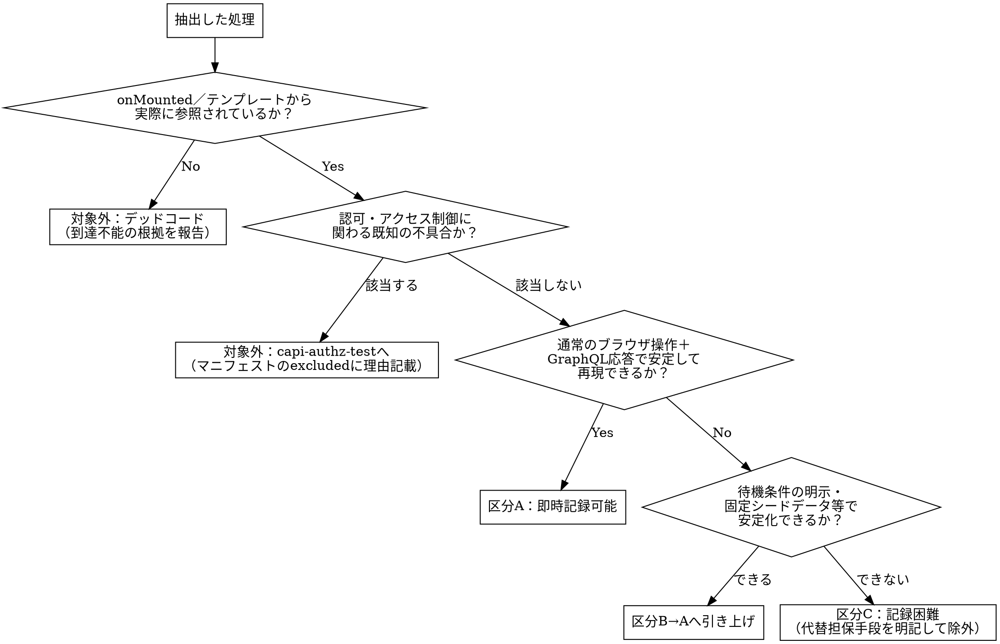

# capi-regression-record

## Overview

今回のリニューアルは「画面の表示内容・操作方法を変えず、内部APIだけを作り直す」方針であるため、現行ソースコードの挙動そのものが規約である。このスキルは、現行実装（Vue.js＋GraphQL呼び出し）を解析して「今どのロールが何を呼び、どう分岐しているか」を抽出し、画面単位のカバレッジ・マニフェスト（対象・除外を明記した git管理JSON）で分母を確定したうえで、レビュー承認を経てPlaywrightの特性テスト（ゴールデンマスターテスト）を生成し、実測したカバレッジ数値で完了を判定する。記録したテストは、`capi-regression-test`が現行版・新版の比較実行に使う入力になる。

## 基本原則

**本スキルのテストは、仕様の検証ではなく現行実装の挙動の再現（特性化）を目的とする。** これは通常のテスト設計の原則（実装ではなく仕様を正とする）の意図的な逆転である。今回の是正が「内部APIだけを作り直し、外部から見た挙動は変えない」方針である以上、現行実装こそが検証すべき仕様そのものになる。

ただし逆転してよいのは表示内容・データ取得範囲についてのみである。**認可・アクセス制御に関わる既知の不具合は例外とし、無批判に固定化しない**（ステップ2）。

- カバレッジ向上のみを目的とした意味のないシナリオを生成しない。同一分岐・同一データ範囲を重複して記録するシナリオを量産しない
- カバレッジは記録の完全性の証明ではなく、記録漏れを見つけるための診断材料である。応答を受け取るだけで内容を検証しないテストは、数値を上げても特性化の役に立たない
- 数値目標：画面本体・専用サービス層（`services/campus/`配下等、当該画面のためだけに新設するSDK）を対象に、全体ベースラインとして行・分岐カバレッジ80%以上を維持し、記録完了と判定する画面は100%を目標とする（ステップ8）

## When to Use

- ある画面のcampus専用API移行実装（`capi-changes`）に着手する前に、その画面の現行ソースコードの挙動をPlaywrightテストとして記録したいとき

**対象外（別スキルの領域）：**
- 記録したテストを新版に対して実行し、差分を判定すること → `capi-regression-test`
- 認可・アクセス制御（ロール×情報区分の正当性）の検証 → `capi-authz-test`（別スキル）
- 新版（campus-api等）の実装に対するテスト作成
- バックエンド（Java）の単体テスト作成

**REQUIRED SUB-SKILL: capturing-playwright-evidence** — 生成したテストコードを実行し、その結果（スクリーンショット・トレース等）をエビデンスとして収集・整理する部分は、このスキルに委譲する（C-HUBに依存せずローカルに保存・受け渡しできる形にする）。

## Core Pattern

**Before**：メンバーが画面ごとにソースコードを都度読み、思い思いのテストを書く。カバレッジが書く人によってばらつき、「高カバレッジで記録した」という自己申告を誰も検証できない。

**After**：ソースコードから機械的に抽出し、画面単位のマニフェストで分母を確定→レビュー承認→生成→**実測カバレッジで完了判定**、という一直線のプロセスにする。

**具体例（ポータル画面）**：`Portal.vue`は12操作を呼び、学生・教員・職員・卒業生WEB検索（同管理者）・市民開放でブロックごとに表示が変わる（「次の授業」は学生・教員のみ／「時間割」は学生本人のみ、等）。これをロール×表示ブロックの組み合わせとして洗い出し、シナリオごとにテストを生成する。

## 全体フロー

```text
[ソース解析]
  ↓
[記録容易性判定（A/B/C区分）]
  ↓
[記録観点抽出・テストケース表作成]
  ↓
[分岐対応確認]
  ↓
[既存テストとの重複確認]
  ↓
[画面カバレッジ・マニフェスト作成]
  ↓
[レビューと開発者承認]
  ↓
[テストコード生成]
  ↓
[カバレッジ測定]
  ↓
[結果報告]
```

承認を得る前にテストコードを生成してはいけない。

## ステップ1 ソース解析

対象画面のVue.jsコンポーネントを読み、以下を抽出する。

- 呼び出しているGraphQL操作（query/mutation）と、その引数・戻り値の型
- `onMounted`・テンプレートから実際に参照されている処理（デッドコード判定はステップ2）
- 画面に到達可能なロール（ルーティングガードだけでなく、テンプレート内の実際の条件分岐＝v-if等を見る）
- ロールによって表示内容・呼び出し操作が変わる分岐（`v-if` / `v-else` / `computed`内の条件 / 三項演算子）。短絡評価（`&&`・`||`によるガード表示）も分岐として扱う

## ステップ2 記録容易性判定（A/B/C区分）

抽出した処理を、以下の3区分に分類する。

| 区分 | 定義 | 扱い |
|---|---|---|
| A. 即時記録可能 | 通常のブラウザ操作＋GraphQL応答で完結する処理 | 高カバレッジ目標の対象。優先して記録する |
| B. 記録に工夫が必要 | タイミング依存（ポーリング等）、ファイルアップロード／ダウンロード、外部SSO経由の遷移など、素直な記録では不安定になる処理 | 待機条件の明示・固定シードデータ等で安定化しAへ引き上げる。引き上げられない場合はCへ回す |
| C. 本質的に記録困難 | SAML SSOの外部IdP依存、WebView2/デスクトップ連携、真にランダムな外部要因に依存する処理 | カバレッジ目標の分母から除外する。除外理由と代替の担保手段（手動確認等の実施記録）をマニフェストに明記する |

以下は記録対象そのものから除外し、区分の議論に含めない（マニフェストの`excluded`へ理由付きで記載）。

- **デッドコード**：`onMounted`・テンプレートのいずれからも参照されていない処理（例：`Portal.vue`に残る`loadRisyuu`/`_fetchPayload`）。到達不能の根拠（参照検索の結果）を報告する
- **認可・アクセス制御に関わる既知の不具合**：`capi-authz-test`の検証対象。無批判に記録すると不具合を「あるべき挙動」として固定してしまう



## ステップ3 記録観点抽出・テストケース表作成

区分Aとして確定した処理について、以下の観点で記録するシナリオを列挙し、表形式で出力する。

| 観点 | 内容 |
|---|---|
| 正常系 | 該当ロールで正常にデータが返り、画面に表示される |
| 異常系 | 到達不能ロール・認証切れでの拒否（FORBIDDEN・401等） |
| データ件数の境界 | 0件・1件・複数件（一覧・ページング系操作） |
| null／空 | 表示すべきデータが存在しない場合の画面表示（空文字・null許容項目） |
| ロール分岐 | 同一操作でもロールによって返却フィールド・表示ブロックが変わる場合、ロールごとに1シナリオ |

テストケース表：

| ID | 対応操作 | 観点 | ロール／データ状態 | 期待結果 | リスク | 既存テスト対応 | 理由 |
|---|---|---|---|---|---|---|---|
| RC-001 | `getPortalNextLecture` | 正常系 | 教員（担当授業あり） | 次の授業が1件返り表示される | 通常 | 新規 | 教員の担当授業表示を確認 |
| RC-002 | `getPortalNextLecture` | 異常系 | 職員 | FORBIDDEN | 通常 | 新規 | 職員は次の授業ブロック非対象（仕様） |
| RC-003 | `getPortalUniversityInformations` | 境界値 | 学生（お知らせ0件） | 空一覧が表示される | 通常 | 新規 | 0件時の表示崩れ確認 |

リスクは「高（個人情報・認可境界に触れる操作）」「通常」「低（表示文言のみ等）」の3段階とする。**高リスクの操作は、後述の記録容易性（区分A/B/C）にかかわらず、内部データ（APIレスポンス）の全量記録を省略しない**（要約・部分アサーションで済ませない）。

観点ごとに最低1シナリオを対応付ける。対応するシナリオが無い観点は、マニフェストに理由（対象外／後続対応）を明記する。

## ステップ4 分岐対応確認

ステップ1で抽出した全分岐（区分Aの範囲）について、両方の経路（true/false、ロールごとの分岐先すべて）に対応するテストケースIDがあるかを確認する。

| 分岐 | 対応TC |
|---|---|
| `role === 'instructor' \|\| role === 'student'`（次の授業ブロック表示条件） true | RC-001 |
| 同上 false（職員） | RC-002 |
| お知らせ件数 `> 0` | 例：RC-999 |
| お知らせ件数 `=== 0` | RC-003 |

片側の経路にしか対応TCが無い分岐は未カバーとして、ステップ3へ戻りケースを追加する。

## ステップ5 既存テストとの重複確認

新規にテストを作成する前に、対象操作・対象ロールの組み合わせで既存の記録済みテストを検索する。同じ振る舞いを記録済みのテストがある場合は、新規作成ではなく拡張（シナリオ追加）を優先する。

| 対象の振る舞い | 既存テスト | 判定 | 対応 |
|---|---|---|---|
| 例：学生が自分の時間割を取得 | `portal.spec.ts::student sees own timetable` | 再利用 | そのまま利用 |

判定は「再利用」「拡張」「新規」のいずれかとする。

## ステップ6 画面カバレッジ・マニフェスト

画面の記録対象・除外対象を担当者の裁量にしないため、`coverage/screens/<ScreenId>.json`を作成し、リポジトリにコミットする。

```json
{
  "screen": "Portal",
  "operations": [
    { "name": "getPortalStudentName", "classification": "A", "risk": "通常", "scenarios": ["RC-101"] },
    { "name": "getPortalNextLecture", "classification": "A", "risk": "高", "scenarios": ["RC-001", "RC-002"] }
  ],
  "excluded": [
    { "target": "loadRisyuu / _fetchPayload", "reason": "dead-code", "evidence": "onMounted/テンプレートから参照なし（grep確認済み）" },
    { "target": "getPortalNextLecture 教員の担当外授業判定", "reason": "known-authz-bug", "evidence": "capi-authz-test対象。campus-api_設計書.md 5章#7参照" }
  ],
  "noTargetsReason": null
}
```

区分A/Bで最終的にAへ引き上げたものは`operations`に、デッドコード・既知の認可不具合・区分Cは`excluded`に理由（`reason`）と根拠（`evidence`）付きで記載する。`evidence`は「確認済み」のような感想ではなく、具体的な参照（grep結果、設計書の章番号等）にする。対象がすべて除外で`operations`が空になる場合は`noTargetsReason`を必須で記載する。

## ステップ7 レビューと開発者承認

マニフェスト案・テストケース表・分岐対応表を以下のチェックリストとともに提示し、開発者の承認を得る。承認前にテストコードは生成しない。

```text
□ 呼び出し操作の抽出漏れがない
□ デッドコードの除外根拠（到達不能の確認）
□ 認可・アクセス制御に関わる既知の不具合の除外根拠
□ 区分A/B/Cの分類結果と、区分Cの代替担保手段
□ 記録観点（正常系/異常系/境界値/null・空/ロール分岐）ごとのシナリオ対応
□ 全分岐（両方の経路）に対応TCがある
□ 高リスク操作はすべて内部データ全量記録の対象になっている
□ 既存テストとの重複確認結果（再利用/拡張/新規）
□ マニフェストがコミット対象として確定している
```

## ステップ8 テストコード生成

承認済みマニフェスト・テストケース表に基づき、共通テンプレート（ロール別ログインヘルパー、ネットワーク応答キャプチャのユーティリティ、`chub-capture-evidence`準拠の撮影ヘルパーを持つ）を用いて、テストケースごとにPlaywrightテストコードを生成する。

- 複数ロール・複数データパターンで同じ検証構造を繰り返す場合は、パラメータ化（`test.each`相当）でテストケース表を1つのテスト関数に流し込み、個別テストを乱立させない
- 各テストケースで、画面表示（スクリーンショット）とAPIレスポンス（生データ）の両方を記録する
- **品質契約**：各テストケースについて「このテストを失敗させる変更は何か」を1つ明示できない場合、アサーションが緩すぎる（応答の有無だけの確認等）ということなので、ステップ3に戻って観点を設計し直す

共通テンプレートは`templates/`配下に別途整備する（本スキル文書には手順のみを記載し、テンプレート自体はコードとして保守する）。

## ステップ9 カバレッジ測定

テストコード生成・実行後、実際のカバレッジを測定し数値で報告する。「高カバレッジで記録した」という自己申告では終わらせない。

### 測定方法

まず既存のカバレッジ基盤・CI設定を確認し、それを利用する。未導入の場合は以下のいずれかを選ぶ（両方を併用しない）。

- Playwright実行時にChromiumの`page.coverage.startJSCoverage()`/`stopJSCoverage()`でJSカバレッジを取得する
- ビルド時に`vite-plugin-istanbul`等で計装し、Playwright実行後に`nyc report`で集計する

### 評価方法

- 分母は、当該画面のコンポーネントファイルと、その画面専用に新設するサービス層（`services/campus/`配下の専用SDK等）のみとする。共通部品（`frontend/share`等、対象外）は分母に含めない
- 全体ベースラインは行・分岐カバレッジとも80%以上とする
- **画面のマニフェストが確定し記録完了と判定する画面は、対象コンポーネント・サービス層について行・分岐カバレッジ100%を必須とする。** 未カバーの分岐があれば、ステップ3・ステップ4に戻りテストケースを追加する。100%未達のまま完了としない
- マニフェストの`excluded`（区分C、デッドコード、既知の認可バグ）は分母から除外してよい。除外を偽装して数値を作らない
- 意味のないテスト（応答の有無だけの確認、trivialな表示文言の一致確認等）で数値を埋めない。品質契約（ステップ8）を満たさないテストはカバレッジに数えても報告しない

### 除外の統制

カバレッジツールの除外コメント・設定（`/* istanbul ignore next */`等）は、マニフェストで根拠を示した範囲（区分C、デッドコード）にのみ適用する。除外を追加・変更した場合は対象・理由・分母への影響を報告する。

### ゲートの検証

CIにカバレッジ閾値を設定する場合は、設定して終わりにせず実際に機能するか確認する。閾値を一時的に現状値より高い値に変更し、ビルド/テストコマンドが非ゼロ終了することを確認したうえで元の値に戻す。

## Common Mistakes

1. **画面表示（DOM）のアサーションだけを記録し、内部データ（APIレスポンス）のキャプチャを組み込まない**：`capi-regression-test`側で内部データ照合ができなくなり、今回の是正の本丸を検証できないテストになる
2. **【最重要】現行実装の既知の不具合まで「正しい仕様」として固定化してしまう**：認可・アクセス制御に関わる既知の不具合（例：成績保存系mutationの担当授業チェック欠落）を無批判にゴールデンマスター化すると、新版でもその不具合を再現すべき仕様として固定してしまう。該当処理はマニフェストの`excluded`へ回し`capi-authz-test`の対象とする
3. **ハッピーパスのみを記録し、境界ケースを見落とす**：記録観点（ステップ3）の5項目すべてに対応シナリオがあるかを確認する
4. **テストアカウントをその場で都度用意する**：既に実機検証済みの安定アカウント（例：23M0026A等）を優先して使い、再現性を確保する
5. **マニフェストを作らず「高カバレッジで生成した」という自己申告で終わらせる**：対象・除外を担当者の裁量に任せると、抜け漏れに誰も気づけない。必ずマニフェストをコミットし、実測カバレッジ（ステップ9）で確認する
6. **緩いアサーションのテストを生成する**：応答の有無だけを確認するテストは値の変化を検知できず特性テストとして機能しない。品質契約（「このテストを失敗させる変更は何か」）で確認する
7. **区分Cの除外を安易に増やす**：記録困難を理由に除外を増やしすぎると、担保されない範囲が広がる。区分B→Aへの引き上げ余地を先に検討し、区分Cにする場合は代替担保手段を必ず明記する
8. **カバレッジ数値を埋めるために意味のないシナリオを量産する**：同一分岐・同一データ範囲を重複して記録しても特性化としての価値は増えない。数値ではなく分岐対応表（ステップ4）の充足を見る
9. **カバレッジ除外設定を根拠なく広げる**：`/* istanbul ignore next */`等をマニフェストの根拠なしに付与すると、実際には未検証の範囲が数値上「達成」に見えてしまう

## 完了条件

- テストケース表・分岐対応表がレビュー承認済み
- 全分岐（区分Aの範囲）に対応するテストケースがある
- 画面カバレッジ・マニフェストが確定し、コミット対象として保存済み
- マニフェストの`operations`全項目に対応するテストコードが生成され、現行版（ステージング環境）に対して実行し成功している
- 対象範囲（区分A、引き上げ済み区分B）の行・分岐カバレッジが100%（未達の場合は理由を明記して報告、完了としない）
- 区分Cの除外理由と代替担保手段（手動確認等の実施記録）を報告済み
- デッドコード候補は到達不能根拠を報告済み
- 認可・アクセス制御に関わる既知の不具合の除外根拠を報告済み
- カバレッジ測定結果を数値で報告済み
