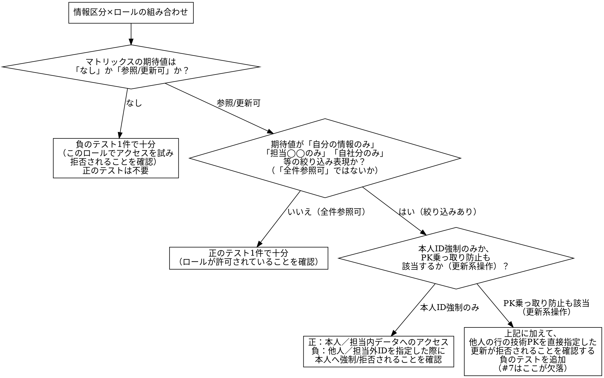

# capi-authz-test

## Overview

`campus身分別取得可能情報一覧_マトリックス.xlsx`（`campus-api_設計書.md`4.3節が参照する一次情報の実体）には、**13身分×27情報区分の全欄が確定済み**の正解表が存在する。加えて`別紙A_全API一覧と取得内容_API単位.csv`（全5,930API棚卸し）により「現状（ほぼ全て未対応）」の実測値も判明している：役割判定なし5,917件、行レベル絞り込みなし5,548件、行レベル絞り込みあり（本人限定）はわずか37件。**このスキルは、現状棚卸しを出発点に、新版が正解表どおりに直っているかをGraphQL APIへ役割別トークンで直接検証するテストへ変換する。**

認可は2層構造でできている。**第1層（粗いロールゲート）**はロールだけで判定する大まかな可否。**第2層（行レベル所有者検証）**は(a)本人ID強制と(b)PK乗っ取り防止（更新対象の技術PKが指す既存行の所有者と入力IDの一致確認）の2種類がある。**第1層だけを確認して完了とせず、第2層、特に(b)まで確認することがこのスキルの核心**である（5章#7のような不具合は、まさに(b)相当のチェックが書き込み系だけ欠落していたために発生する）。

この方針は`セキュリティインシデント対策案.md`「検証方法・完了条件」の「ロール別（9ロール）の認可回帰テストを整備する。『意図したロールでは今まで通り取得できる』『意図しないロールでは取得できなくなる』の両方を確認する」という方針と同一であり、このスキルはその方針を実行可能な手順に落とし込んだものである。

## When to Use

- campus-apiのある操作（query/mutation）の実装（`capi-changes`）が完了し、その操作についてロール別の可否・行レベルの所有者検証が正しく機能しているかを検証したいとき

**対象外（別スキルの領域）：**
- 画面表示・内部データが現行版と一致するかの回帰確認 → `capi-regression-test`／`campus-playwright`
- スキーマ分離テスト・CSRF検証（本人以外のトークンを使わない構造そのものの検証）・許可リスト方式（persisted queries）・エラー応答衛生検査（別スキル候補）
- 正解表（4.3節・`campus身分別取得可能情報一覧_マトリックス.xlsx`）自体の作成・更新：設計工程の産物であり、このスキルは受け取って検証するだけ
- UIを介した動作確認（ブラウザ操作）：GraphQL APIを直接叩く方式に限定する
- パフォーマンス・負荷テスト
- テストアカウントそのものの発行・管理：別途用意されたものを前提とする
- 監査ログ（誰が何を参照・更新したかの記録）が正しく残るかの検証：`セキュリティインシデント対策案.md`の`AuditLogInstrumentation`の対象であり、認可の可否そのものとは別軸

**REQUIRED SUB-SKILL: capi-saml-login** — テスト環境はPT環境を前提とする。PTでは`loginByLocal`が`use-local: false`のため常に失敗し、**学生・大学院生・教員・職員の4ロールはSAML（OneLogin）経由のログインが必須**。これらのロールのCookie・CSRFトークン取得は`capi-saml-login`に委譲する。求人情報（ROLE_JOBOB）・一般市民（ROLE_CITIZEN）・企業担当（ROLE_KIGYOU）は専用mutation（`loginForJobob`等）がSAMLと無関係に動作するため、このスキル単独（ステップ5）でログインできる。

## Core Pattern

**具体例（5章#7：成績保存系mutationの不具合）**：`TblBuseisekiController`の参照系（`getAcademicGradesForLecture`）は`isInstructorResponsibleForLecture`で担当授業を確認済みだが、書き込み系（`createTblBuseiseki`等5本）は`generatedCrudGuard.denyRestrictedUser`（教員・職員の区分チェックのみ＝第1層相当）しか呼んでいない。担当授業チェック・登録期間チェック（第2層のPK乗っ取り防止相当）が書き込み系だけ欠落しているため、**教員・職員なら担当外授業・登録期間外でも成績を新規登録・更新・削除できてしまう**。

第1層（ロールゲート）が存在することを確認しただけでは、この種の不具合は検知できない。**担当内の授業の成績（正のケース）と、担当外の授業の成績（負のケース）の両方に対して同じmutationを実行し、後者が拒否されることまで確認**して初めてこのクラスの不具合を検知できる。

## 入力データ（このスキルが参照する既存資料）

| 資料 | 用途 |
|---|---|
| `campus身分別取得可能情報一覧_マトリックス.xlsx`（Sheet1「身分×情報区分マトリックス」） | あるべき姿（目標状態）の正解表。**13身分×27情報区分の全欄が確定済み**。凡例（Sheet3）：「全件参照可」「自分の情報のみ」「担当◯◯のみ（教員=担当授業／担当グループ、職員=担当部局）」「自社分のみ」「なし」の5パターンで統一表記されている |
| 同xlsx Sheet2「情報区分定義」 | 情報区分ごとの主な情報項目・**主な画面・根拠（ソースファイルパス）**。操作を情報区分へ割り当てる際の一次情報 |
| 同xlsx Sheet4「旧システム出席情報権限」 | 出欠席情報の職員・学生の実際の権限ロジック（プレーンテキスト記述）。「追加で確認すべき懸念事項」の裏付けに使う |
| `campus-api_設計書.md` 5章 | 既知の未解決不具合7件（回帰テスト化の対象） |
| `別紙A_全API一覧と取得内容_API単位.csv` | 現状棚卸し（役割判定・行レベル絞り込みの有無）。修正前ベースラインとして使う。**gakumu側も含む全システムの棚卸しのため、campus-apiの移行対象操作だけに絞り込んで参照する**（ステップ0） |
| `別紙D1_画面別_呼び出されるAPI一覧.csv` | 画面→呼び出しAPI→到達テーブルの対応 |
| `別紙_教員による学生参照の根拠照合.csv` | 担当授業／指導教員／担当グループという実在の関係性データ。行レベルテストの「担当内／担当外」ペアデータ設計のテンプレートとして転用する（ステップ4） |
| `別紙_行レベル判定結果.csv` | ロール×操作×テーブルごとの実測アクセス件数。優先順位付け、および既知不具合7件に無い新たな懸念事項の発見源 |
| `セキュリティインシデント対策案.md`「フェーズ区分」 | フェーズ0（止血）／1（高リスク・分離不要）／2（分離を伴う・career等）／3（低リスク・基盤整備）。テスト着手の優先順位付けに使う（ステップ0） |
| `認証トークン設計書.md` 4.3節・6.1節・7.1節 | Cookie／CSRFトークンの具体的な発行・検証方式（ステップ5で実際のリクエストを組み立てる根拠） |
| `campus-login_設計書.md` 2.1節・8.2節 | ロールごとのログイン操作一覧・実機確認済み手順 |
| `campus-playwright`の画面カバレッジ・マニフェスト（`coverage/screens/<ScreenId>.json`） | 画面単位のカバレッジとの突合（ステップ9） |

## テストケース設計の判断（非自明な分岐）

情報区分×ロールの組み合わせごとに、以下の手順でテストケースを設計する。



**要点**：
- マトリックスの表記（凡例）で判断する：「なし」は負のテストのみ、「全件参照可」は正のテストのみで行レベル検証は不要、それ以外（自分の情報のみ／担当◯◯のみ／自社分のみ）は行レベル検証が必要
- 行レベル所有者検証が必要な情報区分でも、**参照系だけでなく更新系（mutation）にPK乗っ取り防止のテストがあるか**を必ず確認する。参照系にチェックがあることは、更新系にもあることを意味しない（#7がその実例）

## Quick Reference

**身分一覧（マトリックスSheet1、13区分。UserType上は9ロール＋管理者フラグだが、`studentType`属性等でさらに細分化される）**：学部学生／大学院生／非正規生（いずれもROLE_STUDENT、`studentType`で区別）／卒業生・在学中／卒業生・ログイン不可／卒業生求人検索利用者（ROLE_JOBOB）／職員（ROLE_STAFF）／教員（ROLE_INSTRUCTOR）／卒業生WEB検索管理者（ROLE_JOBOBADMIN）／市民開放（ROLE_CITIZEN）／企業（ROLE_KIGYOU）／企業一時（ROLE_KIGYOUTEMP）／未認証。**同じROLE_STUDENTでも`studentType`によって期待値が変わる情報区分がある**（例：情報区分11履修抽選情報・19ディプロマサプリメントは学部学生か大学院生かで可否が変わる）ため、ロール名だけでテストアカウントを1つに決め打ちしない。

**2層構造**：

| 層 | 内容 | 検証観点 |
|---|---|---|
| 第1層：粗いロールゲート | ロールだけで判定する大まかな可否 | 許可されるべきロールが通る／拒否されるべきロールが弾かれる |
| 第2層(a)：本人ID強制 | 入力された対象IDが本人と一致するか | 他人のIDを指定した際に本人へ強制上書き、または拒否される |
| 第2層(b)：PK乗っ取り防止 | 更新対象の技術PKが指す既存行の所有者と、入力の対象IDが一致するか | 他人の行の技術PKを直接指定した更新・削除が拒否される |

**現状棚卸しの規模感（`別紙A`、システム全体5,930API）**：役割判定なし5,917／行レベル絞り込みなし5,548／絞り込みあり（本人限定）37。このうち「④認可注釈なし」（2件）は認証すら効いていない最優先確認対象。

**テスト着手の優先順位（`セキュリティインシデント対策案.md`フェーズ区分に準拠）**：フェーズ0・1（分離不要・高リスク）に該当する操作を優先し、フェーズ2（career等、分離を伴う）・3（低リスク）は後回しにする。

**拒否の判定基準**：明示的な`FORBIDDEN`（認可拒否）で判定する。空応答は「拒否された」のか「単にデータが無い」のか区別できないため使わない。**なお認可拒否以外の例外は現状スタックトレースが応答に露出する既知の課題があるため（`認証トークン設計書.md`7.1.2節）、負のテストで想定外のエラー型（`ExecutionAborted`等）が返った場合は「拒否された」と即断せず、実装側の別の不具合を疑う。**

## ステップ0 対象操作の特定とスコープ絞り込み・優先順位付け

`別紙A`・`別紙D1`はgakumu側も含むシステム全体の棚卸しである。`別紙_対象画面一覧.csv`等でcampus-apiの移行対象画面を確認し、`別紙D1`で当該画面が呼ぶAPIを特定したうえで、`別紙A`の該当行（現状の役割判定・行レベル絞り込み欄）を突合する。campus-apiの移行対象外（gakumu専用機能等）は対象に含めない。

`セキュリティインシデント対策案.md`のフェーズ区分（フェーズ0止血／1高リスク・分離不要／2分離を伴う／3低リスク）を参照し、フェーズ0・1に該当する操作を優先してテスト対象にする。

同一のAPI（汎用の`getFilteredXxx`等）が複数画面から呼ばれる場合、**画面単位ではなく操作（API）単位でテストを管理する**。どの画面群から呼ばれるかは参考情報として記録するにとどめ、操作ごとに1つのテストセットを持つ（複数画面担当者が同じ操作を重複してテストしないため。ステップ3で重複確認する）。

## ステップ1 現状ベースラインの確認

対象操作について`別紙A`の該当行を確認し、修正前の役割判定・行レベル絞り込みの状態を記録する（多くは「なし」）。これを新版が改善したことの比較基準とする。

## ステップ2 テストケース設計

「テストケース設計の判断」フローチャートに従い、マトリックスSheet1の該当セル（身分×情報区分）を見て必要な正・負のテストケースを洗い出す。同一ロールでも`studentType`等の属性によって期待値が変わる情報区分は、属性ごとに別ケースとして扱う。

## ステップ3 既存テストとの重複確認

新規にテストを作成する前に、対象操作について既存の認可テスト（`coverage/authz/`配下）を検索する。同一操作が既に別の画面担当者によってテスト済みの場合は、新規作成ではなく既存のマニフェスト・テストケースを再利用または拡張する。

| 対象操作 | 既存テスト | 判定 | 対応 |
|---|---|---|---|
| 例：`getFilteredTblGakuseki` | `coverage/authz/getFilteredTblGakuseki.json` | 再利用 | そのまま利用 |

判定は「再利用」「拡張」「新規」のいずれかとする。複数画面から呼ばれる汎用APIほど、この確認を怠ると重複作業になりやすい。

## ステップ4 行レベルテストデータの設計

行レベル所有者検証が必要な操作については、担当内／担当外のペアとなる実データを用意する。

- **教員×学生の関係**：`別紙_教員による学生参照の根拠照合.csv`が実例（教員×学籍IDごとの①担当授業の受講生／②指導教員／③担当グループの学生という3つの根拠と判定）を示しているので、これと同じ形でペアを用意する
- **職員×部局の関係**：`セキュリティインシデント対策案.md`が明記する既存機構`mst_kengen`／`mst_kengen_shozoku`（権限マスタ）と`GakusekiShozoku1Guard`を手がかりに、対象職員の担当部局に属する学生（担当内）と属さない学生（担当外）のペアを、これらのマスタテーブルを照会して用意する

## ステップ5 ログイン・トークン取得

テスト環境はPT環境とする。PTは`use-local: false`のため、ロールによってログイン経路が2つに分かれる。

- **学生・大学院生・教員・職員**：`loginByLocal`はPTで常に失敗する（`use-local: false`）。`capi-saml-login`（SAML／OneLogin経由）でCookie・CSRFトークンを取得する
- **求人情報（ROLE_JOBOB）・一般市民（ROLE_CITIZEN）・企業担当（ROLE_KIGYOU）**：`loginForJobob`／`loginForCitizen`／`loginForKigyou`は`use-local`フラグと無関係に動作するため、このスキル単独でログインできる（下記リクエスト例と同様の形）

**リクエスト構造の参考例（`backend/campus`の実装・`CampusSeiseki.graphqls`/`CampusLogin.graphqls`から引用。dev環境での実機確認結果＝正しい実装の期待値として使う）**：

```bash
# dev環境での実機確認結果（campus-api_設計書.md 11.5節。学生23M0026A→3.44、教員itoh964→FORBIDDEN）
# これは「正しい実装ならこう振る舞う」という期待値の参考であり、PT環境ではログイン手段が異なる（下記参照）。

# query実行（CSRF不要。Cookieは capi-saml-login または本ステップのログインmutationで取得したものを使う）
curl -s -b cookie.txt -X POST https://<PT環境ホスト>/campus-api/graphql \
  -H "Content-Type: application/json" \
  -d '{"query":"query{ getCumulativeGPA(koukaiMaePrint:false) }"}'
# 正のテスト（本人＝学生）: {"data":{"getCumulativeGPA":<値>}}
# 負のテスト（教員等、対象外ロール）: {"data":{"getCumulativeGPA":null},"errors":[{"extensions":{"classification":"FORBIDDEN"}}]}

# mutation実行（CSRF必須）
curl -s -b cookie.txt -X POST https://<PT環境ホスト>/campus-api/graphql \
  -H "Content-Type: application/json" -H "X-CSRF-Token: <csrfToken>" \
  -d '{"query":"mutation{ createTblBuseiseki(...){ ... } }"}'
```

**PT環境でのCookie取得方法はロールで異なる**（ステップ5参照）：学生・大学院生・教員・職員は`capi-saml-login`の出力（Cookie・csrfToken）をそのまま使う。求人情報・一般市民・企業担当は以下のようにこのスキル単独でログインする。

```bash
# 求人情報（ROLE_JOBOB）でのログイン例。CampusLoginInput { userCode, password }
curl -i -c cookie.txt -X POST https://<PT環境ホスト>/campus-login/graphql \
  -H "Content-Type: application/json" \
  -d '{"query":"mutation($input: CampusLoginInput){ loginForJobob(input:$input){ success csrfToken roles } }",
       "variables":{"input":{"userCode":"18J1090F","password":"<password>"}}}'
```

`getCumulativeGPA`は対象学籍を**引数で受け取らない**設計（本人がセッションから一意に決まるため、他人を指定する経路自体が存在しない）になっている点も併せて確認する。行レベル検証（PK乗っ取り防止）が必要な**更新系**操作（`createTblBuseiseki`等）では、逆に対象を技術PKで指定できてしまうため、正のテスト（本人／担当内PK）と負のテスト（他人／担当外PKを直接指定）の両方が必須になる（#7参照）。

- Cookieなし／不正なCSRFトークンでのmutation実行は`FORBIDDEN`（実行前に拒否、スキーマ検証にも到達しない）
- ログイン失敗時は`Set-Cookie`が発行されない
- 未認証でcampus-apiを叩くと401（SAML経路は302のままだが、campus-apiのGraphQLエンドポイントは401に固定されている）

## ステップ6 認可テスト・マニフェスト作成

操作ごとに`coverage/authz/<操作名>.json`を作成する。

```json
{
  "operation": "createTblBuseiseki",
  "informationCategory": "13. 成績入力情報",
  "calledFromScreens": ["rishuuseiseki/SeisekiInput.vue"],
  "currentStateBaseline": {
    "source": "別紙A_全API一覧と取得内容_API単位.csv",
    "roleCheck": "なし",
    "rowLevelFilter": "なし"
  },
  "expectedTargetState": {
    "source": "campus身分別取得可能情報一覧_マトリックス.xlsx Sheet1",
    "roleGate": "ROLE_INSTRUCTORのみ＝担当授業のみ（入力可）",
    "rowLevelCheck": ["担当授業一致", "wrs_seisekikikan期間一致"]
  },
  "existingTestCheck": { "judgement": "新規", "reference": null },
  "testCases": [
    { "id": "AZ-101", "role": "instructor-in-charge", "expected": "許可", "failsIfChanged": "担当授業チェックを外すと通ってしまう", "status": "実装済み" },
    { "id": "AZ-102", "role": "instructor-not-in-charge", "expected": "拒否(PK乗っ取り防止)", "failsIfChanged": "担当授業チェックが機能しないと成績が書き換わる", "status": "未実装（#7該当）" }
  ],
  "knownIssue": "campus-api_設計書.md 5章#7"
}
```

`calledFromScreens`は参考情報（ステップ0）。`existingTestCheck`はステップ3の結果。`testCases`の各要素は`failsIfChanged`（品質契約。ステップ8参照）を必須項目とする。

## ステップ7 レビューと承認

マニフェスト案を以下のチェックリストとともに提示し、開発者の承認を得る。承認前にテストを実行・確定しない。

```text
□ 既存テストとの重複確認結果（再利用/拡張/新規）
□ 全分岐（正・負ケース）に対応するテストケースがある
□ 行レベル検証（本人ID強制・PK乗っ取り防止）が必要な操作は両方カバーされている
□ 同一ロールでもstudentType等の属性で期待値が変わる情報区分は、属性ごとに分けてケース化されている
□ 各テストケースに品質契約（failsIfChanged）が記載されている
□ 既知不具合（5章・追加懸念事項）に該当する操作は明記されている
□ マニフェストがコミット対象として確定している
```

## ステップ8 実行・判定

用意したトークンでGraphQL APIを直接叩き、結果を明示的な拒否ステータス／許可された値で判定する。マニフェストの`testCases`の`status`を実施結果に更新する。

**品質契約**：各テストケースの`failsIfChanged`（このテストを失敗させる実装変更は何か）を実行前に確認する。「ステータスコードの有無だけ」のような緩い判定では、認可の境界（どのロール・どの行までが許可範囲か）を実際に検知できているか説明できない。説明できない場合はステップ2に戻ってケースを設計し直す。

## ステップ9 全体ロールアップ・完了判定

`coverage/authz/*.json`を集計し、以下を算出・報告する。「だいたい終わった」という感覚ではなく、この集計を完了の唯一の根拠とする。

| 集計軸 | 内容 |
|---|---|
| 対象操作の実施率 | `coverage/authz/`配下のファイル数 ÷ ステップ0で確定した対象操作数 |
| テストケース実施率 | 全`testCases`のうち`status`が実施済み（成功/失敗いずれか判定済み）の件数 ÷ 総数 |
| 既知不具合の解消率 | 5章7件・追加懸念事項1件のうち、対応する`knownIssue`が解消済みとなっている件数 |
| 画面単位のカバレッジ | `campus-playwright`の画面カバレッジ・マニフェストと`calledFromScreens`で突合し、画面に紐づく全操作が認可テスト済みか |

未完了の操作を一覧化し、担当者にアサインする。

## 追加で確認すべき懸念事項（5章の7件に加えて）

`別紙_行レベル判定結果.csv`の実測から、5章に無い新たな懸念事項が1件見つかっている。

- **学生ロールによる`TblQrsyussekiController`（指定授業の出席状況取得）経由の`gakumu.tbl_buseiseki`（成績関連テーブル）アクセスで、先頭行が本人でないケースが60,697件**：マトリックスSheet1「出欠席情報」の学生の期待値は**「自分の履修科目・打刻情報のみ」**であり、他人のデータが返ることは想定されていない。Sheet4「旧システム出席情報権限」も学生については「自分の履修した授業の出席情報」「自分の打刻情報」のみと明記しており、職員の「部局を制限しない全員表示」規定（Sheet4）は学生には適用されない。**この実測は正解表と矛盾する可能性が高く、新版のテストケースとして最優先で確認する**

## Common Mistakes

1. **マトリックスをそのまま鵜呑みにし、API単体のIDOR到達可能性を見落とす**：マトリックス自身が「画面ベースの整理でありAPI単体の到達可能性は含まない」という前提（`campus-api_設計書.md`4.3節）の上に成り立っている。表を転記しただけのテストでは、画面を経由しない直接ID指定等の攻撃を見逃す
2. **単一ロールのテストだけで済ませ、担当内/担当外のペアデータを用意しない**：「エラーにならないこと」だけを確認し、実際には他人のデータが返っている、あるいは他人の行を更新できてしまうことを見逃す
3. **ロールゲート（第1層）の存在確認だけで、行レベル検証（第2層）まで実装済みと誤解する**：#7がまさにこのパターン（区分チェックはあるが担当授業・期間チェックが無い）
4. **既知の不具合（5章）を回帰テストに含めず、修正後に放置する**：再発を検知できないまま次のリリースへ進んでしまう
5. **拒否の判定を「空応答」または「何らかのエラー」で行い、`FORBIDDEN`と他の例外型を区別しない**：認可拒否以外の例外はスタックトレースが応答に露出する既知の課題があるため、想定外のエラー型は実装側の別の不具合を疑う
6. **`別紙A`の現状棚卸し（ほぼ全て未対応）を「あるべき姿」と誤解する**：`別紙A`は修正前の実測値であり、新版が目指すべき状態はマトリックスにしかない
7. **PT環境で`loginByLocal`を学生・大学院生・教員・職員に使おうとして失敗し、実装側の不具合と誤解する**：PTは`use-local: false`のためこの4ロールは`capi-saml-login`（SAML／OneLogin経由）が必須。求人情報・一般市民・企業担当は専用mutationでそのままログインできる
8. **汎用APIを複数画面担当者が重複してテストする**：ステップ3の重複確認を省略すると、同じ操作に対するテストが画面ごとに乱立する
9. **品質契約（failsIfChanged）を書けないテストをそのまま採用する**：ステータスコードの有無だけの緩い判定は、境界を実際に検知できない
10. **同一ロールを一枚岩として扱い、`studentType`等の属性差を見落とす**：ROLE_STUDENTでも学部学生／大学院生／非正規生で期待値が異なる情報区分がある。ロール名だけでテストケースを1つに決め打ちしない

## 完了条件

- 対象操作（ステップ0で確定）すべてに`coverage/authz/<操作名>.json`が存在する
- 各操作のテストケース表・分岐対応（正負ケース、行レベル検証）がレビュー承認済み
- 既存テストとの重複確認結果（再利用/拡張/新規）が記録済み
- 各テストケースに品質契約（`failsIfChanged`）が記載され、緩いアサーションになっていない
- 5章の既知不具合7件、および「追加で確認すべき懸念事項」の1件が、すべて対応するテストケースを持つ
- 全体ロールアップ（ステップ9）の実施率が100%、または未完了理由が報告済み
