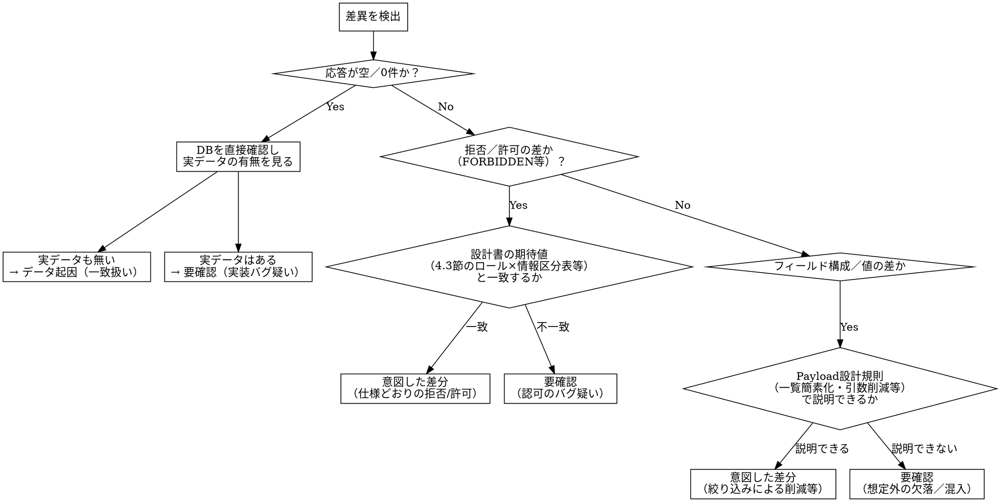

# capi-regression-test

## Overview

画面の表示内容・操作方法は変更せず、内部API（GraphQL）のみを作り直すリニューアルでは、「現行版と新版で同じ操作をして、応答が同じであること」を機械的に確認するのが最も確実な回帰確認になる。ただし今回の是正の本丸は「画面には表示されないが応答には含まれていたデータを絞り込む」ことなので、**画面表示だけを見る照合では最も重要な変更点を見落とす**。画面表示・内部データ（APIレスポンス）・帳票の3点を必ずセットで照合する。

差異は出ることが前提であり、ゼロを目指さない。検出したすべての差異について「意図した変更」か「是正済みの不具合」のいずれかで説明できることを判定基準とする。

## When to Use

- ある画面のcampus専用API（campus-api／campus-login／campus-syllabus）への移行実装が完了し、本番リリース前に現行版との差分照合を行いたいとき

**対象外（別スキルの領域）：**
- 認可・アクセス制御の検証（ロール×情報区分の可否、行レベル所有者検証）→ `capi-authz-test`（別スキル）
- スキーマ分離テスト・CSRF検証・エラー応答衛生検査
- 単体テストの実行（`capi-changes`内で完結するもの）
- 差分レビュー・設計原則との整合確認 → `capi-review-changes`
- エビデンス撮影後のPR作成 → `chub-capture-evidence` / `chub-pullreq`

**REQUIRED SUB-SKILL: chub-capture-evidence** — 画面表示のエビデンス（スクリーンショット）撮影は、Playwright MCPの撮影ルールを既に持つこのスキルに委譲する。内部データ・帳票のエビデンス取得は本スキルで扱う。

## Core Pattern

**Before（アドホックな手動確認）**：メンバーごとに確認する項目・判定基準がばらつき、画面表示だけを目視して「OK」としてしまいがちで、応答に含まれる余計なデータの混入を見逃す。

**After（本スキルによる3軸照合）**：同一操作を現行版・新版の両方に対して実行し、以下の3点を機械的に突き合わせる。

| 照合対象 | 確認できること | エビデンス |
|---|---|---|
| ① 画面表示内容 | 表示される情報に差がないか | スクリーンショット（`chub-capture-evidence`に委譲） |
| ② 内部データ（APIレスポンス） | 画面に表示されない部分を含め、取得されるデータに差がないか | リクエスト/レスポンスの生データ（JSON等）を新旧それぞれ保存 |
| ③ 帳票（PDF/CSV） | 出力ファイルの中身（CSVは行データ、PDFは抽出テキスト）に差がないか（照合方法は後述） | 生成された帳票ファイルそのものを新旧それぞれ保存 |

②が今回の是正の本丸であり、①だけでは検出できない。

**具体例（ポータル画面）**：現行は12操作（うち8操作が汎用`getFilteredXxx`）を呼んでいたが、新版は7操作（6 query + 1 mutation）に統合されている。お知らせ一覧のレスポンスは現行128,538バイト→新版21,209バイト（83.5%削減）。この削減分（本文・部局名・添付ファイル一覧など、一覧画面には表示されない項目）は②の照合で初めて検出でき、①（画面表示）だけを見ていては気づけない。

## Quick Reference

- 記録元は本番ではなく、**暫定対策込みのステージング環境**の現行コード（本番は現在停止中のため）
- 対象アカウントは、必要なロールに応じて用意する（例：ポータル画面なら学生・教員・職員それぞれの検証済みアカウント）
- 差異はゼロを目指さない。判定基準は「意図した変更」または「是正済み」で説明できること
- 画面表示・内部データ・帳票の3点はワンセット。1つでも欠けたら照合として不十分

## 帳票（PDF/CSV）照合の方法

②内部データ（APIレスポンス）はJSON同士の構造比較で機械的に突き合わせられるが、③帳票はファイル形式そのものが比較の妨げになりやすい。**ファイルをバイト単位・見た目全体で丸ごとdiffしない**（生成日時等のメタデータや、出力ライブラリの変更に伴うレイアウト差分だけで大量の偽陽性が出る一方、レイアウトが一致していることに安心して中身の値の入れ替わり・欠落を見逃す偽陰性にもつながる）。ファイル種別ごとに、中身のデータとして突き合わせる。

| ファイル種別 | 照合方法 | 本質的な差分ではない例（差異として扱わない） |
|---|---|---|
| CSV | 行をパースし、帳票ごとに定まる一意キー（学籍番号＋科目コード等、帳票の主キーに相当する列）でレコードを対応付けてから、キー以外の列の値を突き合わせる。行の並び順の違いだけをもって差異としない | 改行コード（CRLF/LF）・文字コード（Shift_JIS/UTF-8）・BOMの有無・末尾の空行 |
| PDF | テキスト抽出（PDF内の文字列データを取り出すツール）で本文を取り出し、内容（項目名・値）を突き合わせる。表形式の明細を含む帳票は、抽出結果を行として解釈しCSVと同様にキー突合せを検討する | フォント・余白・改ページ位置等のレイアウト差分（出力ライブラリの変更に起因するもの） |

差異が「本質的（データの値そのものの違い）」か「非本質的（表現形式の違い）」かの切り分けが機械的に付かない場合は、CSVならセル値、PDFなら抽出テキストの該当箇所を目視で直接比較し、判断根拠を残す。この目視確認を①のスクリーンショット確認で代替しない（①は画面上の見た目、ここでいう照合は帳票ファイル内部のデータそのもの）。

## 差異判定の手順（非自明な分岐）

検出した差異1件ごとに、以下の手順で「一致／意図した差分／要確認」のいずれかに分類する。

**要点**：
- 空応答・0件は「実装が壊れた」と「テストデータが単に無い」の2通りがあり得るため、**必ずDBを直接確認**してから判定する（確認せずにどちらかへ決め打ちしない）
- 拒否／許可の差は、都合よく「意図した差分」に倒さず、必ず設計書側の期待値と突き合わせる
- 「意図した差分」の判定を安易に行うと、既知の重大な不具合（例：認可チェック漏れ）を見逃す。判断に迷う場合は「要確認」側に倒す

## 実行手順

1. 対象画面・対象操作を確定する（リリース回の対象画面一覧に基づく）
2. ステージング環境の現行版で、対象操作を実行し記録する（画面操作→スクリーンショット、APIレスポンス、帳票出力の3点）
3. 新版（campus専用API側）で同じ操作を実行し、同じ3点を記録する。**`capi-changes`でGraphQL操作名または帳票ダウンロードのURLパスがリネーム・統合/分割されている場合、`campus-playwright`が生成したテストコードはネットワーク応答の捕捉マッチ条件を画面マニフェスト（`coverage/screens/<ScreenId>.json`）の`newOperationName`（`operations`・`reports`双方に存在）経由で参照する設計になっている。新版実行前に、実装担当者から旧→新の操作名対応・帳票エンドポイント対応を聞き取り、マニフェストの`newOperationName`を埋めてから実行する**（埋め忘れると、差分ではなくタイムアウト/未捕捉で失敗する。GraphQL操作だけでなく帳票側の埋め忘れも同様に起こり得る）
4. 3点それぞれについて新旧を突き合わせ、差異を検出する（帳票の具体的な照合方法は「帳票（PDF/CSV）照合の方法」を参照）
5. 検出した差異を「差異判定の手順」に従って分類する
6. 「要確認」に分類された差異を一覧化し、実装担当者へ共有する

具体的な記録・比較の実行スクリプトは `scripts/` 配下に別途整備する（本スキル文書には手順と判定基準のみを記載し、実行体はコードとして保守する）。

## Common Mistakes

1. **記録元を間違える**：本番は停止中のため、記録元は暫定対策込みのステージング環境にする。誤って別バージョン（旧脆弱版や開発中ビルド）を記録元にしない
2. **画面表示だけで済ませる**：内部データ（APIレスポンス）の照合を省くと、今回の是正の本丸（画面に表示されないデータの絞り込み）を検証できない
3. **完全一致を求める**：差異が出ることは前提であり、ゼロを完了条件にしない。完全一致を求めると大量の誤検知が出る
4. **都合よく「意図した差分」と判定する**：判断に迷う差異を安易に「意図した差分」に倒すと、重大な不具合（認可チェック漏れ等）を見逃す。迷ったら「要確認」に倒す
5. **0件／空応答の原因を確認せずに進める**：DBを直接確認し、データが実在するかどうかを見てから判定する
6. **操作名／帳票ダウンロードURLがリネームされたことに気づかず、`campus-playwright`のテストコードをそのまま新版に実行する**：マニフェストの`newOperationName`（`operations`・`reports`双方）を埋めないと、②内部データ・③帳票いずれの捕捉も新版側の応答にマッチせずタイムアウトする。これを「差分なし（応答が来ない＝一致）」等と誤読しない。捕捉自体が失敗しているだけなので、まず`newOperationName`の設定漏れを疑う。GraphQL操作名だけ確認して帳票側を見落とすケースに特に注意する
7. **帳票ファイルをバイト単位・見た目全体で丸ごとdiffする**：生成日時等のメタデータや出力ライブラリの変更に伴うレイアウト差分（改行コード・文字コード・フォント・余白等）だけで大量の偽陽性が出る、または逆にレイアウトの一致に安心して中身のデータ（値の入れ替わり・欠落）の差分を見逃す。CSVは行の一意キーによるレコード突合せ、PDFはテキスト抽出した内容の突合せを基本とする（詳細は「帳票（PDF/CSV）照合の方法」）
