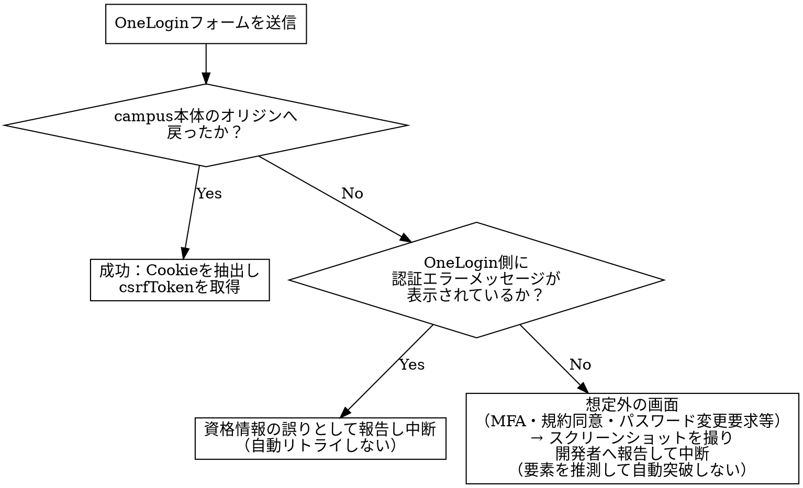

# capi-saml-login

## Overview

PT環境は`loginByLocal`が`use-local: false`により常に失敗するため、学生・大学院生・教員・職員の4ロールはSAML経由でしかログインできない。PTのSAML IdPは大学の実IdP（Shibboleth/GakuNin）ではなく**OneLogin**（`https://ailesystem-corp-dev.onelogin.com`、社内管理のテスト用クラウドIdP）である。このスキルは、Playwrightで「SAML開始→OneLoginログインフォーム→リダイレクト→Cookie発行」の一連のブラウザ遷移を自動化し、取得した`campus_session`Cookieと`csrfToken`を、GraphQL直叩きで動くテストスキル（`capi-authz-test`等）が使える形で受け渡す。

## When to Use

- PT環境で学生・大学院生・教員・職員ロールの認可テスト等を行うため、SAMLログイン経由で`campus_session`のCookieとCSRFトークンを取得したいとき

**対象外（別スキルの領域・別経路）：**
- 取得したCookie/CSRFトークンを使った実際のGraphQL APIテストの実行・判定 → `capi-authz-test`
- 求人情報（ROLE_JOBOB）・一般市民（ROLE_CITIZEN）・企業担当（ROLE_KIGYOU）のログイン：`loginForJobob`／`loginForCitizen`／`loginForKigyou`という専用mutationで完結し、SAMLと無関係。GraphQL直叩きで足り、このスキルは不要
- dev／st／cp／devpt／staging環境でのログイン：`loginByLocal`（`use-local: true`）が有効なため、このスキルは不要。GraphQL直叩きのみで足りる
- production環境でのSAMLログイン：実IdP（大学のShibboleth/GakuNin）が異なり、ログイン画面の構造・フローが同一である保証が無いため、本スキルはPT環境のOneLoginに限定する

## Core Pattern

**Before**：PT環境で学生・教員等のセッションが必要になるたびに、OneLoginのログイン画面を手動操作し、開発者ツールでCookieをコピーする。再現性が低く、複数メンバーで手順がぶれる。

**After**：Playwrightで「SAML開始URLへ遷移→OneLoginフォーム入力→リダイレクト完了待機→Cookie抽出→CSRFトークン取得」を一直線に自動化し、構造化された認証情報（Cookie値・CSRFトークン）として返す。

**具体例**：学生アカウント（`ntatsuno+11@ailesys.co.jp`）でPT環境にログインし、`capi-authz-test`が`getCumulativeGPA`等のテストに使うためのCookie・CSRFトークンを取得する。

## 実行手順

1. Playwrightで`https://<PT環境のホスト>/saml2/authenticate/campus`へ遷移する（Spring Securityの`saml2Login()`が自動的にOneLoginのログイン画面へリダイレクトする）
2. OneLoginのログインフォームにメールアドレス・パスワードを入力して送信する
3. リダイレクトチェーンを追跡し、最終的にcampus本体のオリジンへ戻る（`/saml/success`→`CampusSamlLoginController#samlSuccess`が発行した`Set-Cookie`を経て、`baseUrl`へリダイレクトされる）まで待機する
4. ブラウザコンテキストのCookieストアから`campus_session`を抽出する
5. 抽出したCookieを使って`getLoginStatus`クエリを実行し、レスポンスの`csrfToken`を取得する（CSRFトークンはリダイレクトURLやSet-Cookieには載らず、このクエリでのみ得られる。`認証トークン設計書.md`6.1節）
6. Cookie値とCSRFトークンを構造化して返す（呼び出し元スキルがそのままHTTPリクエストのCookieヘッダー／`X-CSRF-Token`ヘッダーに使える形にする）

## ログイン結果の判定（非自明な分岐）

OneLoginへの資格情報送信後、単純な「成功/失敗」の2択ではなく、想定外の中間画面が挟まる可能性がある。

**要点**：想定外の画面（MFA・規約同意等）に遭遇した場合、セレクタを推測して無理にクリックを続けない。誤った要素をクリックし続けると、意図しない状態変更（パスワード変更処理の誤発火等）を引き起こしかねない。スクリーンショットを撮って中断し、人が確認する。

## Common Mistakes

1. **資格情報をスキル本体やテストコードにハードコードする**：`ntatsuno+11@ailesys.co.jp`等の認証情報は環境変数や秘密管理の仕組みから注入し、リポジトリにコミットされるファイルに直接書かない
2. **OneLoginのエラーメッセージを無視し、空のCookieのまま次工程へ進む**：ログイン失敗を検知せず`capi-authz-test`側に渡すと、原因不明の401/FORBIDDENとして誤診断される
3. **Cookie取得だけでCSRFトークン取得（`getLoginStatus`）を省略する**：mutationを含むテストで`FORBIDDEN`になり、認可の不具合と誤診断される
4. **production環境の実IdP（Shibboleth）にも同じ自動化がそのまま使えると誤解する**：IdPが異なれば画面のセレクタ・フロー段数も異なりうる。production向けには別途確認が必要
5. **Cookieの有効期限を考慮せず長時間使い回す**：セッション切れによる失敗を、認可の不具合と誤診断しないよう、テスト実行前に有効期限を確認するか都度再ログインする
6. **想定外の画面（MFA・規約同意等）で要素を推測してクリックを続ける**：意図しない状態変更を引き起こす可能性があるため、中断してスクリーンショットを残し人に判断を仰ぐ
