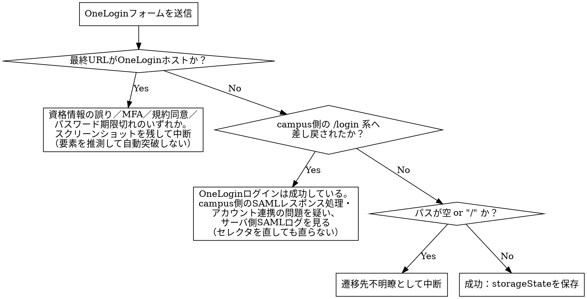

# capi-saml-login

## Overview

PT環境は`loginByLocal`が`use-local: false`により常に失敗するため、学生・大学院生・教員・職員の4ロールはSAML経由でしかログインできない。PTのSAML IdPは大学の実IdP（Shibboleth/GakuNin）ではなく**OneLogin**（`https://ailesystem-corp-dev.onelogin.com`、社内管理のテスト用クラウドIdP）である。

このスキルは「SAML開始→OneLoginログインフォーム→リダイレクト→セッション発行」の一連のブラウザ遷移をPlaywrightで自動化し、後続スキル（`campus-playwright`／`capi-authz-test`）が使える形で認証済みセッションを受け渡す。

**環境体制の変更（2026-09-16、`campus-playwright`と共通の前提）**：PT環境の向き先が変更され、以後PT環境はcampus専用API移行後の**新版**を指す（旧版・移行前の記録対象はST環境）。この変更に伴い、`campus-playwright`の通常の記録作業（ST環境）は`use-local: true`の`loginByLocal`系操作で完結するようになり、本スキルは通常の記録作業では不要になった（詳細・テストアカウントは`campus-playwright`スキルの「環境体制の変更」「ST環境テストアカウント」を参照。ここでは重複記載しない）。**本スキルが実際に必要になるのは、`capi-authz-test`（常にPT＝新版を対象とする）と、`campus-playwright`がPT環境（新版）に対して新旧比較を実行する際に対象ロールがSAMLでしかログインできないと判明した場合の2ケースに限られる。**

**最重要の前提**：この経路で発行されるCookieは**その時点でnginxが`/saml2/**`をどのアプリへ転送しているかで変わる**。名前を決め打ちにしない（後述「発行されるCookieは経路で変わる」）。

## When to Use

- PT環境で学生・大学院生・教員・職員ロールのテストを行うため、SAMLログイン経由で認証済みセッションを取得したいとき

**対象外（別スキルの領域・別経路）：**
- 取得したセッションを使ったGraphQL APIの認可テストの実行・判定 → `capi-authz-test`
- 取得したstorageStateを使った画面の特性テスト／回帰テスト → `campus-playwright`／`capi-regression-test`
- 求人情報（ROLE_JOBOB）・一般市民（ROLE_CITIZEN）・企業担当（ROLE_KIGYOU）のログイン：`loginForJobob`／`loginForCitizen`／`loginForKigyou`という専用mutationで完結し、SAMLと無関係。このスキルは不要
- dev／st／cp／devpt／staging環境でのログイン：`loginByLocal`（`use-local: true`）が有効なため、このスキルは不要
- production環境でのSAMLログイン：実IdP（大学のShibboleth/GakuNin）が異なり、画面構造・フローが同一である保証が無い。本スキルはPT環境のOneLoginに限定する

## 参照実装（まずこれを読む）

PT環境で**実際に動作確認済み**の実装が既にある。新規に書き起こす前に必ずこれを読み、流用する。

| ファイル | 役割 |
|---|---|
| `frontend/campus/templates/auth.ts` | `loginAsRole()` 本体。OneLoginのセレクタ・待機・失敗判定を実装済み |
| `frontend/campus/e2e/auth.setup.ts` | ロールごとにログインし `e2e/.auth/<role>.json` へ storageState を保存 |
| `frontend/campus/playwright.config.ts` | `setup` プロジェクト（長timeout・retry）、`ignoreHTTPSErrors`、認証情報ファイルの読み込み |

## 発行されるCookieは経路で変わる（最重要・非自明）

`/saml2/authenticate/campus` というURLは、既存の`backend/api`とcampus専用API（`backend/campus`）の**両方が同じ登録ID`campus`で持っている**。どちらが応答するかはnginxの転送設定次第で、結果として発行されるCookieが変わる。

| nginxが`/saml2/**`を転送する先 | 発行されるCookie | 認証方式 | 使い道 |
|---|---|---|---|
| 既存 `backend/api`（2026-09-09時点のPT環境はこちら。**2026-09-16に下記へ切り替わったことを実機確認済み**） | `JSESSIONID` | Spring Securityセッション | （移行前の一時的な状態。現在は下記が既定） |
| campus専用API `backend/campus`（**2026-09-16以降の既定**） | `campus_session`（httpOnly / Secure / SameSite=Strict / Path=/） | JWT実トークン（`CampusSessionCookies`） | GraphQL直叩き（`capi-authz-test`）、および`campus-playwright`のPT側新旧比較でSAMLが必要な場合 |

**実機確認済みの事実（2026-09-09時点。当時の状態）**：PT環境で`/saml2/authenticate/campus`経由ログイン後の`storageState`に`campus_session`は存在せず、`allcweb2.local.ailesys.co.jp`ドメインのCookieは`JSESSIONID`のみだった。それでも認証必須ページ（`/campus/portal`）へは到達できていた。

**2026-09-16に解消確認**：web02のnginxが`/saml2/**`をcampus専用API側（`backend/campus`）へ転送するよう切り替わっており、SAMLログイン後の`storageState`に`campus_session`が含まれることを実機確認済み。**ただしnginxの転送設定は今後も変わりうるため、実行前に上記いずれの経路になっているか（`storageState`に`campus_session`が含まれるか）を都度確認すること。決め打ちにしない。**

**したがって**：
- **`campus_session`の有無だけでログイン成否を判定してはならない**（発行されないケースが起こりうる前提を維持する）。判定は「campus本体のオリジンに戻り、かつ`/login`系以外の画面に着地したか」で行う（後述）
- Cookie名を決め打ちで抽出するのではなく、`page.context().storageState()`でコンテキスト全体を保存して受け渡す。移行の進捗でCookieが入れ替わっても壊れない

## 2つの受け渡しモード

### モードA：storageState（`campus-playwright`のPT側新旧比較向け）

ブラウザ実操作でテストする場合はこちら。`page.context().storageState({ path })`でロールごとにJSONへ保存し、`playwright.config.ts`の`storageState`／spec内の`test.use()`で読み込む。

**CSRFトークンの個別取得は不要**。画面自身がアプリ起動時に取得・保持するため。

**2026-09-16以降、`campus-playwright`の通常の記録作業（ST環境）はこのモードを使わない**（ST環境は`use-local: true`のため`loginByLocal`系操作で完結する）。このモードが必要になるのは、`campus-playwright`がPT環境（新版）に対して新旧比較を実行する際、実機確認の結果特定ロールがSAMLでしかログインできないと判明した場合に限る（`campus-playwright`スキルのステップ8参照）。

### モードB：Cookie値＋CSRFトークン（`capi-authz-test`のGraphQL直叩き向け）

**このモードはnginxが`/saml2/**`をcampus専用APIへ転送している場合にのみ成立する**（`campus_session`が発行されない環境では取得できない）。前提が満たされているかを先に確認すること。

1. storageStateから`campus_session`のCookie値を取り出す
2. そのCookieを付けて`getLoginStatus`クエリを実行し、レスポンスの`csrfToken`を取得する（CSRFトークンはリダイレクトURLにも`Set-Cookie`にも載らず、このクエリでのみ得られる。`認証トークン設計書.md`6.1節）
3. mutation実行時は取得値を**`X-CSRF-Token`ヘッダー**に載せる（`CampusCsrfTokens.HEADER_NAME`。queryには不要）

## 実行手順

1. **認証情報を環境変数から読み込む**（既定 `~/pw/.env`、`E2E_CREDENTIALS_FILE`で上書き可）。値が無ければ即座にエラーで止める
2. `page.goto('/saml2/authenticate/campus')` — **先頭の`/`は必須**。`baseURL`は`https://allcweb2.local.ailesys.co.jp/campus/`だが、SAMLエンドポイントはホスト直下にあるため`/campus/`配下に解決させてはいけない（画面遷移側の`gotoScreen`等は逆に先頭`/`を付けない、と規約が反転する点に注意）
3. **OneLoginへのリダイレクトを待つ**（`waitForURL`でホスト名`ailesystem-corp-dev.onelogin.com`にマッチ、timeout 30秒）
4. **ユーザー名を入力して`Continue`**（`#username` / `input[name="username"]`、実機確認済み）
5. **パスワード欄の出現を待って入力し、再び`Continue`** — OneLoginは2段階フォームで、**どちらの段も同じ`Continue`ラベル**（「Log In」等には変わらない。実機確認済み）
6. **OneLoginホストから離れるのを待ち**（`waitForURL`でhostname不一致、timeout 30秒）、`networkidle`でSAML POST（`/trust/saml2/http-post/sso/...`）後のリダイレクトが落ち着くのを待つ
7. **着地点を検証する**（次節の判定フロー）。成功なら`storageState`を保存する

## ログイン結果の判定（非自明な分岐）

**「OneLoginに留まった」と「/loginへ戻された」を切り分けることが要点**。前者はテストコード側（セレクタ・資格情報）の問題、後者はサーバ側（SAML設定・アカウント連携）の問題で、対処がまったく違う。エラーメッセージにこの切り分けを書き込んでおくと、次に踏んだ人が迷わない。

## 環境固有の設定（PT環境＝2026-09-16以降の新版環境）

| 項目 | 値・理由 |
|---|---|
| `baseURL` | `https://allcweb2.local.ailesys.co.jp/campus/`（`frontend/campus/.env.pt`。フロントは同一オリジンの`/campus/`配下で配信） |
| `ignoreHTTPSErrors` | **`true`必須**。PTは自己署名／内部CA証明書のため既定では`net::ERR_CERT_AUTHORITY_INVALID`になる |
| setupプロジェクトの`timeout` | **180000ms**。OneLoginのホスト画面は描画に数十秒かかることがあり、既定60秒ではusername欄の待機でタイムアウトする（実測） |
| setupプロジェクトの`retries` | **2**。認証は全specの前提であり、IdP側の一時的な遅延で全体を落とさないため |
| 認証情報 | `~/pw/.env`（`E2E_CREDENTIALS_FILE`で上書き）。`STUDENT_ID/PASSWORD`、`FACULTY_ID/PASSWORD`、`STAFF_ID/PASSWORD`、`GRADUATE_STUDENT_ID/PASSWORD`、`HISEIKI_STUDENT_ID/PASSWORD` |

**共有テストアカウントは壊れることがある**：`GRADUATE_STUDENT_ID`はOneLogin側でパスワードが期限切れになり（2026-09-09実機確認：`Your password has expired.`の新パスワード設定画面で停止）、campus本体へ到達できない状態だった。共有アカウントのパスワード変更は勝手に行わず、**そのロールのsetupだけを環境変数フラグ（例：`E2E_GRADUATE_ENABLED=1`）付きで`skip`し、他ロールのテストを巻き込んで落とさない**。skipの理由・確認日・復旧手順をコメントに残す。

## Common Mistakes

1. **`campus_session`の有無でログイン成否を判定する**：現在のPT環境では発行されない（`JSESSIONID`）。ログインは成功しているのに失敗と誤判定する
2. **Cookie名を決め打ちで1つだけ抽出して受け渡す**：移行の進捗でCookieが入れ替わると壊れる。`storageState()`でコンテキストごと渡す
3. **資格情報をスキル本体やテストコードにハードコードする**：必ず環境変数（`~/pw/.env`等）から注入する。ロールごとのアカウントIDやメールアドレスもコミット対象ファイルに書かない
4. **OneLoginのエラーを検知せず、空のセッションのまま次工程へ進む**：後続で原因不明の401/FORBIDDENとして誤診断される
5. **`/login`へ差し戻されたのをセレクタの問題だと思って直し続ける**：OneLogin側は成功している。campus側のSAMLレスポンス処理を疑う
6. **`page.goto()`のパスの先頭`/`を落とす**：`baseURL`の`/campus/`配下に解決され、SAMLエンドポイントに届かない
7. **モードB（CSRFトークン）を前提が無いまま実行する**：`campus_session`が発行されない経路では`getLoginStatus`から`csrfToken`を得ても意味がない。まず経路を確認する
8. **CSRFトークン取得を省略してmutationを叩く（モードBのとき）**：`FORBIDDEN`になり、認可の不具合と誤診断される
9. **`ignoreHTTPSErrors`を設定せず証明書エラーを「環境が落ちている」と誤診断する**
10. **想定外の画面（MFA・規約同意・パスワード変更要求等）で要素を推測してクリックを続ける**：意図しない状態変更（パスワード変更の誤発火等）を招く。スクリーンショットを残して中断し、人に判断を仰ぐ
11. **productionの実IdP（Shibboleth）にも同じ自動化がそのまま使えると誤解する**：セレクタもフロー段数も異なりうる
12. **storageStateを有効期限を考慮せず長時間使い回す**：セッション切れによる失敗を認可の不具合と誤診断しないよう、テスト実行のたびにsetupから流すか有効期限を確認する
13. **2026-09-16の環境体制の変更（ST＝旧版・PT＝新版）を知らず、`campus-playwright`の通常の記録作業（ST環境）でも本スキルが必須だと誤解する**：ST環境は`use-local: true`のため`loginByLocal`系操作で完結し、本スキルは不要。本スキルが必要なのは`capi-authz-test`（常にPT＝新版）と、`campus-playwright`のPT側新旧比較でSAMLが必須と判明した場合に限る
