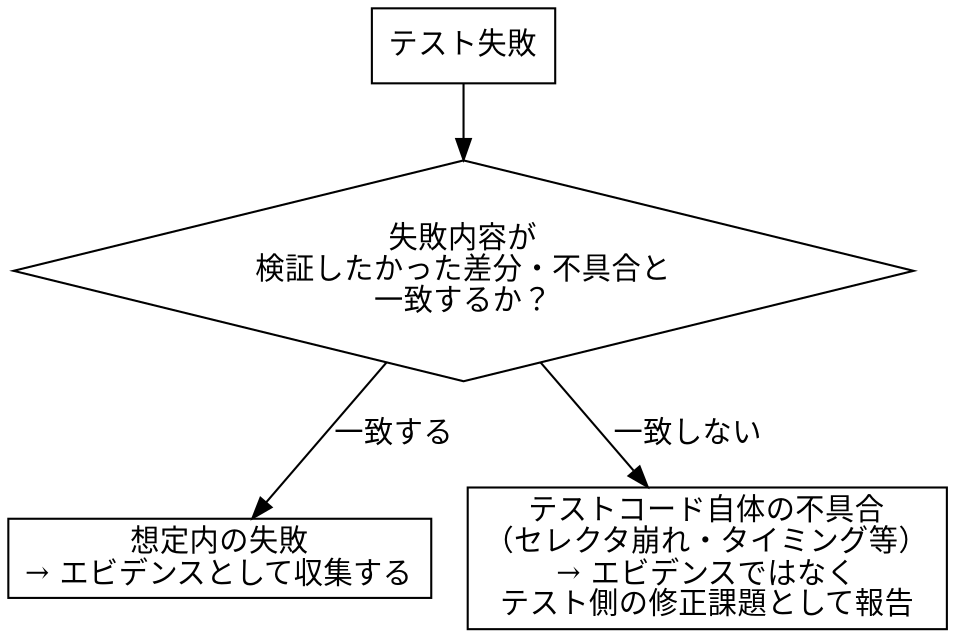

# capturing-playwright-evidence

## Overview

Playwrightのテストコードを実行すると、テスト自身が本物の画面を操作してスクリーンショット・トレースを生成する。このスキルは、その実行結果を「証明すべき観点」ごとに整理し、目視確認・完全性ゲートを経てローカルにそのまま保存・受け渡しできる形にする。C-HUB等のタスク管理システムへの依存を持たない。

## When to Use

- Playwrightのテストコード（`campus-playwright`が生成したもの等）を実行し、その結果をエビデンスとして収集・整理し、C-HUBに依存せずローカルに保存・受け渡ししたいとき

**対象外（別スキルの領域）：**
- Playwright MCPでその場でライブ操作しながら撮影すること → `chub-capture-evidence`
- テストコード自体の生成 → `campus-playwright`
- C-HUBへの投稿 → `chub-post-evidence`
- 現行版・新版の差分判定 → `capi-regression-test`
- テストコードの中身（何を検証するか）の設計

## Core Pattern

**Before**：`chub-capture-evidence`を流用しようとすると、タスクID必須・差し戻し理由確認・`task_progress.py`連携などC-HUB前提の手順が邪魔になり、C-HUBに紐づかない文脈では使えない。

**After**：撮影のノウハウ（観点先出し、条件一致、el-dialog撮影、目視確認ゲート、完全性ゲート）はそのまま流用しつつ、実行主体をPlaywright MCPのライブ操作からテストコード実行に置き換え、成果物をローカルフォルダ／zipとして受け渡せる形にする。

**具体例**：`campus-playwright`が生成したポータル画面のテスト（`portal.spec.ts`）を`npx playwright test`で実行すると、`test-results/`配下にスクリーンショット・トレースが生成される。これを`evidence/<セッションラベル>_<timestamp>/e2e-evidence/Portal/`へ集約し、観点ごとの取得状況を判定表にまとめてzip化する。同じ作業セッションで他の画面（例：`Syllabus`）も実行した場合は、新規に`evidence/syllabus_<timestamp2>/`を作らず、同じ`evidence/<セッションラベル>_<timestamp>/e2e-evidence/Syllabus/`へ追加する。

## 全体フロー

```text
[撮影設定の確認]
  ↓
[テスト実行]
  ↓
[失敗性質の判定]
  ↓
[成果物の収集・命名整理]
  ↓
[撮影直後の目視確認]
  ↓
[完全性ゲート]
  ↓
[保存・受け渡し]
```

## ステップ1 撮影設定の確認

実行前に、対象のテストコード・`playwright.config.ts`を確認し、以下が設定されているかを確認する。

- `page.screenshot()`の明示的な呼び出し、または設定の`screenshot: 'on'`／`'only-on-failure'`
- 必要に応じて`trace: 'on'`／`video: 'on'`

設定されていない場合、実行しても何も撮れずに終わる。実行前に指摘し、追加を提案する。

**「共通ヘルパーがあるから規約は満たされている」と仮定しない。** 撮影ヘルパーの実体（`captureScreenshot`等）を開き、下記の共通ルールが**実際にコードとして実装されているか**を実行前に読んで確認する。2026-09-17、ヘッダー非表示も操作後の待機も実装されていないヘルパーで撮影を進め、規約違反のスクリーンショットを量産した事例がある。

### 撮影ヘルパーが満たすべき共通ルール

共通テンプレートの撮影ヘルパー（`captureScreenshot`等）は、以下の2点を必ず満たす。個別のテストコードで省略しない。

- **ヘッダーを非表示にした状態で撮影する**：スクリーンショット直前に画面上部の固定ヘッダー（ナビゲーション等）を隠してから撮影する（例：対象要素に`display: none`を当ててから撮る、またはヘッダー分をクリップする）
- **あらゆる操作の後に0.2秒待機する**：クリック・入力・タブ切替等、UIを変化させる操作の直後は`page.waitForTimeout(200)`等で0.2秒待ってから次の処理（次の操作／スクリーンショット撮影）に進む。ダイアログの開閉時等、opacityの切り替わりの途中でUIが正しく表示されない状態のまま操作・撮影を進めてしまうことがあるため

これらは撮影ヘルパーに一度組み込めば全テストへ自動的に適用されるべき挙動であり、テストケースごとに個別実装しない。

**アニメーション無効化（`addStyleTag`等）は`page.goto()`の直後に呼ばない。** SPAのルーティングが進行中で「Execution context was destroyed」になる。撮影の直前に呼び、失敗しても撮影自体は続行させる。

### 撮影対象の画面に居ることを撮影前に確認する（必須）

撮影の直前に、**いま撮ろうとしている画面が意図した画面であること**をアサーションで確認する。最低限、次の3つを弾く。

| 弾く対象 | 判定 |
|---|---|
| IdP（OneLogin等）へ飛ばされている | 最終URLのホスト名がIdPのホストを含む |
| アプリの`/login`へ差し戻された | 最終URLのパスが`/login`系にマッチする |
| そもそも別画面に居る | 最終URLのパスが想定パスを含まない |

**`expect(page.locator('body')).toBeVisible()`のような緩いアサーションで済ませてはならない。** 2026-09-17、storageStateが失効していた状態でこの緩いアサーションを使ったため、**OneLoginのログイン画面を撮影したままテストが「成功」した**。エビデンスとして無価値なだけでなく、同じ実行で「画面が操作を1件も発生させなかった」という誤った観測を記録してしまった。

storageStateの寿命は数時間なので、**撮影の直前に認証セットアップを流し直す**（`capi-saml-login`参照）。

## ステップ2 テスト実行

`npx playwright test <対象spec>`等で実行する。実行結果（pass/fail）と、レポート（HTML reporter等）・成果物の出力先を確認する。

### 書き込みを伴う撮影の扱い（非自明な分岐）

完了画面のように、**撮影するために実データの更新や外部への送信（メール等）が必要な画面がある**。撮影の都合で勝手に実行しない。

| 撮影対象 | 扱い |
|---|---|
| 表示のみで到達できる（一覧・詳細・ダイアログの表示・バリデーションエラー表示） | そのまま撮影してよい。バリデーションエラーは登録ボタンを押しても**検証で止まり書き込みが発生しない**ため、発火しないことをアサーションで確認したうえで撮る |
| 書き込みが必要（登録成功後の完了画面等） | **利用者の承認を得てから実行する。** 何が起きるか（更新されるデータ・送信されるメールの通数）を具体的に示して確認を取る。承認が得られない場合は「書き込みを伴うため未撮影」として明記する |

承認を得て実行する場合、入力値は既存の特性テスト（golden-master）と同じ方式に揃える（変更検知を成立させるためのダミー値の付け替え等）。独自の値を入れると、後から実データの状態を追いにくくなる。

## ステップ3 失敗性質の判定（非自明な分岐）

テストが失敗した場合、それが「証拠として価値のある失敗」か「テストコード自体の不具合」かを判定する。



判定を誤ると、前者を「テストが壊れているだけ」として握りつぶし本来価値のある不具合検知を見逃す、あるいは後者を不具合として誤報告する、のいずれかが起きる。

## ステップ4 成果物の収集・命名整理

生成されたスクリーンショット・トレース等は、**1回の作業セッションにつき1つの受け渡し用フォルダ**（例：`evidence/<セッションラベル>_<タイムスタンプ>/`）に集約する。**同じセッション内で複数画面のテストを実行しても、画面ごとに別のトップレベルフォルダ（`evidence/<Screen>_<timestamp>/`を画面数ぶん作る等）を作ってはいけない。** 画面の区別はセッションフォルダの内側のサブフォルダ（`e2e-evidence/<Screen>/`）で行う。ロール・シナリオ・修正前後がペアと分かる命名にする（例：`<screen>_<role>_<シナリオ>.png`）。複数回の実行結果を同じフォルダへ上書きしない。

### セッション内の複数画面・新旧2環境を集約するときの構造（ケースIDは揃える）

セッションフォルダの下は、画面（`<Screen>`）→ケースID、の順で階層化する。新旧比較を伴う場合は画面の上に環境の階層が入る。**環境はフォルダ階層で分け、ケースIDは両環境で同一にする**。

```text
evidence/<セッションラベル>_<timestamp>/
  e2e-evidence/<Screen>/<ケースID>/            ← 単一環境（通常の実行）。同一セッションで複数画面を扱う場合はここに画面ぶん並ぶ
```

```text
evidence/<セッションラベル>_<timestamp>/
  old-ST/e2e-evidence/<Screen>/<ケースID>/    ← 旧版
  new-PT/e2e-evidence/<Screen>/<ケースID>/    ← 新版（ケースIDは旧版と同じ）
```

**ケースIDに`NEW-`のような接頭辞を付けて別フォルダに分けてはいけない。** 環境は既に上位階層で分かれているため接頭辞は冗長で、しかも新旧のケース対応が崩れて突き合わせ（ステップ6）ができなくなる。同じケースフォルダ内で由来の違うファイル名が衝突する場合は、**ファイル名側に接頭辞を付ける**（例：撮影専用パスの出力は`capture-`で始める）。

同じケースフォルダに、もう使っていない過去の変種が残っていないかも確認する（テストを作り替えた後の残骸は削除する）。

**`evidence/`はリポジトリの`.gitignore`に必ず登録する**（対象リポジトリのルート、または`evidence/`が実際に作られる階層の`.gitignore`）。スクリーンショット・トレース・帳票ファイル等の大容量バイナリに加え、ステップ7で確認する機微情報（テストアカウントの個人情報等）が含まれうるため、誤ってコミットされないようにする。収集フォルダを新規作成した時点で`.gitignore`に`evidence/`エントリが無ければ追記する（既にあれば何もしなくてよい）。`orchestrating-capi-screen-verification`が画面単位フォルダへ統合する際も同じ`evidence/`配下に書き込むため、この除外は共通して効く。

## ステップ5 撮影直後の目視確認

収集したスクリーンショットをReadツールで開き、以下を確認する。確認せずに次工程へ進まない。

- 証明したい要素が実際に写っているか
- **UIが実機と同じ見た目になっているか**（ダイアログの位置がずれていないか、オーバーレイが半透明に見える・画面の一部にしか描かれていない等の崩れが無いか）
- **ヘッダーが写り込んでいないか**（撮影ヘルパーのヘッダー非表示が効いているかの確認）
- **opacityの遷移途中の中間状態で撮れていないか**（ダイアログ等が半透明・アニメーション中のまま止まっている場合は、操作後0.2秒待機が効いていない可能性がある）
- （el-dialog等、`overflow: auto/scroll`を持つ要素で内部に隠れている続きがある場合はそれでよい。下記「無理に全体を1枚へ収めようとしない」参照）

### 無理に全体を1枚へ収めようとしない（重要・過去の失敗）

過去、「ページ全体・ダイアログ全体を必ず1枚のスクリーンショットへ収める」ことを優先するあまり、以下のいずれかを行っていた時期があったが、**いずれも実機と異なる崩れた見た目のエビデンスを生み、撮影直後の目視確認を徹底していれば防げたはずの不良エビデンスを量産していた**。今後は行わないこと。

- **禁止1: ダイアログ等が開いた状態で`page.screenshot({ fullPage: true })`を使う。** Element Plusのダイアログ・オーバーレイ（`.el-overlay`/`.el-dialog`）は`position: fixed`で実装されている。Chromiumのfull-page撮影はページを仮想的に引き伸ばして1枚に収めるが、`position: fixed`要素はその引き伸ばしに正しく追従できず、**元のビューポート1画面分の帯にしか描画されない**。結果、その帯の外側では本来オーバーレイの下に隠れているはずのページ本体がそのまま透けて見え、「ダイアログが半透明に見える」「UIがずれている」という崩れたエビデンスになる。ダイアログ等が開いている間は`fullPage`を使わず、現在のビューポートのまま（＝実機で実際に見えている内容そのまま）撮影すること。
- **禁止2: ダイアログの`scrollHeight`に合わせて`page.setViewportSize()`でビューポートを一時的に拡張してから撮影する。** ダイアログ自身の位置やオーバーレイの高さはレンダリング時点のビューポートに基づいて決まるため、リサイズ後にCSSの再計算がレイアウトへ正しく追従せず、ダイアログの位置がずれる・オーバーレイが画面の一部にしか描画されない等、禁止1と同種の崩れが起きる。
- **禁止3: `document.documentElement.style.overflow`や祖先要素の`position`/`transform`/`z-index`をJSで強制的に書き換えてから撮影する（旧版の`window.__prepCapture`）。** ダイアログの中央寄せ・オーバーレイの重なりはこれらのCSSプロパティに依存しているため、書き換えた時点で実機とは別物のレイアウトになる。

**正しい方針**: ダイアログ等が開いている間の撮影は常に「現在のビューポートのまま」（`fullPage`指定なし・ビューポートリサイズなし・CSS書き換えなし）で行う。内部が`overflow:auto/scroll`で続きが隠れている場合、それを1枚で全部見せようとする必要は無い。それが実機でユーザーが実際に目にする見た目であり、無理に全体を見せようとして崩れたエビデンスを作るより、実機相当の見た目のまま部分的に記録するほうが正しい。`frontend/campus/templates/evidence.ts`の`captureScreenshot`（ダイアログが開いていれば自動的にfullPageを使わない）・`captureDialogFullHeight`（名前は歴史的経緯で残っているが、現在はリサイズせず現在のビューポートのまま撮影する）を参照。

## ステップ6 完全性ゲート（非自明な分岐）

証明すべき観点（`campus-playwright`のテストケース表・マニフェスト等）と、実際に収集できたエビデンスを突き合わせ、判定表にまとめる。テストのpass/fail結果だけでは観点の充足は分からない。

| 観点 | エビデンス | 判定 |
|---|---|---|
| 例：教員が担当授業の次の授業を表示 | `portal_instructor_next-lecture.png` | 完全 |
| 例：職員が次の授業ブロックで拒否される | （未取得） | 不完全 |

不完全な観点があれば、原因（撮影設定不足／テスト失敗／目視確認NG）に応じて該当ステップへ戻る。「だいたい揃った」で先に進まない。

### 判定は必ずケース単位で行う（画面単位の合計で判定しない）

**画面ごとのファイル数合計で「揃った」と判断してはならない。** 2026-09-17、画面単位の合計（ST 132 / PT 148）を見て「全画面で両環境のエビデンスが揃った」と報告したが、実際には**ある画面の9ケース全てで新版のスクリーンショットが0枚**だった。合計は別ケースで増えたファイルに吸収されて見えなくなる。

新旧2環境を集約した場合は、**ケースIDごとに両環境のファイル数（特にスクリーンショット枚数）を並べた表**を作って突き合わせる。

| ケース | 旧版(計/png/json) | 新版(計/png/json) | 状態 |
|---|---|---|---|
| KK-001 | 5/1/4 | 3/1/2 | 両方あり |
| KK-002 | 7/2/5 | 0/0/0 | **新版欠落** |

- **png（スクリーンショット）枚数の不一致は必ず理由を書く**。json数の差はPayload統合（旧N操作→新1操作）や保存単位の違いで生じるため一致しなくてよいが、pngの欠落は①画面表示の照合が成立していないことを意味する
- この突き合わせは手作業で目視集計しない。ケースフォルダを走査して表を生成するスクリプトを`scripts/`に置く（`orchestrating-capi-screen-verification`のステップ5でも同じ表を使う）

## ステップ7 保存・受け渡し

- ローカルフォルダにそのまま保存する
- 必要に応じてzip化する（例：`evidence/<シナリオ名>_<timestamp>.zip`）
- **zip化前に、機微情報（テストアカウントの個人情報・パスワード等）がスクリーンショットに写り込んでいないか確認する**

収集・zip化を自動化するスクリプトは`scripts/`配下に別途整備する（本スキル文書には手順のみを記載し、実体はコードとして保守する）。

## Common Mistakes

1. **テスト失敗の性質を確認せず片付ける**：「テストコード自体のバグ」と「想定通り不具合を検知した」を区別せず、前者を後者として誤報告する、または逆に後者を「テストが壊れているだけ」として握りつぶす
2. **撮影設定を確認せず実行し、何も撮れていないことに実行後気づく**：`playwright.config.ts`の設定、テストコード内の明示的な`page.screenshot()`呼び出しの有無を事前に確認しない
3. **収集先を都度変えて成果物が混在・上書きされる**：複数回の実行結果が区別できなくなる
4. **撮影直後の目視確認を省略する**：内容が崩れている・意図と違うスクリーンショットをそのままエビデンスとして扱ってしまう
5. **配布前に機微情報の写り込みを確認しない**：テストアカウントの個人情報等がスクリーンショットに写り込んだままzip化・受け渡ししてしまう
6. **ヘッダーを非表示にせず撮影する**：撮影ヘルパーにヘッダー非表示の処理が入っていないと、全スクリーンショットに固定ヘッダーが写り込んだまま量産されてしまう
7. **操作後の0.2秒待機を省略する**：ダイアログの開閉等、opacityの切り替わり中にスクリーンショットを撮ってしまい、実機とは異なる中間状態（半透明・アニメーション途中）のまま記録してしまう
8. **`evidence/`を`.gitignore`に登録せずコミットしてしまう**：スクリーンショット・トレース・帳票ファイル等の大容量バイナリがリポジトリに混入するうえ、機微情報（テストアカウントの個人情報等）が写り込んだまま履歴に残ってしまう。収集フォルダ作成時に`.gitignore`の登録有無を必ず確認する
9. **完全性を画面単位の合計ファイル数で判定する**：別ケースで増えたファイルに欠落が吸収され、「ある画面の全ケースで新版のスクリーンショットが0枚」という状態を「揃った」と誤報告する（2026-09-17に実際に発生し、利用者から「まだold-STとnew-PTで数が合わない」と指摘された）。判定はケース単位×環境単位で行う（ステップ6「判定は必ずケース単位で行う」）
10. **セッション（storageState）の失効に気づかず、ログイン画面をエビデンスとして撮ってしまう**：`expect(body).toBeVisible()`のような緩いアサーションでは、ログイン画面でもテストが成功してしまう。撮影前に対象画面に居ることを必ず確認する（ステップ1「撮影対象の画面に居ることを撮影前に確認する」）
11. **新版のエビデンスを`NEW-<ケースID>`等の別フォルダへ分けてしまう**：新旧のケース対応が崩れ、突き合わせができなくなる。ケースIDは新旧で同一にし、区別はファイル名の接頭辞または環境フォルダで行う（ステップ4「新旧2環境を集約するときの構造」）
12. **CSSを書き換える撮影前処理（`addStyleTag`等）を`page.goto()`の直後に呼ぶ**：ナビゲーションが完了しきらないうちに評価され「Execution context was destroyed」で落ちる。撮影の直前に呼び、失敗を握って続行できるようにする
13. **同一セッションで複数画面を扱う際、画面ごとに別のevidenceトップフォルダを作ってしまう**：`evidence/portal_<timestamp1>/`・`evidence/syllabus_<timestamp2>/`のように画面数ぶん分かれると、セッション全体を横断した完全性ゲート（ステップ6）・受け渡し（ステップ7）が分断される。セッションにつき1つのトップフォルダにまとめ、画面の区別は内側のサブフォルダ（`e2e-evidence/<Screen>/`）で行う（ステップ4）
