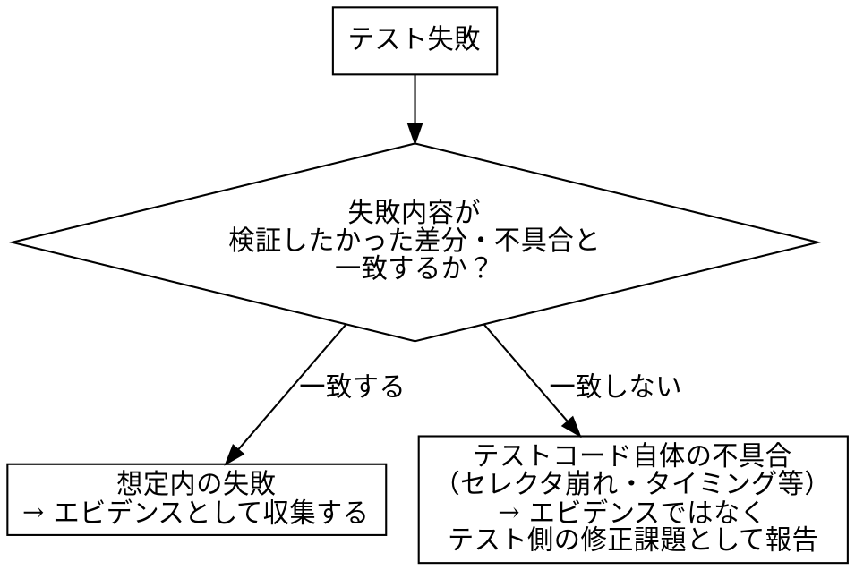

# capturing-playwright-evidence

## Overview

Playwrightのテストコードを実行すると、テスト自身が本物の画面を操作してスクリーンショット・トレースを生成する。このスキルは、その実行結果を「証明すべき観点」ごとに整理し、目視確認・完全性ゲートを経てローカルにそのまま保存・受け渡しできる形にする。C-HUB等のタスク管理システムへの依存を持たない。

## When to Use

- Playwrightのテストコード（`campus-playwright`が生成したもの等）を実行し、その結果をエビデンスとして収集・整理し、C-HUBに依存せずローカルに保存・受け渡ししたいとき

**対象外（別スキルの領域）：**
- Playwright MCPでその場でライブ操作しながら撮影すること → `chub-capture-evidence`
- テストコード自体の生成 → `campus-playwright`
- C-HUBへの投稿 → `chub-post-evidence`
- 現行版・新版の差分判定 → `capi-regression-test`
- テストコードの中身（何を検証するか）の設計

## Core Pattern

**Before**：`chub-capture-evidence`を流用しようとすると、タスクID必須・差し戻し理由確認・`task_progress.py`連携などC-HUB前提の手順が邪魔になり、C-HUBに紐づかない文脈では使えない。

**After**：撮影のノウハウ（観点先出し、条件一致、el-dialog撮影、目視確認ゲート、完全性ゲート）はそのまま流用しつつ、実行主体をPlaywright MCPのライブ操作からテストコード実行に置き換え、成果物をローカルフォルダ／zipとして受け渡せる形にする。

**具体例**：`campus-playwright`が生成したポータル画面のテスト（`portal.spec.ts`）を`npx playwright test`で実行すると、`test-results/`配下にスクリーンショット・トレースが生成される。これを`evidence/portal_<timestamp>/`へ集約し、観点ごとの取得状況を判定表にまとめてzip化する。

## 全体フロー

```text
[撮影設定の確認]
  ↓
[テスト実行]
  ↓
[失敗性質の判定]
  ↓
[成果物の収集・命名整理]
  ↓
[撮影直後の目視確認]
  ↓
[完全性ゲート]
  ↓
[保存・受け渡し]
```

## ステップ1 撮影設定の確認

実行前に、対象のテストコード・`playwright.config.ts`を確認し、以下が設定されているかを確認する。

- `page.screenshot()`の明示的な呼び出し、または設定の`screenshot: 'on'`／`'only-on-failure'`
- 必要に応じて`trace: 'on'`／`video: 'on'`

設定されていない場合、実行しても何も撮れずに終わる。実行前に指摘し、追加を提案する。

### 撮影ヘルパーが満たすべき共通ルール

共通テンプレートの撮影ヘルパー（`captureScreenshot`等）は、以下の2点を必ず満たす。個別のテストコードで省略しない。

- **ヘッダーを非表示にした状態で撮影する**：スクリーンショット直前に画面上部の固定ヘッダー（ナビゲーション等）を隠してから撮影する（例：対象要素に`display: none`を当ててから撮る、またはヘッダー分をクリップする）
- **あらゆる操作の後に0.2秒待機する**：クリック・入力・タブ切替等、UIを変化させる操作の直後は`page.waitForTimeout(200)`等で0.2秒待ってから次の処理（次の操作／スクリーンショット撮影）に進む。ダイアログの開閉時等、opacityの切り替わりの途中でUIが正しく表示されない状態のまま操作・撮影を進めてしまうことがあるため

これらは撮影ヘルパーに一度組み込めば全テストへ自動的に適用されるべき挙動であり、テストケースごとに個別実装しない。

## ステップ2 テスト実行

`npx playwright test <対象spec>`等で実行する。実行結果（pass/fail）と、レポート（HTML reporter等）・成果物の出力先を確認する。

## ステップ3 失敗性質の判定（非自明な分岐）

テストが失敗した場合、それが「証拠として価値のある失敗」か「テストコード自体の不具合」かを判定する。



判定を誤ると、前者を「テストが壊れているだけ」として握りつぶし本来価値のある不具合検知を見逃す、あるいは後者を不具合として誤報告する、のいずれかが起きる。

## ステップ4 成果物の収集・命名整理

生成されたスクリーンショット・トレース等を1つの受け渡し用フォルダ（例：`evidence/<シナリオ名>_<タイムスタンプ>/`）に集約する。ロール・シナリオ・修正前後がペアと分かる命名にする（例：`<screen>_<role>_<シナリオ>.png`）。複数回の実行結果を同じフォルダへ上書きしない。

## ステップ5 撮影直後の目視確認

収集したスクリーンショットをReadツールで開き、以下を確認する。確認せずに次工程へ進まない。

- 証明したい要素が実際に写っているか
- **UIが実機と同じ見た目になっているか**（ダイアログの位置がずれていないか、オーバーレイが半透明に見える・画面の一部にしか描かれていない等の崩れが無いか）
- **ヘッダーが写り込んでいないか**（撮影ヘルパーのヘッダー非表示が効いているかの確認）
- **opacityの遷移途中の中間状態で撮れていないか**（ダイアログ等が半透明・アニメーション中のまま止まっている場合は、操作後0.2秒待機が効いていない可能性がある）
- （el-dialog等、`overflow: auto/scroll`を持つ要素で内部に隠れている続きがある場合はそれでよい。下記「無理に全体を1枚へ収めようとしない」参照）

### 無理に全体を1枚へ収めようとしない（重要・過去の失敗）

過去、「ページ全体・ダイアログ全体を必ず1枚のスクリーンショットへ収める」ことを優先するあまり、以下のいずれかを行っていた時期があったが、**いずれも実機と異なる崩れた見た目のエビデンスを生み、撮影直後の目視確認を徹底していれば防げたはずの不良エビデンスを量産していた**。今後は行わないこと。

- **禁止1: ダイアログ等が開いた状態で`page.screenshot({ fullPage: true })`を使う。** Element Plusのダイアログ・オーバーレイ（`.el-overlay`/`.el-dialog`）は`position: fixed`で実装されている。Chromiumのfull-page撮影はページを仮想的に引き伸ばして1枚に収めるが、`position: fixed`要素はその引き伸ばしに正しく追従できず、**元のビューポート1画面分の帯にしか描画されない**。結果、その帯の外側では本来オーバーレイの下に隠れているはずのページ本体がそのまま透けて見え、「ダイアログが半透明に見える」「UIがずれている」という崩れたエビデンスになる。ダイアログ等が開いている間は`fullPage`を使わず、現在のビューポートのまま（＝実機で実際に見えている内容そのまま）撮影すること。
- **禁止2: ダイアログの`scrollHeight`に合わせて`page.setViewportSize()`でビューポートを一時的に拡張してから撮影する。** ダイアログ自身の位置やオーバーレイの高さはレンダリング時点のビューポートに基づいて決まるため、リサイズ後にCSSの再計算がレイアウトへ正しく追従せず、ダイアログの位置がずれる・オーバーレイが画面の一部にしか描画されない等、禁止1と同種の崩れが起きる。
- **禁止3: `document.documentElement.style.overflow`や祖先要素の`position`/`transform`/`z-index`をJSで強制的に書き換えてから撮影する（旧版の`window.__prepCapture`）。** ダイアログの中央寄せ・オーバーレイの重なりはこれらのCSSプロパティに依存しているため、書き換えた時点で実機とは別物のレイアウトになる。

**正しい方針**: ダイアログ等が開いている間の撮影は常に「現在のビューポートのまま」（`fullPage`指定なし・ビューポートリサイズなし・CSS書き換えなし）で行う。内部が`overflow:auto/scroll`で続きが隠れている場合、それを1枚で全部見せようとする必要は無い。それが実機でユーザーが実際に目にする見た目であり、無理に全体を見せようとして崩れたエビデンスを作るより、実機相当の見た目のまま部分的に記録するほうが正しい。`frontend/campus/templates/evidence.ts`の`captureScreenshot`（ダイアログが開いていれば自動的にfullPageを使わない）・`captureDialogFullHeight`（名前は歴史的経緯で残っているが、現在はリサイズせず現在のビューポートのまま撮影する）を参照。

## ステップ6 完全性ゲート（非自明な分岐）

証明すべき観点（`campus-playwright`のテストケース表・マニフェスト等）と、実際に収集できたエビデンスを突き合わせ、判定表にまとめる。テストのpass/fail結果だけでは観点の充足は分からない。

| 観点 | エビデンス | 判定 |
|---|---|---|
| 例：教員が担当授業の次の授業を表示 | `portal_instructor_next-lecture.png` | 完全 |
| 例：職員が次の授業ブロックで拒否される | （未取得） | 不完全 |

不完全な観点があれば、原因（撮影設定不足／テスト失敗／目視確認NG）に応じて該当ステップへ戻る。「だいたい揃った」で先に進まない。

## ステップ7 保存・受け渡し

- ローカルフォルダにそのまま保存する
- 必要に応じてzip化する（例：`evidence/<シナリオ名>_<timestamp>.zip`）
- **zip化前に、機微情報（テストアカウントの個人情報・パスワード等）がスクリーンショットに写り込んでいないか確認する**

収集・zip化を自動化するスクリプトは`scripts/`配下に別途整備する（本スキル文書には手順のみを記載し、実体はコードとして保守する）。

## Common Mistakes

1. **テスト失敗の性質を確認せず片付ける**：「テストコード自体のバグ」と「想定通り不具合を検知した」を区別せず、前者を後者として誤報告する、または逆に後者を「テストが壊れているだけ」として握りつぶす
2. **撮影設定を確認せず実行し、何も撮れていないことに実行後気づく**：`playwright.config.ts`の設定、テストコード内の明示的な`page.screenshot()`呼び出しの有無を事前に確認しない
3. **収集先を都度変えて成果物が混在・上書きされる**：複数回の実行結果が区別できなくなる
4. **撮影直後の目視確認を省略する**：内容が崩れている・意図と違うスクリーンショットをそのままエビデンスとして扱ってしまう
5. **配布前に機微情報の写り込みを確認しない**：テストアカウントの個人情報等がスクリーンショットに写り込んだままzip化・受け渡ししてしまう
6. **ヘッダーを非表示にせず撮影する**：撮影ヘルパーにヘッダー非表示の処理が入っていないと、全スクリーンショットに固定ヘッダーが写り込んだまま量産されてしまう
7. **操作後の0.2秒待機を省略する**：ダイアログの開閉等、opacityの切り替わり中にスクリーンショットを撮ってしまい、実機とは異なる中間状態（半透明・アニメーション途中）のまま記録してしまう
