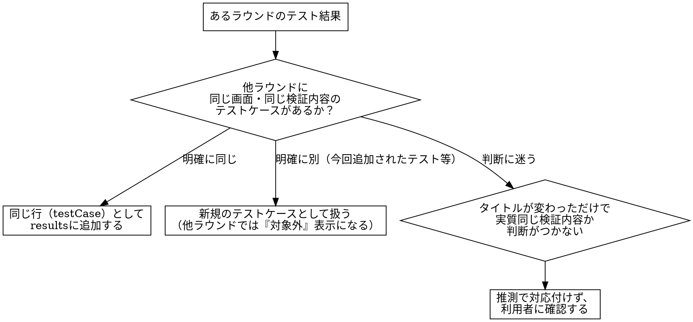

# comparing-evidence-rounds

## Overview

修正が入るたびに再実行したPlaywrightのエビデンス（スクリーンショット・テスト結果のpass/fail）を、画面・テストケース単位に整理し、ラウンドをまたいだ新旧比較（1回目→2回目→3回目…）ができる1枚の静的HTMLにまとめ、顧客にそのまま提出できる形にする。

テストケースの「同一性」（=どのラウンドのどのスクリーンショットが同じテストケースの結果か）は、**ファイル名の命名規則には依存しない**。Playwrightのテスト結果（レポート・タイトル階層）や、テストケースの意味内容を人が読んで判断するのと同じやり方で、Claude自身が対応付ける。命名規則が守られていない・撮影者によって揺れている状況でも成立させることが本スキルの狙いである。

## When to Use

- ラウンドごとのエビデンスフォルダ（例: `evidence/round1/`, `round2/`, `round3/`）が揃っており、「1回目→2回目→3回目でどう改善したか」を画面別・テストケース別に示すHTMLを顧客に提出したいとき

**対象外（別スキルの領域）：**
- エビデンス自体の撮影・収集 → `capturing-playwright-evidence`（本スキルはその後工程。まずそちらでラウンドごとのフォルダを作ってから使う）
- テストコード自体の生成 → `campus-playwright`
- 現行実装／新実装（campus専用API移行）の一致判定そのもの（「一致／意図した差分／要確認」の判定ロジック） → `capi-regression-test`。本スキルが扱う「新旧比較」は**同じテストを複数回実行した際のラウンド間比較**（修正の効果検証）であり、実装バージョン間の差分判定ではない
- 単発の修正検証を1回だけ社内向けにArtifactとして出すもの → `test-verify` / `uat-verify`（あちらは1修正=1回のレポート。本スキルは同じテストケースを複数ラウンド並べて比較する）

**REQUIRED SUB-SKILL: capturing-playwright-evidence** — 各ラウンドのスクリーンショット・テスト結果を撮影・収集する部分は、このスキルに委譲する。本スキルは収集済みのフォルダを入力として受け取るところから始まる。

## Core Pattern

**Before**：ラウンドごとのスクリーンショットフォルダがただ積み上がるだけで、顧客は「これは1回目と2回目のどちらの、どのテストケースの結果か」をファイル名から自力で読み解く必要があった。撮影者や状況によってファイル名の付け方は揺れる。

**After**：各ラウンドのテスト結果（Playwrightレポート、または人が読んで判断するテストケースの内容）をもとに、同じテストケースをラウンドをまたいで対応付け、画面ごとに区切られたセクション内に「1回目｜2回目｜3回目」を横並びで見せる。OK/NGを問わず全スクリーンショットを添付し、判定はPlaywrightのテスト結果のpass/failをそのまま使う。

**具体例**：`portal.spec.ts`をround1/round2/round3で3回実行した結果を渡すと、「ポータル画面」セクション内に「教員:担当授業の次の授業表示」というテストケースの行ができ、1回目NG（スクリーンショット付き）→2回目NG→3回目OKと3列で並ぶ。同じテストケースが存在しないラウンドがあれば「対象外（このラウンドでは未実施）」と明示される。

## マニフェストの形式

本スキルの中核は、Claudeが各ラウンドのエビデンスを読んで下記の`manifest.json`を組み立てることである。HTML生成スクリプトはこのJSONを機械的にレンダリングするだけで、画面・テストケースの意味的な対応付けの判断は行わない。

```json
{
  "title": "ポータル画面 改修エビデンス報告",
  "customer": "〇〇大学 御中",
  "generatedAt": "2026-09-14",
  "rounds": ["1回目 (2026-09-01)", "2回目 (2026-09-05)", "3回目 (2026-09-10)"],
  "screens": [
    {
      "screen": "ポータル画面",
      "testCases": [
        {
          "name": "教員:担当授業の次の授業表示",
          "note": "任意。テストケースの補足説明",
          "results": [
            { "round": 0, "status": "NG", "screenshot": "round1/portal_instructor.png", "note": "次の授業が表示されない" },
            { "round": 1, "status": "NG", "screenshots": ["round2/portal_instructor_1.png", "round2/portal_instructor_2.png"] },
            { "round": 2, "status": "OK", "screenshot": "round3/portal_instructor.png" }
          ]
        }
      ]
    }
  ]
}
```

- `rounds`：ラウンドのラベル一覧。`results[].round`はこの配列のインデックス（0始まり）
- `results`：そのラウンドで実施していない場合は配列に要素を入れない（自動的に「対象外」と表示される。存在しないのに`status: "pending"`を無理に作らない）
- `status`：`OK`/`NG`（大文字小文字は問わない。`pass`/`fail`等の表記も同じ意味として扱われる）
- `screenshot`（単数）と`screenshots`（複数）はどちらも使える。1テストケース・1ラウンドで複数枚（操作前後、複数ステップ等）ある場合は`screenshots`配列に**OK/NGを問わず全て**入れる
- 画像パスは`manifest.json`のあるディレクトリからの相対パスとして解決される

## 全体フロー

```text
[ラウンドフォルダの確認]
  ↓
[各ラウンドのテスト結果の把握]
  ↓
[テストケースの同一性判定（非自明な分岐）]
  ↓
[マニフェストJSONの作成]
  ↓
[HTML生成（スクリプト実行）]
  ↓
[目視確認・受け渡し]
```

## ステップ1 ラウンドフォルダの確認

利用者から、比較したいラウンド分のエビデンスフォルダ（`evidence/round1/`, `round2/`, `round3/`等。名称・階層は問わない）を受け取る。各フォルダの中身をGlob/Readで一通り確認し、以下を把握する。

- スクリーンショット一式（`.png`/`.jpg`等）
- Playwrightのテスト結果（`playwright-report/`のJSON、`test-results.json`、HTMLレポート等）が残っているか
- `capturing-playwright-evidence`が作る判定表（完全性ゲートの表）が残っていればそれも参照する

ラウンドの順序（どれが1回目でどれが3回目か）は、フォルダ名・タイムスタンプ・利用者への確認のいずれかで確定させる。憶測で決め打ちしない。

## ステップ2 各ラウンドのテスト結果の把握

各ラウンドについて、テストケースごとのOK/NGを次の優先順位で確認する。

1. **Playwrightのテスト結果（JSON/HTMLレポート）があればそれを正とする**：`status`（`passed`/`failed`等）をそのままOK/NGに変換する。テストの見出し階層（describe＝画面、test＝テストケース）がそのまま画面・テストケース名の手がかりになる
2. **レポートが無い場合**：スクリーンショットを実際にReadツールで開いて内容を確認し、画面名・テストケースの内容・OK/NGを人が判断するのと同じやり方で判断する。ファイル名はヒントとして使ってよいが、それだけで機械的に断定しない
3. どちらの手段でも判断がつかない場合（画面が何か分からない、OK/NGの根拠が読み取れない等）は、推測で埋めずに利用者に確認する

## ステップ3 テストケースの同一性判定（非自明な分岐）

複数ラウンドの結果を「同じテストケース」として並べてよいかどうかは、テストの見出し・検証内容の一致で判断する。ファイル名の一致・不一致だけで判定しない（命名規則は前提にしない）。



ラウンドを重ねる中でテストケースが増える（新しい観点を追加した）・減る（撮影対象外にした）ことは自然に起こる。無理に全ラウンド同じ本数に揃えようとせず、無い場合は素直に「対象外」として表示する。

## ステップ4 マニフェストJSONの作成

ステップ2・3で確定した内容を、上記スキーマに従って`manifest.json`として書き出す（Writeツール）。置き場所はエビデンスフォルダの親ディレクトリ等、各ラウンドのスクリーンショットへの相対パスが解決できる場所にする。

- `title`・`customer`は利用者に確認する（未指定なら画面名から妥当な仮タイトルを付け、後で確認を促す）
- OK/NGを問わず、そのラウンドで撮影された全スクリーンショットを`screenshot`/`screenshots`に含める（NGだったスクリーンショットを「見せたくないから」と省略しない。要件上、全件添付が前提）

## ステップ5 HTML生成（スクリプト実行）

```bash
node <このスキルのディレクトリ>/scripts/generate-report.js <manifest.jsonのパス> <出力先.html>
```

- 既定では画像をbase64埋め込みし、**1ファイルで完結する静的HTML**を生成する（メール添付等でそのまま渡せる）
- スクリーンショット枚数が多くファイルサイズが大きくなりすぎる場合は`--link`オプションを付ける。この場合、出力先と同じディレクトリに`assets/`が作られ、HTMLは相対パス参照になる（この場合はHTMLファイル単体ではなく`assets/`ごとzip化して渡す）
- 存在しないスクリーンショットパスがあれば、生成時に警告（`WARN: screenshot not found`）が出るので、そのまま無視せずmanifest.jsonのパスを確認する

## ステップ6 目視確認・受け渡し

生成したHTMLをブラウザ（またはReadツールで構造を）確認し、以下をチェックする。

- 全ての画面・テストケースが意図通りグルーピングされているか
- OK/NGのラベルが実際のテスト結果と一致しているか（特にNGのケースを誤ってOKと表示していないか）
- ラウンドを横断して同じテストケースが正しく同じ行に並んでいるか（ステップ3の判定が誤っていないか）
- 機微情報（テストアカウントの個人情報等）がスクリーンショットに写り込んでいないか（`capturing-playwright-evidence`のステップ7と同様の確認）

確認後、HTMLファイル（`--link`使用時は出力ディレクトリ一式）をそのまま顧客への提出物として受け渡す。

## Common Mistakes

1. **ファイル名の命名規則が守られている前提で機械的にマッチングしてしまう**：撮影者やラウンドによって命名が揺れることは普通に起こる。テストの見出し・検証内容で同一性を判断し、ファイル名はあくまでヒントに留める
2. **判断に迷うケースを推測で対応付けてしまう**：タイトルが変わっただけで同じテストケースかどうか判断がつかない場合、勝手に決めずに利用者へ確認する（ステップ3）
3. **NGだったスクリーンショットを報告書から省いてしまう**：要件は「OK/NGを問わず全て添付」。見栄えを気にして失敗時の証跡を削らない
4. **ラウンドを揃えようとして、実施していないラウンドに無理に結果を捏造する**：実施していないラウンドは素直に「対象外」と表示する（`results`に要素を追加しない）。存在しないテスト結果をでっち上げない
5. **base64埋め込みでファイルサイズが膨大になっていることに気づかず渡してしまう**：スクリーンショット枚数が多い案件では生成後にファイルサイズを確認し、大きすぎる場合は`--link`モードに切り替える
6. **スクリーンショットに機微情報が写り込んだまま提出してしまう**：受け渡し前に必ず目視確認する（ステップ6）
