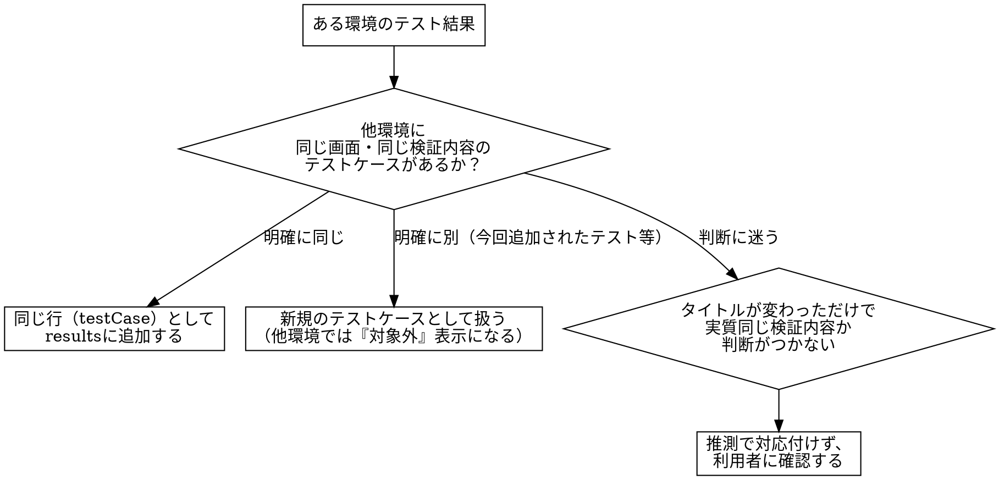

# comparing-evidence-rounds

## Overview

同じテストコードをST（旧版）／PT（新版）、old-ST／new-PTのように異なる環境・実装バージョンに対して実行した結果を、画面・テストケース単位に整理し、複数の「列」を横並びで比較できる1枚の静的HTMLにまとめ、顧客にそのまま提出できる形にする。この場合の「OK/NG」は本スキル自身が判定を下すのではなく、**すでに下された判定（capi-regression-testの成果物や、画面回帰テストのpass/fail、もしくは利用者からの指示）をそのまま転記する**ことに徹する（詳細はステップ2参照）。

**廃止（2026-09-25）：** 修正のたびに再実行したエビデンス（1回目→2回目→3回目…の時系列ラウンド比較）で改善経過を示す運用は廃止した。今後は最終のテスト結果のみを収集・提出すればよく、本スキルは新旧環境（ST/PT等）比較の用途にのみ使う。マニフェスト上は列を`rounds`という配列名で扱うが、これは新旧環境比較でも同じ形式・同じHTML生成をそのまま流用するための歴史的な名残であり、時系列ラウンドを意味するものではない。

テストケースの「同一性」（=どの列のどのスクリーンショットが同じテストケースの結果か）は、**ファイル名の命名規則には依存しない**。Playwrightのテスト結果（レポート・タイトル階層）や、テストケースの意味内容を人が読んで判断するのと同じやり方で、Claude自身が対応付ける。命名規則が守られていない・撮影者によって揺れている状況でも成立させることが本スキルの狙いである。

## When to Use

- 新旧環境（ST/PT、old-ST/new-PT等）のエビデンスフォルダが揃っており、画面ごとに新旧を横並びで見せたいとき（判定自体は`capi-regression-test`等ですでに完了している前提。本スキルはその可視化を担当する）

**対象外（別スキルの領域）：**
- 修正のたびの時系列ラウンド比較（1回目→2回目→3回目…）で改善経過を示すもの → 廃止済み。最終のテスト結果のみを`capturing-playwright-evidence`で収集・提出すればよい
- エビデンス自体の撮影・収集 → `capturing-playwright-evidence`（本スキルはその後工程。まず環境ごとのフォルダを作ってから使う）
- テストコード自体の生成 → `campus-playwright`
- 現行実装／新実装（campus専用API移行）の**一致判定ロジックそのもの**（「一致／意図した差分／要確認」をゼロから判定する作業） → `capi-regression-test`。本スキルは新旧環境を並べて見せることはできるが、判定自体（あるケースをOK扱いにするかNG扱いにするか）は`capi-regression-test`の成果物（`COMPLETENESS_GATE.md`・`REGRESSION_DIFF_JUDGEMENT.md`等）や利用者の指示を情報源とし、本スキル独自の判定基準を新たに作らない（ステップ2参照）
- 単発の修正検証を1回だけ社内向けにArtifactとして出すもの → `test-verify` / `uat-verify`（あちらは1修正=1回のレポート。本スキルは同じテストケースを複数列並べて比較する）

**REQUIRED SUB-SKILL: capturing-playwright-evidence** — 各環境のスクリーンショット・テスト結果を撮影・収集する部分は、このスキルに委譲する。本スキルは収集済みのフォルダを入力として受け取るところから始まる。

## Core Pattern

**Before**：新旧環境ごとのスクリーンショットフォルダがただ積み上がるだけで、顧客は「これはST（旧版）とPT（新版）のどちらの、どのテストケースの結果か」をファイル名から自力で読み解く必要があった。撮影者や状況によってファイル名の付け方は揺れる。

**After**：各環境のテスト結果（Playwrightレポート、または人が読んで判断するテストケースの内容）をもとに、同じテストケースを環境をまたいで対応付け、画面ごとに区切られたセクション内に「ST（旧版）｜PT（新版）」を横並びで見せる。OK/NGを問わず全スクリーンショットを添付し、判定は`capi-regression-test`等で既に下された判定をそのまま転記する。

**具体例**：`portal.spec.ts`をold-ST環境／new-PT環境で実行した結果を渡すと、「ポータル画面」セクション内に「教員:担当授業の次の授業表示」というテストケースの行ができ、ST（スクリーンショット付き・OK）｜PT（スクリーンショット付き・OK）と2列で並ぶ。同じテストケースが存在しない環境があれば「対象外（この環境では未実施）」と明示される。

## マニフェストの形式

本スキルの中核は、Claudeが各環境のエビデンスを読んで下記の`manifest.json`を組み立てることである。HTML生成スクリプトはこのJSONを機械的にレンダリングするだけで、画面・テストケースの意味的な対応付けの判断は行わない。

```json
{
  "title": "ポータル画面 新旧環境比較エビデンス報告",
  "customer": "〇〇大学 御中",
  "generatedAt": "2026-09-14",
  "rounds": ["ST環境（旧版）", "PT環境（新版）"],
  "screens": [
    {
      "screen": "ポータル画面",
      "testCases": [
        {
          "name": "教員:担当授業の次の授業表示",
          "note": "任意。テストケースの補足説明",
          "results": [
            { "round": 0, "status": "OK", "screenshot": "old-ST/portal_instructor.png" },
            { "round": 1, "status": "OK", "screenshot": "new-PT/portal_instructor.png" }
          ]
        }
      ]
    }
  ]
}
```

- `rounds`：列のラベル一覧。`results[].round`はこの配列のインデックス（0始まり）。名称は`"ST環境（旧版）"`, `"PT環境（新版）"`等、新旧環境比較であることが分かるものにする。列数も2列に限らず3列以上でも構わない（3環境以上を並べる場合等）
- `results`：そのラウンドで実施していない場合は配列に要素を入れない（自動的に「対象外」と表示される。存在しないのに`status: "pending"`を無理に作らない）
- `status`：`OK`/`NG`（大文字小文字は問わない。`pass`/`fail`等の表記も同じ意味として扱われる）
- `screenshot`（単数）と`screenshots`（複数）はどちらも使える。1テストケース・1ラウンドで複数枚（操作前後、複数ステップ等）ある場合は`screenshots`配列に**OK/NGを問わず全て**入れる
- 画像パスは`manifest.json`のあるディレクトリからの相対パスとして解決される

## 全体フロー

```text
[環境フォルダの確認]
  ↓
[各環境のテスト結果の把握]
  ↓
[テストケースの同一性判定（非自明な分岐）]
  ↓
[マニフェストJSONの作成]
  ↓
[HTML生成（スクリプト実行）]
  ↓
[目視確認・受け渡し]
```

## ステップ1 環境フォルダの確認

利用者から、比較したい列の数だけエビデンスフォルダ（`evidence/old-ST/`, `new-PT/`等。名称・階層は問わない）を受け取る。各フォルダの中身をGlob/Readで一通り確認し、以下を把握する。

- スクリーンショット一式（`.png`/`.jpg`等）
- Playwrightのテスト結果（`playwright-report/`のJSON、`test-results.json`、HTMLレポート等）が残っているか
- `capturing-playwright-evidence`が作る判定表（完全性ゲートの表）が残っていればそれも参照する

どの環境がST（旧版）でどれがPT（新版）か等の対応は、フォルダ名・利用者への確認のいずれかで確定させる。憶測で決め打ちしない。

`orchestrating-capi-screen-verification`や`capi-regression-test`が生成した以下のような構造になっていることが多い。まずこれらの有無を確認する。

- `<label>_<timestamp>/old-ST/e2e-evidence/` と `<label>_<timestamp>/new-PT/e2e-evidence/`（環境ごとにスクリーンショットフォルダが分かれている）
- `collection-summary.json`（どの環境がどのルートから収集されたかのメタ情報）
- `COMPLETENESS_GATE.md`（画面回帰テストケース単位でST/PTそれぞれのpass/fail一覧表）
- `REGRESSION_DIFF_JUDGEMENT.md`（①画面表示／②内部データの差異を「一致／意図した差分／要確認」に分類した結論）

これらが揃っている場合、判定作業（一致／意図した差分／要確認の分類）はすでに完了済みの成果物として扱い、本スキルはその結論を転記・可視化するだけに徹する（ステップ2参照）。分類がまだ無い場合は、本スキルの範囲外（`capi-regression-test`）であることを利用者に伝え、勝手に分類を新設しない。

## ステップ2 各環境のテスト結果の把握

各環境について、テストケースごとのOK/NGを次の優先順位で確認する。

1. **Playwrightのテスト結果（JSON/HTMLレポート）があればそれを正とする**：`status`（`passed`/`failed`等）をそのままOK/NGに変換する。テストの見出し階層（describe＝画面、test＝テストケース）がそのまま画面・テストケース名の手がかりになる
2. **レポートが無い場合**：スクリーンショットを実際にReadツールで開いて内容を確認し、画面名・テストケースの内容・OK/NGを人が判断するのと同じやり方で判断する。ファイル名はヒントとして使ってよいが、それだけで機械的に断定しない
3. どちらの手段でも判断がつかない場合（画面が何か分からない、OK/NGの根拠が読み取れない等）は、推測で埋めずに利用者に確認する

**追加ルール：** golden-masterのテストコードは1つで新旧両環境に対して実行されることが多く、その際「テストの内部データ検証（②）が新Payload形状に未対応で機械的に失敗しているだけで、画面の見た目（①）は新旧で一致している」というケースが起こる（campus-api移行のようなAPI刷新で典型的）。この場合、生のpass/fail をそのまま転記すると「画面が壊れている」という誤った印象を与える。

- `COMPLETENESS_GATE.md`・`REGRESSION_DIFF_JUDGEMENT.md`のような判定済み成果物がある場合は、**そこに記載された①（画面表示）の判定を優先してOK/NGを決める**。生のtest pass/failだけで機械的に決めない
- 新環境側でgolden-masterがスクリーンショット撮影前に停止している（新環境のエビデンスフォルダにそのケースの画像が無い）場合、`capture-`接頭辞など撮影専用パスで別途取得された画像が無いか探す。判定済み成果物がその画像を①の根拠として使っている場合は、本スキルの`screenshot`にも同じ画像を使う
- test自体はNG（生のpass/fail上は失敗）だが画面表示は一致と判定されている場合、`status`は判定済み成果物に従って`OK`とし、`note`に「golden-masterの内部データ検証は◯◯という理由で新Payloadに未対応のため失敗扱いだが、画面表示は◯◯で新旧一致を確認済み」のように機械的pass/failとの食い違いの理由を必ず書く（黙って上書きしない）
- 判定済み成果物が無く、生のpass/failと実際の画面表示のどちらを優先すべきか自分で判断がつかない場合は、推測せず利用者に確認する（本スキルは新規に判定基準を作らない。ステップ1参照）

## ステップ3 テストケースの同一性判定（非自明な分岐）

複数環境の結果を「同じテストケース」として並べてよいかどうかは、テストの見出し・検証内容の一致で判断する。ファイル名の一致・不一致だけで判定しない（命名規則は前提にしない）。


```dot
digraph matching {
    entry [label="ある環境のテスト結果", shape=box];
    sameTitle [label="他環境に\n同じ画面・同じ検証内容の\nテストケースがあるか？", shape=diamond];
    align [label="同じ行（testCase）として\nresultsに追加する", shape=box];
    newCase [label="新規のテストケースとして扱う\n（他環境では『対象外』表示になる）", shape=box];
    unclear [label="タイトルが変わっただけで\n実質同じ検証内容か\n判断がつかない", shape=diamond];
    ask [label="推測で対応付けず、\n利用者に確認する", shape=box];

    entry -> sameTitle;
    sameTitle -> align [label="明確に同じ"];
    sameTitle -> unclear [label="判断に迷う"];
    sameTitle -> newCase [label="明確に別（今回追加されたテスト等）"];
    unclear -> ask;
}
```

環境によってテストケースの本数が増減する（新しい観点を追加した・撮影対象外にした等）ことは自然に起こる。無理に全環境同じ本数に揃えようとせず、無い場合は素直に「対象外」として表示する。

## ステップ4 マニフェストJSONの作成

ステップ2・3で確定した内容を、上記スキーマに従って`manifest.json`として書き出す（Writeツール）。置き場所はエビデンスフォルダの親ディレクトリ等、各環境のスクリーンショットへの相対パスが解決できる場所にする。

- `title`・`customer`は利用者に確認する（未指定なら画面名から妥当な仮タイトルを付け、後で確認を促す）
- OK/NGを問わず、その環境で撮影された全スクリーンショットを`screenshot`/`screenshots`に含める（NGだったスクリーンショットを「見せたくないから」と省略しない。要件上、全件添付が前提）

## ステップ5 HTML生成（スクリプト実行）

```bash
node <このスキルのディレクトリ>/scripts/generate-report.js <manifest.jsonのパス> <出力先.html>
```

- 既定では画像をbase64埋め込みし、**1ファイルで完結する静的HTML**を生成する（メール添付等でそのまま渡せる）
- スクリーンショット枚数が多くファイルサイズが大きくなりすぎる場合は`--link`オプションを付ける。この場合、出力先と同じディレクトリに`assets/`が作られ、HTMLは相対パス参照になる（この場合はHTMLファイル単体ではなく`assets/`ごとzip化して渡す）
- 存在しないスクリーンショットパスがあれば、生成時に警告（`WARN: screenshot not found`）が出るので、そのまま無視せずmanifest.jsonのパスを確認する

## ステップ6 目視確認・受け渡し

生成したHTMLをブラウザ（またはReadツールで構造を）確認し、以下をチェックする。

- 全ての画面・テストケースが意図通りグルーピングされているか
- OK/NGのラベルが実際のテスト結果と一致しているか（特にNGのケースを誤ってOKと表示していないか）
- 環境を横断して同じテストケースが正しく同じ行に並んでいるか（ステップ3の判定が誤っていないか）
- 機微情報（テストアカウントの個人情報等）がスクリーンショットに写り込んでいないか（`capturing-playwright-evidence`のステップ7と同様の確認）

確認後、HTMLファイル（`--link`使用時は出力ディレクトリ一式）をそのまま顧客への提出物として受け渡す。

## Common Mistakes

1. **ファイル名の命名規則が守られている前提で機械的にマッチングしてしまう**：撮影者や環境によって命名が揺れることは普通に起こる。テストの見出し・検証内容で同一性を判断し、ファイル名はあくまでヒントに留める
2. **判断に迷うケースを推測で対応付けてしまう**：タイトルが変わっただけで同じテストケースかどうか判断がつかない場合、勝手に決めずに利用者へ確認する（ステップ3）
3. **NGだったスクリーンショットを報告書から省いてしまう**：要件は「OK/NGを問わず全て添付」。見栄えを気にして失敗時の証跡を削らない
4. **環境を揃えようとして、実施していない環境に無理に結果を捏造する**：実施していない環境は素直に「対象外」と表示する（`results`に要素を追加しない）。存在しないテスト結果をでっち上げない
5. **base64埋め込みでファイルサイズが膨大になっていることに気づかず渡してしまう**：スクリーンショット枚数が多い案件では生成後にファイルサイズを確認し、大きすぎる場合は`--link`モードに切り替える
6. **スクリーンショットに機微情報が写り込んだまま提出してしまう**：受け渡し前に必ず目視確認する（ステップ6）
7. **新旧環境比較で、golden-masterの生のpass/failをそのままOK/NGに転記してしまう**：campus-api移行のようなAPI刷新では、テストの内部データ検証（②）だけが新Payload形状に未対応で機械的に失敗し、画面表示（①）自体は新旧一致していることがよくある。`COMPLETENESS_GATE.md`・`REGRESSION_DIFF_JUDGEMENT.md`等の判定済み成果物があればそちらの①判定を優先し、生のpass/failと食い違う理由を`note`に明記する（ステップ2）
8. **新環境側でgolden-masterが撮影前に停止しているのに気づかず、スクリーンショット無しのまま報告してしまう**：`capture-`接頭辞等、撮影専用パスで別途取得された画像が無いか探す（ステップ1・2）
