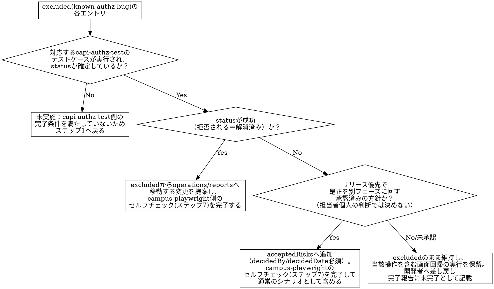

# orchestrating-capi-screen-verification

## Overview

capi-changesが完了した画面は、`capi-authz-test`（認可検証）と`campus-playwright`（新旧比較回帰）の両方を通す必要があるが、両者は独立したスキルとして別々に起動されるため、素朴に並べて実行するだけでは橋渡しが漏れる。特に、`campus-playwright`のマニフェストが既知の認可不具合を`excluded`（`reason: known-authz-bug`）として抱えている画面では、その不具合が**今回のcapi-changesで実際に解消されたか**を`capi-authz-test`の実行結果でしか確認できない。解消済みなら通常の`operations`へ格上げすべきだし、未解消でリリースを優先するなら`acceptedRisks`として承認記録付きで含めるべきだが、どちらも`campus-playwright`単体では判断できない。

**このスキルの核心は、実行順序を「`capi-authz-test`を先に完走させ、その結果を`campus-playwright`のマニフェスト判断へ反映してから画面回帰を実行する」に固定し、両スキルの成果物（`coverage/authz/*.json`・不具合一覧と、screenshot/trace）を画面単位のフォルダへ統合して完全性を確認するところまでを担う**点にある。加えて、画面回帰で検出された新旧差異を「一致／意図した差分／要確認」に分類する工程（`capi-regression-test`）まで通しで実行し、「要確認」に分類された差異を不具合として画面単位の完了報告に含める。各サブスキル自体の検証ロジック・承認フローは変更せず、呼び出す順序と、両者の間で本来つながっているはずの情報（既知不具合の解消状況、検出された差異の分類結果）を確実に橋渡しすることだけに専念する。

## When to Use

- 対象画面のcapi-changes（campus-api移行実装）が完了し、`campus-playwright`の着手前ベースライン（画面マニフェスト・テストコード）も既に存在する状態で、認可検証・画面回帰・エビデンス収集・差異照合を画面単位で一気通貫に実行し、差異を不具合として報告したいとき

**対象外（別スキルの領域）：**
- capi-changes（実装）そのもの
- `campus-playwright`の着手前ベースライン記録（特性テストの新規作成）自体：無ければ案内して停止する（ステップ0）。代わりに実施はしない
- 3点照合の差異分類そのものの判定基準（一致／意図した差分／要確認の切り分けロジック、帳票照合方法等）の変更：`capi-regression-test`側のものをそのまま使う（ステップ5）
- 各サブスキル自体の検証基準・承認手順の変更：本スキルは呼び出し順序と成果物の橋渡し・統合のみを担う

**REQUIRED SUB-SKILL: capi-authz-test** — ロール別・行レベルの認可検証本体（ステップ1）。
**REQUIRED SUB-SKILL: campus-playwright** — 新旧比較回帰の実行本体（ステップ3。ステップ2の反映結果次第でマニフェスト更新〜セルフチェック再実施〜テストコード生成の再実行を伴う）。
**REQUIRED SUB-SKILL: capturing-playwright-evidence** — `campus-playwright`が実行したテスト結果のエビデンス収集（ステップ4）。
**REQUIRED SUB-SKILL: capi-regression-test** — 収集済みエビデンスの新旧突き合わせ・差異分類（ステップ5。対象確定・記録取得に当たる同スキルのステップ1〜3は使わず、突き合わせ・分類・報告に当たるステップ4〜6相当の判定ロジックのみを、ステップ3・4で既に取得済みのエビデンスに対して適用する）。

`capi-saml-login`は上記2スキルがログインを要する場面でそれぞれ内部的に要求するサブスキルであり、本スキルから直接呼び出すことはしない（各スキルの`When to Use`の対象外節・REQUIRED SUB-SKILL宣言に従う）。

## Core Pattern

**Before**：担当者が画面ごとに「`capi-authz-test`を回す」「`campus-playwright`を回す」を別々のタイミング・別々の担当者で実施する。認可の既知不具合（`campus-playwright`マニフェストの`excluded`）が今回のリリースで解消されたのか、リリース優先で先送りされたのかを`campus-playwright`側は知る手段が無く、`excluded`のまま放置される（解消済みなのに検証されない）か、逆に承認記録なしに現状挙動が`operations`へ紛れ込む。認可検証の不具合一覧（`coverage/authz/*.json`）と画面回帰のエビデンス（`evidence/`）も別々の場所に残り、「この画面は検証完了」と画面単位で言える状態を誰も保証できない。

**After**：画面情報を受け取ったら、まず`capi-authz-test`を対象操作について完走させる。その結果（不具合の解消/未解消）を`campus-playwright`マニフェストの`excluded`／`acceptedRisks`判断へ反映し、変更があればセルフチェック（`campus-playwright`ステップ7相当）を完了したうえで画面回帰（`campus-playwright`ステップ9の新旧比較）を実行する。回帰で得られたST・PT双方のエビデンスを`capi-regression-test`の分類ロジックで突き合わせ、「要確認」の差異を不具合として一覧化する。すべての成果物を画面単位フォルダへ統合し、完全性ゲートで抜け漏れを検知してから完了報告する。

**具体例（成績入力画面 `SeisekiInput.vue`）**：`campus-playwright`のマニフェストには、担当授業・登録期間外でも成績を書き込めてしまう既知不具合（`campus-api_設計書.md`5章#7、`capi-authz-test`のCore Patternで扱う不具合そのもの）が`excluded`（`reason: known-authz-bug`）として記載されている。本スキルでは、まず`capi-authz-test`のテストケース`AZ-102`（担当外授業への書き込みが拒否されるか）を実行し、①`成功`（拒否される＝解消済み）なら`excluded`を`operations`へ格上げする変更を提案、②`失敗`（許可されてしまう＝未解消）で、かつリリース優先の方針が承認されているなら`acceptedRisks`へ承認記録付きで追加、③方針が未承認ならその項目を`excluded`のまま維持し画面回帰の実行を保留して開発者へ差し戻す——という三分岐（ステップ2）で判断する。

## 全体フロー

```text
[ステップ0 前提確認]
  ↓
[ステップ1 capi-authz-test 実行]
  ↓
[ステップ2 認可検証結果のマニフェストへの反映判断]
  ↓（保留に該当する項目が無い、または保留を明記した上で進める）
[ステップ3 campus-playwright 新旧比較実行]
  ↓
[ステップ4 capturing-playwright-evidence によるエビデンス収集]
  ↓
[ステップ5 capi-regression-test によるエビデンス照合・差異分類]
  ↓
[ステップ6 画面単位フォルダへの統合・完全性ゲート]
  ↓
[ステップ7 完了報告]
```

## ステップ0 前提確認

画面情報として最低限以下を受け取る。不足があれば起動元に確認する。

| 項目 | 内容 |
|---|---|
| 画面ID | `campus-playwright`のマニフェスト（`coverage/screens/<ScreenId>.json`）を特定するためのID |
| capi-changesの完了状況 | 対象画面の新版実装がPT環境にデプロイ済みか |
| 対象ロール（任意） | 特定ロールに絞りたい場合のみ指定。省略時はマニフェスト・正解表から到達可能な全ロールが対象になる |

以下の前提のうち1つでも満たさないものがあれば、本スキルを開始せず該当スキルの実施を案内して停止する。

| 前提 | 満たさない場合の対応 |
|---|---|
| `coverage/screens/<ScreenId>.json`（`campus-playwright`の着手前ベースラインマニフェスト）が既に存在する | `campus-playwright`（着手前のベースライン記録）を先に実施するよう案内し、本スキルは停止する |
| 対象画面のcapi-changesがPT環境に完了済みである | `capi-authz-test`・`campus-playwright`ステップ9の新旧比較のいずれも実行対象が存在しないため、完了を待つよう案内して停止する |
| 新旧2環境のリポジトリの実パスが分かっている | 下表「リポジトリと環境の対応（実パス）」で確認する。見つからない場合はホームディレクトリだけを探して「存在しない」と断定せず、起動元に所在を確認する |
| テストコードの捕捉条件・期待値が実行対象（旧版／新版）で切り替わる形になっている | 旧版専用のリテラル（操作名・URL・期待文言）が直書きされたままだと、新版実行で全ケースが捕捉失敗する。ステップ3の実行前チェックを参照。満たさない場合は`campus-playwright`ステップ8へ差し戻す |

### リポジトリと環境の対応（実パス）

| 区分 | リポジトリ | 実パス | 環境 | baseURL | env |
|---|---|---|---|---|---|
| 旧版（移行前） | `allcampus` | `C:\Users\roonawa\allcampus` | ST | `https://allcweb3.local.ailesys.co.jp/campus/` | `.env.st` |
| 新版（移行後） | `allcampus-regression` | `D:\allcampus-regression\allcampus-regression` | PT | `https://allcweb2.local.ailesys.co.jp/campus/` | `.env.pt` |

**`allcampus-regression`はホームディレクトリ配下に無い**（別ドライブにある）。ホームディレクトリだけを検索して「リポジトリが存在しない」と断定してはならない。2026-09-17にこの誤断定により、新版リポジトリ側に既に存在していた修正（認可ハーネスの許可リスト対応等）を旧版リポジトリのコピーを見ながら再実装する重複作業が発生した。**共有のハーネス・テンプレートを触る前に、両リポジトリの同名ファイルを必ず比較し、どちらが正（canonical）かを先に決める。**

前提を満たしたら、マニフェストの`operations`／`reports`一覧（画面が呼ぶ操作・帳票エンドポイントの一覧。セルフチェック済みマニフェストに確定済み）に加えて、`excluded`のうち`reason: known-authz-bug`に該当するエントリの対象操作（`target`欄）も対象操作一覧へ含め、`capi-authz-test`ステップ0（対象操作の特定）の入力としてそのまま渡す。

**`excluded(known-authz-bug)`の対象操作を漏らさないこと**：この種のエントリが指す操作は、正常系の記録が無い（`operations`/`reports`のどちらにも登場しない）書き込み系操作であることがある（例：担当外授業への書き込みを拒否できていない`createTblBuseiseki`が、担当内書き込みの正常系シナリオ自体は別途用意されていない場合）。`operations`／`reports`だけを機械的に拾うと、まさにステップ2で判断が必要なその操作が対象一覧から漏れ、ステップ1（`capi-authz-test`実行）でも検証されないまま`hasCase`が永久に「No」になる。`excluded`の`known-authz-bug`エントリは必ず個別に拾い出し、対象操作一覧へ明示的に加える。

これにより、`別紙D1_画面別_呼び出されるAPI一覧.csv`を画面から辿り直す手間を省略できる。

## ステップ1 capi-authz-test 実行

`capi-authz-test`のステップ0〜9を、ステップ0で渡した対象操作一覧に絞って完走させる。ログインは同スキルのREQUIRED SUB-SKILLである`capi-saml-login`に委譲される（本スキルから直接操作しない）。

- 不具合が見つかっても`capi-authz-test`ステップ8の方針どおりその場で修正しない。`status`を失敗として記録し、ステップ9の不具合一覧に含めたまま次へ進む
- `capi-authz-test`の完了条件（対象操作すべてに`coverage/authz/<操作名>.json`が存在し、テストケース・分岐対応がステップ7のセルフチェックを完了している）を満たしたことを確認してからステップ2へ進む

## ステップ2 認可検証結果のマニフェストへの反映判断（非自明な分岐）

ステップ1の結果と、対象画面の`campus-playwright`マニフェストの`excluded`（`reason: known-authz-bug`）を突き合わせ、エントリごとに以下の判断を行う。既知不具合に対応しないエントリ（`dead-code`等の`excluded`、通常の`operations`／`reports`）はこの判断の対象外。



**要点**：
- `hasCase`／`resolved`の判定対象は、当該操作の`coverage/authz/<操作名>.json`内の`testCases`のうち`resolvesKnownIssue: true`が付与されたエントリに限る（`capi-authz-test`ステップ6参照）。該当エントリが複数ある場合、全件の`status`が確定済みであることを`hasCase`の条件とし、全件が成功（拒否）であることを`resolved`の条件とする（1件でも失敗があれば未解消として`riskDecision`へ進む）。`resolvesKnownIssue`が付与されたエントリが1件も無い操作は、対応する認可テストが未設計とみなしステップ1（`capi-authz-test`）へ差し戻す
- 実データ不足によるテスト未確定（`capi-authz-test`側で「未実施（テストデータ準備不可）」等の理由付きで報告された場合）も`hasCase`は`No`としてステップ1へ差し戻す。`capi-authz-test`側は実データが見当たらない場合まずテストデータを用意する方針のため、この差し戻しは通常一時的なもので足踏みにはならない。テストデータ準備自体が困難と報告された場合は、その理由を伴う`No`として本スキルの完了報告（保留扱い）に明記する
- `toOperations`・`toAcceptedRisks`のいずれも、マニフェスト変更は`campus-playwright`ステップ7相当のセルフチェックを完了してから反映する。セルフチェックはチェックリスト全項目の充足を機械的に確認する工程であり、開発者の承認待ちは発生しないがフルオートメーションを理由に省略してはならない
- `holdEntry`（保留）に該当する項目がある画面は、その操作を含む範囲についてステップ3（新旧比較）を実行しない。他の操作に保留が無ければ、保留対象を除いた範囲でステップ3へ進めてよい
- `toOperations`／`toAcceptedRisks`に決まった項目は、`campus-playwright`ステップ8（テストコード生成）でその項目のテストコードが未生成の場合は生成し直す必要がある（マニフェストが変わった以上、対応するテストコードも追従させる）

## ステップ3 campus-playwright 新旧比較実行

ステップ2で`holdEntry`に該当しなかった範囲について、`campus-playwright`ステップ9「新旧比較を伴う実行」（`allcampus`〈ST〉→`allcampus-regression`〈PT〉の順、同一テストコード）を実施する。

- ステップ2でマニフェストを更新した場合は、`campus-playwright`ステップ7（再セルフチェック）→ステップ8（該当シナリオのテストコード生成・更新）→ステップ9（実行）を該当エントリについて再実行する
- `test.skip()`・アサーション緩和でPT側だけを通す対応は`campus-playwright`のCommon Mistakesどおり禁止。失敗は隠さず報告する

### 新版（PT）実行の前に必ず確認する3点

旧版（ST）が全件成功しても、新版（PT）はそのままでは動かない。**PT実行に着手する前に以下を確認する。順序を守らないと、原因の異なる失敗が同時に大量発生して切り分けに時間を取られる**（2026-09-17に24ケース中23ケースが失敗し、うち17ケースが同一の原因だった）。

| # | 確認内容 | 満たさない場合 |
|---|---|---|
| 1 | 捕捉条件・期待値が実行対象で切り替わる形になっているか（旧版専用のリテラルが直書きされていないか） | `campus-playwright`ステップ8へ差し戻す。旧版のリテラルを新版の値で「置き換える」と今度は旧版実行が壊れるため、置き換えではなく実行対象による切り替えにする |
| 2 | 新版のリクエストボディに`operationName`が載っているか（1本だけ実際に覗く） | 載っていなければ捕捉を`extensions.documentId`からの逆引きに変える。`newOperationName`をいくら埋めても捕捉できない（`capi-regression-test`「新版で応答が捕捉できないときに最初に疑うこと」） |
| 3 | 新版環境のセッション（storageState）が当日取得したものか | 期限切れのセッションではログイン画面に着地する。緩いアサーションだとそれでも成功扱いになるため、必ず取り直す（`capi-saml-login`） |

これら3点は**PT実行の1ケースで確認できる**。全ケースを流してから原因を探すのではなく、1ケースを流して切り分けてから全ケースを流す。

## ステップ4 capturing-playwright-evidence によるエビデンス収集

ステップ3で実行したテストの結果を`capturing-playwright-evidence`のステップ1〜7（撮影設定確認・実行・失敗性質の判定・成果物収集・目視確認・完全性ゲート・保存）に従って収集する。`campus-playwright`が独自に撮影を行うわけではなく、このスキルが実行結果からエビデンスを整理する担当であることに注意する。

## ステップ5 capi-regression-test によるエビデンス照合・差異分類

ステップ3（`campus-playwright`ステップ9）・ステップ4（`capturing-playwright-evidence`）で既に取得済みのST（旧版）・PT（新版）双方のエビデンス（画面表示・内部データ・帳票）を、`capi-regression-test`の「帳票（PDF/CSV）照合の方法」「差異判定の手順」（一致／意図した差分／要確認の三分類）にそのまま適用し、対応する操作・シナリオごとに新旧を突き合わせる。

- **`capi-regression-test`のステップ1〜3（対象確定・記録取得）は実行しない**：対象画面・対象操作の確定はステップ0で完了しており、新旧それぞれの記録は既にステップ3・4で取得済みのため、`capi-regression-test`を独立に走らせて記録を重複取得させない。使うのは同スキルのステップ4〜6（突き合わせ・分類・報告）に当たる判定ロジックのみである
- 判定基準（帳票のキー突合せ、0件/空応答時のDB確認、拒否/許可差の設計書照合、Payload設計規則との照合等）は`capi-regression-test`側のものをそのまま使い、緩めない。判断に迷う差異は「要確認」側に倒す（安易に「意図した差分」へ倒さない）
- `campus-playwright`ステップ9でPT側が失敗したケースは、この照合で「意図した差分」（Payload設計規則による削減等）か「要確認」（想定外の欠落・混入、認可のバグ疑い）のいずれかに必ず分類する。「テスト失敗」のまま未分類で次工程へ進まない
- 「要確認」に分類された差異は、対象操作・シナリオID・期待値（ST側の記録内容）・実際の結果（PT側の内容）・根拠を伴う不具合として一覧化する
- ステップ2で`holdEntry`（保留）となり画面回帰自体を実行していない操作は、この照合の対象外（非該当）とする

## ステップ6 画面単位フォルダへの統合・完全性ゲート

`capturing-playwright-evidence`が出力した`evidence/<screen>_<timestamp>/`配下に、ステップ1の認可検証結果（対象操作分の`coverage/authz/*.json`のコピーと、該当する不具合一覧の抜粋）と、ステップ5の差異分類結果（要確認の不具合一覧を含む）を追加し、画面単位で1つの受け渡し用フォルダに統合する。

統合フォルダ内に、ステップ1・ステップ5で検出された不具合を1つにまとめた**不具合報告書**（`evidence/<screen>_<timestamp>/不具合報告.md`）を作成する。

- ステップ1（`capi-authz-test`）で`status`が失敗となったテストケース（対象操作・テストケースID・期待値・実際の結果・根拠コード箇所）
- ステップ5（`capi-regression-test`）で「要確認」に分類された差異（対象操作・シナリオID・期待値・実際の結果・根拠）
- 該当する不具合が1件も無い場合も、「本画面での指摘事項なし」と明記した報告書を作成する（ファイル自体の作成を省略しない）

統合後、マニフェストの`operations`／`reports`／`acceptedRisks`全項目を基準に、以下の完全性ゲートを実施する。「だいたい揃った」で完了報告に進まない。

| 観点 | 確認内容 | 判定 |
|---|---|---|
| 認可検証 | 対象操作に対応する`coverage/authz/*.json`のテストケースが実施済みか（該当が無い操作は非該当） | 完全／不完全／非該当 |
| 画面回帰 | 対象操作に対応するST→PT新旧比較の実行結果（成功/失敗）が記録されているか | 完全／不完全 |
| エビデンス | **テストケース単位で**、ST（旧版）・PT（新版）双方に画面表示のスクリーンショットが存在し、内部データ・帳票（該当する場合）が揃っているか（下記「エビデンスの判定はケース単位×環境単位で行う」） | 完全／不完全 |
| 差異照合 | 画面回帰で検出された差異が「一致／意図した差分／要確認」のいずれかに分類済みか（未分類のまま放置されていないか） | 完全／不完全 |
| 不具合報告書 | ステップ1・5で検出された不具合が漏れなく反映されているか（該当なしの場合もその旨が明記されているか） | 完全／不完全 |
| マニフェスト整合 | ステップ2で決めた反映（`toOperations`/`toAcceptedRisks`/`holdEntry`）が実際のマニフェストに反映されているか | 完全／不完全 |

不完全な観点があれば、原因に応じて該当ステップへ戻る（認可検証の不足はステップ1、画面回帰の不足はステップ3、エビデンスの不足はステップ4、差異照合・不具合報告書の不足はステップ5・6、マニフェスト整合の不足はステップ2）。
### エビデンスの判定はケース単位×環境単位で行う（画面単位の合計で判定しない）

エビデンスの観点だけは、上表を画面単位で1行にまとめて判定してはならない。**テストケースID×環境（ST/PT）の表を作り、スクリーンショット枚数を並べて突き合わせる。**

| ケース | ST(計/png/json) | PT(計/png/json) | 状態 |
|---|---|---|---|
| KK-001 | 5/1/4 | 3/1/2 | 両方あり |
| KK-002 | 7/2/5 | 0/0/0 | **PT欠落** |

- 画面単位のファイル数合計は、別ケースで増えたファイルが欠落を吸収するため使えない。2026-09-17に合計（ST 132 / PT 148）を見て「全画面で両環境のエビデンスが揃った」と報告したが、実際にはある画面の9ケース全てでPT側のスクリーンショットが0枚だった（利用者から指摘を受けて判明）
- json数の新旧不一致は許容する（旧N操作→新1操作の統合等で必然的に変わる）。**pngの欠落は許容しない**——欠落は画面表示の照合が成立していないことを意味する
- この表は目視集計せず、ケースフォルダを走査して生成するスクリプトで作る（手作業の集計は、まさにこの見落としが起きた工程である）
- 欠落ケースの撮影に書き込み（実データ更新・メール送信等）が伴う場合は、`capturing-playwright-evidence`の「書き込みを伴う撮影の扱い」に従い承認を得てから実行する。撮れないことを理由に「非該当」へ倒さない

## ステップ7 完了報告

画面単位で以下を報告する。

- ステップ1（`capi-authz-test`）の実施率・不具合一覧
- ステップ2の反映結果（`excluded`→`operations`/`acceptedRisks`へ移した項目、保留〈`holdEntry`〉にした項目とその理由）
- ステップ3（`campus-playwright`新旧比較）の成功/失敗結果（保留により未実施の項目はその旨を明記）
- ステップ5の差異照合結果：「要確認」に分類された不具合一覧（対象操作・シナリオID・期待値・実際の結果・根拠を含む）。「意図した差分」に分類された項目も件数を報告する
- ステップ6の完全性ゲート結果

**完了報告の末尾に、以下2点を必ず明記する（省略しない）**：

- 統合済みエビデンスフォルダへのリンク（`evidence/<screen>_<timestamp>/`の実パス）
- 不具合報告書のパス（`evidence/<screen>_<timestamp>/不具合報告.md`）

口頭の要約だけで済ませ、これらのパス・リンクを示さないまま完了報告としない。受け取った担当者がこの2点から実ファイルへ直接たどり着けることを完了報告の条件とする。

保留（`holdEntry`）、または「要確認」に分類された差異が1件でもある画面は、「検証完了」ではなく「部分完了・要開発者判断」として報告し、完了と誤解されないようにする。

## Quick Reference

| 段階 | 担当スキル | このスキルの役割 |
|---|---|---|
| 認可検証 | `capi-authz-test` | 対象操作を渡して完走させ、結果を受け取る（判断基準は変更しない） |
| 結果の橋渡し | （本スキル固有） | 既知不具合の解消状況をcampus-playwrightマニフェストの判断へ反映する三分岐（ステップ2） |
| 画面回帰 | `campus-playwright`（ステップ9） | 保留項目を除いた範囲で新旧比較を実行させる |
| エビデンス収集 | `capturing-playwright-evidence` | 画面回帰の実行結果を撮影規約どおりに整理させる |
| 差異照合 | `capi-regression-test`（ステップ4〜6相当） | 収集済みエビデンスを新旧突き合わせ、「要確認」の差異を不具合として一覧化させる（対象確定・記録取得は使わない） |
| エビデンス統合 | （本スキル固有） | 認可検証結果・差異分類結果・画面回帰エビデンスを画面単位フォルダへ統合し、完全性ゲートを通す |
| ログイン | `capi-saml-login`（間接） | 上記2スキルが内部で必要時に呼ぶ。本スキルから直接操作しない |

**実行順序が固定である理由**：`campus-playwright`マニフェストの`excluded`（`known-authz-bug`）／`acceptedRisks`の判断は、認可是正が実際に効いているかという事実（`capi-authz-test`の実行結果）に依存する。順序を逆にすると、未確定の判断のまま画面回帰を通してしまい、後から「意図した仕様」か「是正待ちのリスク」か区別できなくなる。

## Common Mistakes

1. **`capi-authz-test`の結果を待たずに`campus-playwright`の新旧比較を先に実行してしまう**：既知不具合の是正状況が未確定のまま回帰を通すと、`acceptedRisks`の承認記録なしに現状挙動が既成事実化してしまう
2. **`capi-authz-test`の結果（解消/未解消）を`campus-playwright`マニフェストへ反映せず放置する**：`excluded`/`acceptedRisks`が実態と食い違ったまま次フェーズへ進んでしまい、次に見た担当者が誤った前提で判断する
3. **前提確認（ステップ0）を省略し、ベースライン（`coverage/screens/<ScreenId>.json`）が無い画面でオーケストレーションを開始してしまう**：比較対象のテストコードが無く、新旧比較そのものが実行できない
4. **マニフェスト変更（`excluded`→`operations`/`acceptedRisks`への移動）を、`campus-playwright`ステップ7相当のセルフチェックを経ずに反映してしまう**：セルフチェックはフルオートメーションの一部として省略してよい工程ではなく、チェックリスト全項目の充足確認を飛ばすと抜け漏れに誰も気づけなくなる
5. **保留（`holdEntry`）に該当する項目があるにもかかわらず、画面全体を「検証完了」として報告してしまう**：一部の操作が是正未承認のまま保留になっていることを埋もれさせず、部分完了として明記する
6. **認可検証結果と画面回帰エビデンスを別々の場所に残したまま完了報告する**：完全性ゲート（ステップ6）を省略すると、画面単位で「両方揃って検証完了」と言える状態を後から誰も確認できなくなる
7. **各サブスキル自身の判定基準（`capi-authz-test`の拒否判定、`campus-playwright`の記録深度判定等）を、オーケストレーションの都合で緩めてしまう**：本スキルは順序と橋渡しのみを担い、各サブスキルの検証ロジックは変更しない
8. **ステップ0で`operations`／`reports`だけを機械的に対象操作一覧へ渡し、`excluded`（`known-authz-bug`）の対象操作を含め忘れる**：正常系の記録が無い書き込み系操作など、`operations`／`reports`のどちらにも登場しない既知不具合対象がある場合、`capi-authz-test`の対象から漏れて`status`が確定せず、ステップ2の`hasCase`判断が永久に「未実施」のまま進めなくなる
9. **`campus-playwright`ステップ9のPT側テスト失敗を、ステップ5の分類を経ずにそのまま「不具合」または「意図した差分」と決め打ちする**：PT側の失敗はPayload設計規則等による意図した差分でも起こりうるため、`capi-regression-test`の判定基準（一致／意図した差分／要確認）を必ず通す。通さずに済ませると、実際は要確認の不具合を「仕様」として見逃す、または意図した差分を無用な不具合として過剰報告する、のいずれかが起きる
10. **ステップ5で`capi-regression-test`のステップ1〜3（対象確定・記録取得）まで独立に実行し、記録を二重に取得してしまう**：対象確定はステップ0、新旧の記録取得はステップ3・4で既に完了している。`capi-regression-test`側で再度記録を取り直すと、取得タイミングのズレにより本来存在しない差異（テストデータの状態変化等）を誤検知するおそれがある
11. **完了報告を口頭の要約だけで済ませ、エビデンスフォルダへのリンクや不具合報告書のパスを示さない**：受け取った担当者が実ファイルにたどり着けず、確認のたびにフォルダ構成を都度探索させることになる。ステップ7では両方のパスを必ず明記する
12. **エビデンスの完全性を画面単位のファイル数合計で判定する**：別ケースで増えたファイルに欠落が吸収され、「ある画面の全ケースでPT側のスクリーンショットが0枚」という状態を「揃った」と誤報告する（2026-09-17に実際に発生）。判定はケース単位×環境単位で行う（ステップ6）
13. **リポジトリの所在をホームディレクトリだけ探して「存在しない」と断定する**：`allcampus-regression`は別ドライブ（`D:\`）にある。断定した結果、新版リポジトリ側に既にあった修正を旧版のコピーを見ながら再実装する重複作業が発生した。共有ハーネス・テンプレートを触る前に両リポジトリの同名ファイルを比較し、どちらが正かを先に決める（ステップ0）
14. **テストコードの捕捉条件・期待値を「旧版のリテラルを新版の値に置き換える」形で新版対応する**：置き換えた瞬間に旧版（ST）実行が壊れ、新旧比較そのものが成立しなくなる。実行対象（旧版／新版）で解決を切り替える形にする（ステップ0の前提・ステップ3の実行前チェック）
15. **新版（PT）で全ケースを流してから失敗原因を探す**：捕捉機構の不一致・セッション失効のような単一原因が全ケースを巻き込んで落とすため、原因の異なる失敗が混ざって切り分けに時間を取られる。1ケースで3点（捕捉切り替え／リクエストボディの操作識別方法／セッション鮮度）を確認してから全ケースを流す（ステップ3）

## 完了条件

- ステップ0の前提（ベースライン存在・capi-changes完了）を満たしている
- `capi-authz-test`が対象操作について完走し、同スキルの完了条件（不具合一覧確定を含む）を満たしている
- 既知不具合の反映判断（ステップ2）が全エントリについて完了し、`toOperations`/`toAcceptedRisks`はセルフチェック（`campus-playwright`ステップ7相当）を完了している
- 保留（`holdEntry`）に該当する項目がある場合、その旨と対象操作が完了報告に明記されている
- 保留を除く範囲で`campus-playwright`ステップ9（新旧比較）が完了している
- エビデンスの完全性がテストケース単位×環境単位（ST/PT）で判定され、pngの欠落が無い（または欠落理由が報告済み）
- `capturing-playwright-evidence`によるエビデンス収集・完全性ゲートを通過している
- 保留を除く範囲で検出された全差異が`capi-regression-test`の判定基準で「一致／意図した差分／要確認」のいずれかに分類済みであり、「要確認」に分類された差異は不具合として一覧化・報告済みである（ステップ5）
- 画面単位フォルダへの統合・完全性ゲート（ステップ6）で不完全な観点が無い、またはあれば理由付きで報告済みである
- 不具合報告書（`evidence/<screen>_<timestamp>/不具合報告.md`）が作成されており（該当なしの場合も明記）、完了報告にその実パスと統合済みエビデンスフォルダへのリンクが明記されている（ステップ7）
