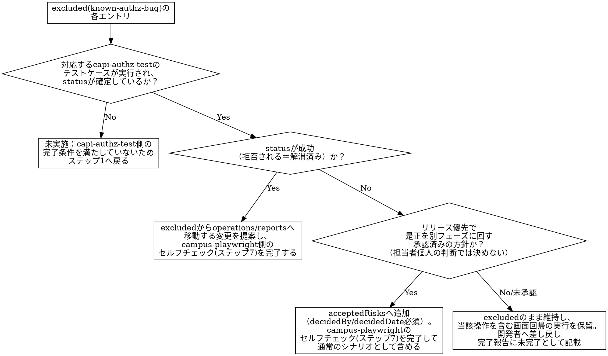
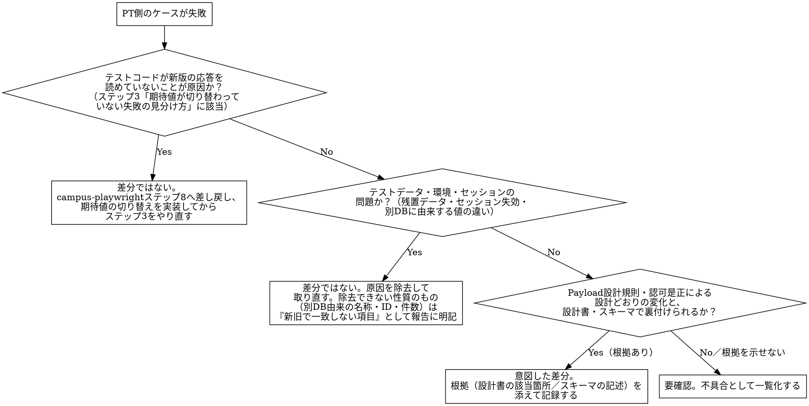

# orchestrating-capi-screen-verification

## Overview

capi-changesが完了した画面は、`capi-authz-test`（認可検証）と`campus-playwright`（新旧比較回帰）の両方を通す必要があるが、両者は独立したスキルとして別々に起動されるため、素朴に並べて実行するだけでは橋渡しが漏れる。特に、`campus-playwright`のマニフェストが既知の認可不具合を`excluded`（`reason: known-authz-bug`）として抱えている画面では、その不具合が**今回のcapi-changesで実際に解消されたか**を`capi-authz-test`の実行結果でしか確認できない。解消済みなら通常の`operations`へ格上げすべきだし、未解消でリリースを優先するなら`acceptedRisks`として承認記録付きで含めるべきだが、どちらも`campus-playwright`単体では判断できない。

**このスキルの核心は、実行順序を「`capi-authz-test`を先に完走させ、その結果を`campus-playwright`のマニフェスト判断へ反映してから画面回帰を実行する」に固定し、両スキルの成果物（`coverage/authz/*.json`・不具合一覧と、screenshot/trace）を画面単位のフォルダへ統合して完全性を確認するところまでを担う**点にある。加えて、画面回帰で検出された新旧差異を「一致／意図した差分／要確認」に分類する工程（`capi-regression-test`）まで通しで実行し、「要確認」に分類された差異を不具合として画面単位の完了報告に含める。各サブスキル自体の検証ロジック・承認フローは変更せず、呼び出す順序と、両者の間で本来つながっているはずの情報（既知不具合の解消状況、検出された差異の分類結果）を確実に橋渡しすることだけに専念する。

**もう1つの中核リスクは「検証したつもり」で完了報告に進んでしまうことである。**着手前ベースラインのテストコードは旧版のPayload構造を読む形で書かれているため、捕捉条件だけを新版対応にして実行すると、新版は「応答は受け取れているのに値が読めない」形で全件失敗する。この失敗は**仕様差の証拠に見えてしまう**ため、「Payload差分＝意図した差分」と分類して先へ進めてしまいやすい。しかし実体はテストコードの不備で、その状態では**新版の画面表示を1件も検証していない**。さらに、失敗時スクリーンショットを1枚残せばエビデンスの完全性ゲートは通ってしまう。本スキルは、(1) 新版実行の前に**期待値の切り替え**を1ケースで実測する、(2) PT失敗の分類を「テストコードの不備→環境要因→意図した差分→要確認」の順で行う、(3) 完全性ゲートを「スクリーンショットの有無」ではなく**「新版で照合が成立したか」**で判定する、の3点でこれを塞ぐ。

**ベースライン（画面マニフェスト・spec）が無い／古い画面も本スキルの対象で、ステップ0.5で`campus-playwright`を実行して記録してから先へ進む。** ただしここで記録するベースラインは、`campus-playwright`が想定する「着手前」のものとは条件が違う——capi-changesが既に完了しており、新版の姿がリポジトリから読める。この非対称性は両方向に効く。有利な側では、同スキルが「記録時点では未知だから`null`のままでよい」と定める`newOperationName`をコミットから確定できる。不利な側では、新版の結果を見てから旧版の期待値を書けてしまい、旧版の成功が**空読み**（旧スキーマに無いフィールドを読んで`undefined`同士で通る）でも気づけない。本スキルは記録工程に満たすべき形（ステップ0.5の「記録するベースラインの要件」4項目）を課し、旧版での照合成立とハッシュ記録を済ませてからしか新版の実行へ進まない。

## When to Use

- 対象画面のcapi-changes（campus-api移行実装）が完了しており、認可検証・画面回帰・エビデンス収集・差異照合を画面単位で一気通貫に実行し、差異を不具合として報告したいとき
- 同じ状況で、`campus-playwright`のベースライン（画面マニフェスト・spec）が未記録・紛失・移行前ビルド基準のまま古く、記録・改訂から回帰・報告までをまとめて通したいとき（複数画面をまとめて渡される場合を含む）

**対象外（別スキルの領域）：**
- capi-changes（実装）そのもの
- ベースライン記録の判定基準そのもの（記録容易性・記録深度の判定、テストケース設計、セルフチェック項目）の変更：`campus-playwright`側のものをそのまま使う。**記録の実施自体は本スキルの対象内**（ステップ0.5）
- 3点照合の差異分類そのものの判定基準（一致／意図した差分／要確認の切り分けロジック、帳票照合方法等）の変更：`capi-regression-test`側のものをそのまま使う（ステップ5）
- 各サブスキル自体の検証基準・承認手順の変更：本スキルは呼び出し順序と成果物の橋渡し・統合のみを担う

**REQUIRED SUB-SKILL: capi-authz-test** — ロール別・行レベルの認可検証本体（ステップ1）。
**REQUIRED SUB-SKILL: campus-playwright** — ベースライン記録の本体（ステップ0.5。同スキルのステップ1〜8と、ステップ9「通常の実行」＝旧版〈ST環境〉に対する全ケース成功の確認まで）と、新旧比較回帰の実行本体（ステップ3＝同スキルのステップ9「新旧比較を伴う実行」。ステップ2の反映結果次第でマニフェスト更新〜セルフチェック再実施〜テストコード生成の再実行を伴う）。
**REQUIRED SUB-SKILL: capturing-playwright-evidence** — `campus-playwright`が実行したテスト結果のエビデンス収集（ステップ4）。
**REQUIRED SUB-SKILL: capi-regression-test** — 収集済みエビデンスの新旧突き合わせ・差異分類（ステップ5。対象確定・記録取得に当たる同スキルのステップ1〜3は使わず、突き合わせ・分類・報告に当たるステップ4〜6相当の判定ロジックのみを、ステップ3・4で既に取得済みのエビデンスに対して適用する）。

`capi-saml-login`は上記2スキルがログインを要する場面でそれぞれ内部的に要求するサブスキルであり、本スキルから直接呼び出すことはしない（各スキルの`When to Use`の対象外節・REQUIRED SUB-SKILL宣言に従う）。

## Core Pattern

**Before**：担当者が画面ごとに「ベースラインを記録する」「`capi-authz-test`を回す」「`campus-playwright`を回す」を別々のタイミング・別々の担当者で実施する。ベースラインが無い画面に行き当たると、回帰も認可検証も着手できないまま差し戻して止まる。認可の既知不具合（`campus-playwright`マニフェストの`excluded`）が今回のリリースで解消されたのか、リリース優先で先送りされたのかを`campus-playwright`側は知る手段が無く、`excluded`のまま放置される（解消済みなのに検証されない）か、逆に承認記録なしに現状挙動が`operations`へ紛れ込む。認可検証の不具合一覧（`coverage/authz/*.json`）と画面回帰のエビデンス（`evidence/`）も別々の場所に残り、「この画面は検証完了」と画面単位で言える状態を誰も保証できない。

**After**：画面情報を受け取ったら、まずベースラインの実在をspecから判定し、不足・古い画面はその場で`campus-playwright`で記録・改訂して旧版（ST）成功とハッシュ記録まで済ませる（ステップ0.5）。次に`capi-authz-test`を対象操作について完走させる。その結果（不具合の解消/未解消）を`campus-playwright`マニフェストの`excluded`／`acceptedRisks`判断へ反映し、変更があればセルフチェック（`campus-playwright`ステップ7相当）を完了したうえで画面回帰（`campus-playwright`ステップ9の新旧比較）を実行する。回帰で得られたST・PT双方のエビデンスを`capi-regression-test`の分類ロジックで突き合わせ、「要確認」の差異を不具合として一覧化する。すべての成果物を画面単位フォルダへ統合し、完全性ゲートで抜け漏れを検知してから完了報告する。

**具体例（成績入力画面 `SeisekiInput.vue`）**：`campus-playwright`のマニフェストには、担当授業・登録期間外でも成績を書き込めてしまう既知不具合（`campus-api_設計書.md`5章#7、`capi-authz-test`のCore Patternで扱う不具合そのもの）が`excluded`（`reason: known-authz-bug`）として記載されている。本スキルでは、まず`capi-authz-test`のテストケース`AZ-102`（担当外授業への書き込みが拒否されるか）を実行し、①`成功`（拒否される＝解消済み）なら`excluded`を`operations`へ格上げする変更を提案、②`失敗`（許可されてしまう＝未解消）で、かつリリース優先の方針が承認されているなら`acceptedRisks`へ承認記録付きで追加、③方針が未承認ならその項目を`excluded`のまま維持し画面回帰の実行を保留して開発者へ差し戻す——という三分岐（ステップ2）で判断する。

## 全体フロー

```text
[ステップ0 前提確認・ベースライン実在判定]
  ↓
[ステップ0.5 ベースライン記録（不足・古い画面のみ）]
  │  ├─ 計画を記録して即着手（承認取得済み。GO取得も画面ごとの確認もしない）
  │  ├─ campus-playwright ステップ1〜8（「記録するベースラインの要件」4項目を満たす）
  │  ├─ campus-playwright ステップ9「通常の実行」＝旧版(ST)で全ケース成功
  │  └─ ベースラインのハッシュを記録（以降の改変を検知可能にする）
  ↓
[ステップ1 capi-authz-test 実行]
  ↓
[ステップ2 認可検証結果のマニフェストへの反映判断]
  ↓（保留に該当する項目が無い、または保留を明記した上で進める）
[ステップ3 campus-playwright 新旧比較実行]
  │  ├─ ST（旧版）全ケース実行
  │  ├─ PT実行前の5点チェック（1ケースだけ流して実測）───┐
  │  │                                                    │ 期待値が新版を読めていない
  │  └─ PT（新版）全ケース実行                            │ ／環境が汚れている
  ↓                                                        ↓
[ステップ4 capturing-playwright-evidence によるエビデンス収集]   [campus-playwright ステップ8へ差し戻し]
  ↓                                                        （改修後ステップ3へ戻る）
[ステップ5 capi-regression-test によるエビデンス照合・差異分類]
  │  └─ PT失敗は「テストコードの不備→環境要因→意図した差分→要確認」の順で分類
  ↓
[ステップ6 画面単位フォルダへの統合・完全性ゲート]
  │  └─ 判定軸は「新旧それぞれで照合が成立したか」。スクリーンショットの有無では判定しない
  ↓
[ステップ7 完了報告]
```

## ステップ0 前提確認・ベースライン実在判定

画面情報として最低限以下を受け取る。不足があれば起動元に確認する。

| 項目 | 内容 |
|---|---|
| 画面ID | `campus-playwright`のマニフェスト（`coverage/screens/<ScreenId>.json`）を特定するためのID |
| capi-changesの完了状況 | 対象画面の新版実装がPT環境にデプロイ済みか |
| 対象ロール（任意） | 特定ロールに絞りたい場合のみ指定。省略時はマニフェスト・正解表から到達可能な全ロールが対象になる |

以下の前提を確認する。**ベースラインの不足は停止事由ではなくステップ0.5の対象**であり、それ以外の前提を満たさない場合は本スキルを開始せず該当スキルの実施を案内して停止する。

| 前提 | 満たさない場合の対応 |
|---|---|
| ベースライン（specと画面マニフェスト）が実在し、現行の新版に追従している | **停止しない。**不足・紛失・移行前ビルド基準のいずれでも、ステップ0.5で記録・改訂してから先へ進む（下記「ベースラインの実在判定」） |
| 対象画面のcapi-changesが完了済みである | 判定方法と、未移行だった場合の2分岐（完了を待つ／そもそも移行対象外として記録）は下記「capi-changesの完了判定」による。該当画面のみを対象から外し、残りの画面は進める |
| 新旧2環境のリポジトリの実パスが分かっている | 下表「リポジトリと環境の対応（実パス）」で確認する。見つからない場合はホームディレクトリだけを探して「存在しない」と断定せず、起動元に所在を確認する |
| テストコードの捕捉条件・期待値が実行対象（旧版／新版）で切り替わる形になっている | **この前提は着手前ベースラインでは通常「満たしていない」**（ベースラインは旧版だけを見て書かれるため）。捕捉条件（操作名）と**期待値（応答の読み出し）は別々に確認する**。捕捉条件はコードで静的に確認できるが、**期待値は静的には判断できないので、ステップ3でPT1ケースを実測して確認する**。満たさない場合は`campus-playwright`ステップ8へ差し戻す（本スキル内で改修する場合も、改修完了までステップ3の全ケース実行へ進まない）。**ステップ0.5で新規に記録した画面は、記録要件の#1・#2でこれを記録時点に満たしている**ため、ステップ3の5点チェックは確認のために行う |

### capi-changesの完了判定（画面の`.vue`だけを見ない）

対象画面の`.vue`が旧版と同一で`campus`への参照が0件でも、**移行済みか未移行かは判別できない**。履修・成績エリアの画面の多くは20行程度のラッパーで、データ取得は共有コンポーネントにある。

| 画面 | ラッパーの中身 | 実体 | 判定 |
|---|---|---|---|
| `DaimokuKensaku`／`Syuutyuu`／`Kakunin` | `<DaimokuBase :mode="…"/>` | `DaimokuBase.vue`が`campusRisyuu.*`を呼ぶ | 移行済み |
| `Syuutoku` | `<Alsyuutoku />` | `Alsyuutoku.vue`は旧`useApiService`のまま（両リポジトリで同一） | **未移行** |

判定は**データ経路を共有コンポーネントまで辿り、`src/services/campus/`配下のクライアントを呼んでいるか**で行う。`git log`で代用する場合、`--grep=campus-api`は取りこぼす（コミット件名が「campus専用API: …」の形のものがあり、ラッパー画面はそもそも自身の履歴を持たない）。`git log --oneline -i --grep='campus[-専用]*api' -- <実体のコンポーネント>`のように**実体側のパス**へ当てる。

未移行だった場合の分岐は2つある。**どちらかを見極めずに「完了を待つ」と答えない。**

| 状況 | 対応 |
|---|---|
| 移行予定だが未着手／フロント切替漏れ | 完了を待つよう案内し、その画面を対象から外す。**サーバ側の新操作だけ先に実装済み**のことがある（例：`Syuutoku`は`getRisyuuEnrollmentCreditsList`が`CampusRisyuuService.ts`に実装済みだが、フロントは旧`/api`のまま）。この食い違い自体を開発者へ報告する |
| そもそも移行対象外 | 待たずに**対象外として記録し報告する**。例：`SeisekiCsvOutput`は`routes.ts`で`MODE ∈ {development, dev2, pt, st}`のときだけ登録される比較用ルートで、`campus-api_設計書.md`4.3節#12が本番対象外と明記している。移行されない画面を待ち続けない |

### ベースラインの実在判定（「マニフェストがある」を根拠にしない）

次の順で確認し、**1段目で落ちたらベースラインは「無い」**として扱う（ステップ0.5の対象にする）。

| 順 | 確認するもの | 落ちたときの意味 |
|---|---|---|
| 1 | 実行可能なspecの実在（`frontend/campus/e2e/<area>/<Screen>.spec.ts`、無ければ`documents/campus専用API/playwright-nightly/screens/<route_name>/03_spec.ts`） | 同じテストコードでST→PTを流せず、新旧比較が原理的に成立しない。ベースラインは「無い」 |
| 2 | マニフェスト`coverage/screens/<ScreenId>.json`の実在と、その`route`欄が対象画面と一致すること | 画面名での対応付けは誤る。例：`Kakunin.json`の`route`は`/portal/Kakunin`であり、`rishuuseiseki/Kakunin.vue`（履修確認）のマニフェストではない |
| 3 | マニフェストの`deployedVersionCheck`／`versionNote`が現行の新版に追従していること | capi-changes投入前に記録されたマニフェストは`newOperationName`が未設定で、操作一覧も旧経路のまま。ステップ0.5で改訂する |

**マニフェストが`testCode`・`executionResult`（「ST 8 passed」等）を記録していても、参照先のspecが現存しなければベースラインは無い。** `coverage/`・`e2e/`はどちらもgitignore対象でgit履歴から追えないため、実行結果の記録だけが残って実体が消えている状態が起こる（2026-09-18に履修・成績12画面で実際に発生：4画面のマニフェストが`testCode`と`executionResult`を持つ一方、specもエビデンスもどちらのリポジトリにも存在しなかった）。

### リポジトリと環境の対応（実パス）

| 区分 | リポジトリ | 実パス | 環境 | baseURL | env |
|---|---|---|---|---|---|
| 旧版（移行前） | `allcampus` | `C:\Users\roonawa\allcampus` | ST | `https://allcweb3.local.ailesys.co.jp/campus/` | `.env.st` |
| 新版（移行後） | `allcampus-regression` | `D:\allcampus-regression\allcampus-regression` | PT | `https://allcweb2.local.ailesys.co.jp/campus/` | `.env.pt` |

**`allcampus-regression`はホームディレクトリ配下に無い**（別ドライブにある）。ホームディレクトリだけを検索して「リポジトリが存在しない」と断定してはならない。2026-09-17にこの誤断定により、新版リポジトリ側に既に存在していた修正（認可ハーネスの許可リスト対応等）を旧版リポジトリのコピーを見ながら再実装する重複作業が発生した。**共有のハーネス・テンプレートを触る前に、両リポジトリの同名ファイルを必ず比較し、どちらが正（canonical）かを先に決める。**

#### 正（canonical）はファイル単位で決める

**「新版リポジトリが常に正」ではない。** 対象ごとに向きが違う（2026-09-18実測）。

| 対象 | 正 | 根拠 |
|---|---|---|
| `coverage/authz/` | `allcampus-regression` | 認可JSON・ROLLUP・ゲート記録はallcampus-regression側にのみ存在する |
| `coverage/screens/` | どちらでも同じ | 全ファイルが`diff -q`で同一 |
| `templates/`・`playwright.config.ts` | **`allcampus`（C:）** | C:が上位集合。`loginAsRoleLocal`・`loginAsKigyou`（`auth.ts`）、`captureFailureScreenshot`（`evidence.ts`）、`manifestNewOperationName`・`authDirNameForTarget`（`manifestOperations.ts`）はC:にしか無く、D:にしか無い関数は0件。`playwright.config.ts`もC:のみが`E2E_TARGET`/`E2E_BASE_URL`による環境切替と`setup`/`setup-pt`プロジェクトを持つ |

**一律にallcampus-regressionで上書きしてはならない。** ステップ3の「同じテストコードをST→PTへ流す」機構、`newOperationName: null`の「新版では待たない」分岐、失敗時スクリーンショットは、いずれもC:側にしかない実装に依存している。比較して新しい側を採り、**どちらを採ったかと理由を記録する**。

前提を満たしたら、マニフェストの`operations`／`reports`一覧（画面が呼ぶ操作・帳票エンドポイントの一覧。セルフチェック済みマニフェストに確定済み）に加えて、`excluded`のうち`reason: known-authz-bug`に該当するエントリの対象操作（`target`欄）も対象操作一覧へ含め、`capi-authz-test`ステップ0（対象操作の特定）の入力としてそのまま渡す。

**`excluded(known-authz-bug)`の対象操作を漏らさないこと**：この種のエントリが指す操作は、正常系の記録が無い（`operations`/`reports`のどちらにも登場しない）書き込み系操作であることがある（例：担当外授業への書き込みを拒否できていない`createTblBuseiseki`が、担当内書き込みの正常系シナリオ自体は別途用意されていない場合）。`operations`／`reports`だけを機械的に拾うと、まさにステップ2で判断が必要なその操作が対象一覧から漏れ、ステップ1（`capi-authz-test`実行）でも検証されないまま`hasCase`が永久に「No」になる。`excluded`の`known-authz-bug`エントリは必ず個別に拾い出し、対象操作一覧へ明示的に加える。

これにより、`別紙D1_画面別_呼び出されるAPI一覧.csv`を画面から辿り直す手間を省略できる。

## ステップ0.5 ベースライン記録（不足・古い画面のみ）

ステップ0で「無い」または「古い」と判定された画面について、`campus-playwright`のステップ1〜8を実行し、同スキルのステップ9「通常の実行」で**旧版（ST環境）に対して全ケース成功**するまでを完了させる。記録容易性・記録深度の判定、テストケース設計、セルフチェック項目は同スキルのものをそのまま使い、緩めない。

ベースラインが揃っている画面はこのステップを飛ばしてステップ1へ進む。

### 着手前に計画を記録する（確認は取らない — 承認は取得済み）

**このスキルの実行について、次の2点は2026-09-18に本スキルの所有者から恒久的な承認を得ている。都度の確認は不要であり、画面数にかかわらず着手前のGO取得も画面ごとの確認も行わない。**

| 承認済み事項 | 範囲 |
|---|---|
| ステップ0.5〜7の一括実行 | 渡された全画面。画面ごとの中断・確認を挟まない |
| ST・PT両環境への使い捨てフィクスチャの作成・削除 | `campus-playwright`の記録・実行に必要な範囲。学生アカウントの履修登録・削除を含む |

確認を取らない代わりに、着手前に次を**報告として記録してから、そのまま実行へ進む**（承認待ちをしない）。

- 記録対象の画面一覧と、画面ごとの区分（新規記録／マニフェスト改訂のみ／記録済みで対象外）
- **環境への書き込みを伴う操作の有無**（使い捨てフィクスチャの作成・削除を含む）と、その対象環境
- 先に揃える共有ハーネス（`frontend/campus/templates/`・`playwright.config.ts`）の差分。**ファイル単位で比較し、新しい／上位集合の側を採る**（下記「正（canonical）はファイル単位で決める」）

保留・停止が必要になった画面だけを報告に積む。

**この恒久承認が免除するのは確認だけで、記録義務は免除しない。** 書き込みの対象環境の明示（上記）と、残置データの実測報告（ステップ6「後片付けは実測で確認してから報告する」）は従来どおり必須である。`capturing-playwright-evidence`の「書き込みを伴う撮影の扱い」が求める承認も、使い捨てフィクスチャの作成・削除に当たる範囲は本承認で充足済みとして扱う。

**本承認の範囲外**（従来どおり停止して確認する）：使い捨てフィクスチャの範囲を超える書き込み——実データの恒久的な更新・削除、メール送信、抽選実行・当落確定のような取り消せない業務処理、本番環境への操作。

### 記録するベースラインの要件（4項目）

**ここで記録するベースラインは「着手前」のものではない。capi-changesが既に完了しており、新版の姿がリポジトリから読める。** そのぶん、着手前記録では埋めようのなかった項目を記録時点で満たせる。4項目すべてを満たしてから同スキルのステップ9（旧版実行）へ進む。

| # | 要件 | 満たし方 |
|---|---|---|
| 1 | `newOperationName`を埋める（`null`で残さない） | 新版の実装から確定する。**一次情報は`src/services/campus/`配下のクライアント定義**（例：`CampusSeisekiKakuninService.ts`の`getSeisekiMyGrades`）であり、コミット検索は補助に使う（`git log --oneline -i --grep='campus[-専用]*api' -- <実体のコンポーネント>`。`--grep=campus-api`だけでは「campus専用API: …」形式の件名を取りこぼす）。コミットメッセージが旧→新の対応と意図した変化まで明記していることが多い（例：`e70c0408ea`は旧`getWebAcademicGradesForStudent`系→新`getSeisekiMyGrades`系8操作の移行と、職員の全操作拒否・素点マスク・件数上限50固定・学籍ID引数の除去を列挙している）。`campus-playwright`ステップ6の「記録時点では常に`null`でよい」は**新版が未知の場合の規定**であり、本スキルの文脈では当てはまらない |
| 2 | 期待値の読み出しを実行対象で切り替える正規化層を置く | 捕捉条件の切り替えは`templates/manifestOperations.ts`の`runTarget()`が既に担うが、**応答の読み出し（どのフィールドを見るか）を新旧で畳む層はハーネスに無い**。specごとに1か所へ置き、アサーションは正規化済みモデルだけを見る（ステップ3「期待値が切り替わっていない失敗の見分け方」の予防にあたる） |
| 3 | 新版がサーバ側で導出する引数に依存する期待値を固定しない | capi-changesは学籍ID・基準日などクライアント指定の引数をセッション／サーバ時刻から強制する（設計規則4）。旧版でこれらを固定して件数・行集合を期待値にすると、新版では母集団自体が変わり、**不具合でも意図した差分でもない「テスト手法の欠陥」**による差が出る。件数ではなくキー（授業コード・学籍番号等）で突き合わせる |
| 4 | アサーションが空読みでないことを裏取りする | 旧スキーマに無いフィールドを読むアサーションは、旧版でも`undefined`同士で通り**成功が何も証明しない**。旧スキーマ定義（`backend/api/src/main/resources/graphql/*.graphqls`）に当該フィールドが実在することと、記録した応答JSONで非nullであることの両方を確認する |

### 記録先と、記録に含める成果物

- **チェックアウトは1つにする**（`allcampus`＝C:）。同じテストコードをST→PTへ流す仕組みは`playwright.config.ts`の`E2E_BASE_URL`／`E2E_TARGET`と`setup`／`setup-pt`プロジェクトによる環境切替であり、2つのチェックアウトへspecを複製する必要はない。複製すると、ステップ3の「同じテストコードを変更せずに両環境へ実行する」が成立しなくなる
- **`e2e/`配下は丸ごと成果物**である。spec・マニフェストだけでなく、`e2e/auth.setup.ts`・`e2e/authPt.setup.ts`と`e2e/.auth/`・`e2e/.auth-pt/`（storageState）も、無ければ作る。`playwright.config.ts`の`testDir: './e2e'`と各プロジェクトの依存がこれらを前提にしている。**spec以前にこの土台が無いことがある**ので、記録に着手する前に実在を確認する

### `excluded`に`known-authz-bug`を書けるとは限らない

本スキルの記録はcapi-changes後に行うため、認可の実挙動はステップ1（`capi-authz-test`）まで確定しない。記録時点で既知不具合として書けるのは`campus-api_設計書.md`5章に列挙済みのものだけで、**それ以外を推測で`excluded`へ書かない**。結果としてステップ2の三分岐が**入力ゼロ**になる画面は普通にある。その場合は空欄にせず「`known-authz-bug`該当なしにつき三分岐は非該当」と明記する（`reason`が`authz-test-scope`・`known-authz-scope-out-of-production`のエントリは**文字列が似ているだけで対象外**。判定は`reason`の完全一致で行う）。

### 凍結（ハッシュ記録）

旧版での全ケース成功を確認した時点で、ベースラインのハッシュを記録する。`coverage/`・`e2e/`はgitignore対象でgit差分が残らないため、これが唯一の改変検知手段になる。**specとマニフェストだけでなく、挙動を左右する`templates/`・`auth.setup.ts`・`playwright.config.ts`も対象に含める**（これらはステップ0.5で手を入れる対象そのものである）。

```bash
cd frontend/campus && find e2e coverage/screens templates playwright.config.ts -type f \( -name "*.ts" -o -name "*.json" \) -not -path "e2e/.auth*" -print0 | sort -z | xargs -0 sha256sum > baseline.sha256
```

storageState（`e2e/.auth*`）は実行のたびに変わるため除外する。`sha256sum`が使えない環境では`Get-FileHash`等に読み替える（ハッシュ値そのものより、**同じ手順で再計算して突き合わせられること**が要件）。出力をステップ6の統合フォルダへ`baseline.sha256`として保存する。ステップ3以降にベースラインを変更した場合は、**変更前後のハッシュと変更理由を完了報告に明記する**。`campus-playwright`ステップ9は「期待値そのものが記録ミスだったと判明した場合に限りテストを修正する」を認めるが、記録と比較を同一実行で行う本スキルではその判断が新版の結果を見た後になる。ハッシュはその事実を残すためのものである。

## ステップ1 capi-authz-test 実行

`capi-authz-test`のステップ0〜9を、ステップ0で渡した対象操作一覧に絞って完走させる。ログインは同スキルのREQUIRED SUB-SKILLである`capi-saml-login`に委譲される（本スキルから直接操作しない）。

- 不具合が見つかっても`capi-authz-test`ステップ8の方針どおりその場で修正しない。`status`を失敗として記録し、ステップ9の不具合一覧に含めたまま次へ進む
- `capi-authz-test`の完了条件（対象操作すべてに`coverage/authz/<操作名>.json`が存在し、テストケース・分岐対応がステップ7のセルフチェックを完了している）を満たしたことを確認してからステップ2へ進む

## ステップ2 認可検証結果のマニフェストへの反映判断（非自明な分岐）

ステップ1の結果と、対象画面の`campus-playwright`マニフェストの`excluded`（`reason: known-authz-bug`）を突き合わせ、エントリごとに以下の判断を行う。既知不具合に対応しないエントリ（`dead-code`等の`excluded`、通常の`operations`／`reports`）はこの判断の対象外。



**要点**：
- `hasCase`／`resolved`の判定対象は、当該操作の`coverage/authz/<操作名>.json`内の`testCases`のうち`resolvesKnownIssue: true`が付与されたエントリに限る（`capi-authz-test`ステップ6参照）。該当エントリが複数ある場合、全件の`status`が確定済みであることを`hasCase`の条件とし、全件が成功（拒否）であることを`resolved`の条件とする（1件でも失敗があれば未解消として`riskDecision`へ進む）。`resolvesKnownIssue`が付与されたエントリが1件も無い操作は、対応する認可テストが未設計とみなしステップ1（`capi-authz-test`）へ差し戻す
- 実データ不足によるテスト未確定（`capi-authz-test`側で「未実施（テストデータ準備不可）」等の理由付きで報告された場合）も`hasCase`は`No`としてステップ1へ差し戻す。`capi-authz-test`側は実データが見当たらない場合まずテストデータを用意する方針のため、この差し戻しは通常一時的なもので足踏みにはならない。テストデータ準備自体が困難と報告された場合は、その理由を伴う`No`として本スキルの完了報告（保留扱い）に明記する
- `toOperations`・`toAcceptedRisks`のいずれも、マニフェスト変更は`campus-playwright`ステップ7相当のセルフチェックを完了してから反映する。セルフチェックはチェックリスト全項目の充足を機械的に確認する工程であり、開発者の承認待ちは発生しないがフルオートメーションを理由に省略してはならない
- `holdEntry`（保留）に該当する項目がある画面は、その操作を含む範囲についてステップ3（新旧比較）を実行しない。他の操作に保留が無ければ、保留対象を除いた範囲でステップ3へ進めてよい
- `toOperations`／`toAcceptedRisks`に決まった項目は、`campus-playwright`ステップ8（テストコード生成）でその項目のテストコードが未生成の場合は生成し直す必要がある（マニフェストが変わった以上、対応するテストコードも追従させる）

## ステップ3 campus-playwright 新旧比較実行

ステップ2で`holdEntry`に該当しなかった範囲について、`campus-playwright`ステップ9「新旧比較を伴う実行」（`allcampus`〈ST〉→`allcampus-regression`〈PT〉の順、同一テストコード）を実施する。

- ステップ2でマニフェストを更新した場合は、`campus-playwright`ステップ7（再セルフチェック）→ステップ8（該当シナリオのテストコード生成・更新）→ステップ9（実行）を該当エントリについて再実行する
- `test.skip()`・アサーション緩和でPT側だけを通す対応は`campus-playwright`のCommon Mistakesどおり禁止。失敗は隠さず報告する

### 新版（PT）実行の前に必ず確認する5点

旧版（ST）が全件成功しても、新版（PT）はそのままでは動かない。**PT実行に着手する前に以下を確認する。順序を守らないと、原因の異なる失敗が同時に大量発生して切り分けに時間を取られる**（2026-09-17に24ケース中23ケースが失敗し、うち17ケースが同一の原因だった）。

| # | 確認内容 | 確認方法 | 満たさない場合 |
|---|---|---|---|
| 1 | **捕捉条件**が実行対象で切り替わるか（旧版専用の操作名が直書きされていないか） | マニフェストの`newOperationName`を解決する形になっているかコードで確認 | `campus-playwright`ステップ8へ差し戻す。旧版のリテラルを新版の値で「置き換える」と今度は旧版実行が壊れるため、置き換えではなく実行対象による切り替えにする |
| 2 | 新版のリクエストボディに`operationName`が載っているか | 1本だけ実際に覗く | 載っていなければ捕捉を`extensions.documentId`からの逆引きに変える。`newOperationName`をいくら埋めても捕捉できない（`capi-regression-test`「新版で応答が捕捉できないときに最初に疑うこと」） |
| 3 | **期待値（応答の読み出し）**が実行対象で切り替わるか | **PTで1ケースだけ実行し、下記「期待値が切り替わっていない失敗の見分け方」に当てはまらないことを実測する** | `campus-playwright`ステップ8へ差し戻す。**この状態のまま全ケースを流してはならない**（失敗が全件「差分」に見えてしまう。下記参照） |
| 4 | 新版環境のセッション（storageState）が当日取得したものか | 取得時刻を確認する | 期限切れのセッションではログイン画面に着地する。緩いアサーションだとそれでも成功扱いになるため、必ず取り直す（`capi-saml-login`） |
| 5 | 対象環境に**過去の実行が残したテストデータが無いか** | フィクスチャと同じ命名規則（使い捨て授業名等）で環境を検索する | 残置を削除してから実行する。残置は一覧の件数を押し上げ、新旧エビデンスに「アプリの差ではない差」を作る（下記「テストデータの残置」参照） |

これら5点は**PT実行の1ケースで確認できる**。全ケースを流してから原因を探すのではなく、1ケースを流して切り分けてから全ケースを流す。

#### 期待値が切り替わっていない失敗の見分け方

**捕捉条件だけを新版対応にして期待値を旧版のまま残すと、新版の実行は「応答は受け取れているのに値が読めない」形で失敗する。**
これは差分ではなく**テストコードの不備**であり、`campus-playwright`ステップ8へ差し戻す対象である。
次のいずれかに当てはまったら、その場で全ケース実行を中止して差し戻す。

- 応答は届いている（タイムアウトではない）のに、期待値の取得結果が `undefined` / `null` / 空配列・0件になる
- 失敗メッセージが「一覧に○○が見つからない」「本人データを1件も返さなかった」「最低1件あるはず」のように、**新版では別名・別構造で返っている値を旧版のパスで読もうとした**ことを示している
- 新版だけが**全件または大半失敗**している（旧版は全件成功している）

対応は「アサーションを緩める」ことでも「旧版のパスを新版のパスへ置き換える」ことでもない。
**期待値の読み出しだけを実行対象で切り替え、期待値そのもの（何がどう表示されるべきか）は新旧で共通にする**。

- 新旧の応答を同じ形へ畳む読み出し層（正規化）を1か所に置き、アサーションはその正規化済みモデルだけを見る
- 「新版にしか無い正しい姿」（引数から学籍IDが消えた／平文パスワードを返さなくなった／旧版で失敗していた操作が成功する等）は、旧版の期待値と**分岐して明示的に検証する**。旧版の期待値のまま実行すると、**是正されたこと自体をテストが不合格にしてしまう**
- 新版で発生しなくなった操作（マニフェストの`newOperationName`が`null`）は待ち受けない。待つとタイムアウト（偽陰性）になる

#### テストデータの残置

使い捨てフィクスチャは、実行の失敗・セッション失効・タイムアウトで`afterAll`が完走しないと環境に残る。
残ったフィクスチャは次回以降の実行で一覧に混ざり、**ST/PTのエビデンスに「アプリの差ではない件数差」を作る**。
実行の前後で残置を実測し、報告に「後片付け済み」と書く前に**必ず確認結果で裏を取る**（ステップ6）。

## ステップ4 capturing-playwright-evidence によるエビデンス収集

ステップ3で実行したテストの結果を`capturing-playwright-evidence`のステップ1〜7（撮影設定確認・実行・失敗性質の判定・成果物収集・目視確認・完全性ゲート・保存）に従って収集する。`campus-playwright`が独自に撮影を行うわけではなく、このスキルが実行結果からエビデンスを整理する担当であることに注意する。

## ステップ5 capi-regression-test によるエビデンス照合・差異分類

ステップ3（`campus-playwright`ステップ9）・ステップ4（`capturing-playwright-evidence`）で既に取得済みのST（旧版）・PT（新版）双方のエビデンス（画面表示・内部データ・帳票）を、`capi-regression-test`の「帳票（PDF/CSV）照合の方法」「差異判定の手順」（一致／意図した差分／要確認の三分類）にそのまま適用し、対応する操作・シナリオごとに新旧を突き合わせる。

- **`capi-regression-test`のステップ1〜3（対象確定・記録取得）は実行しない**：対象画面・対象操作の確定はステップ0で完了しており、新旧それぞれの記録は既にステップ3・4で取得済みのため、`capi-regression-test`を独立に走らせて記録を重複取得させない。使うのは同スキルのステップ4〜6（突き合わせ・分類・報告）に当たる判定ロジックのみである
- 判定基準（帳票のキー突合せ、0件/空応答時のDB確認、拒否/許可差の設計書照合、Payload設計規則との照合等）は`capi-regression-test`側のものをそのまま使い、緩めない。判断に迷う差異は「要確認」側に倒す（安易に「意図した差分」へ倒さない）
- 「要確認」に分類された差異は、対象操作・シナリオID・期待値（ST側の記録内容）・実際の結果（PT側の内容）・根拠を伴う不具合として一覧化する
- ステップ2で`holdEntry`（保留）となり画面回帰自体を実行していない操作は、この照合の対象外（非該当）とする

### PT側の失敗を分類する順序（「意図した差分」へ倒す前に必ず通す）

`campus-playwright`ステップ9でPT側が失敗したケースは、**次の順に判定する**。順序を飛ばして
いきなり「意図した差分」に分類すると、**テストコードの不備を仕様差と取り違えたまま「検証済み」にしてしまう**。



**要点**：

- **「意図した差分」は根拠とセットでしか成立しない。**「新旧でPayloadが違うから」は根拠ではない。
  どの設計規則・どのスキーマ定義に基づく変化かを示せないものは「要確認」へ倒す
- **新版の成功ケース数を必ず数え、報告に書く。**「PT側が全件失敗」「大半が同じ形で失敗」は、
  仕様差ではなくテストコードの不備か環境問題のサインである。この状態で全件を「意図した差分」に
  分類してはならない（2026-09-18に13ケース全失敗をそう分類しかけ、実際には期待値が新版を
  読めていないだけだった）
- **「分類できた」と「検証できた」は別である。**テストコードの不備で止まったケースは、
  分類上どう扱っても**新版の画面表示を1件も照合していない**。ステップ6の完全性ゲートでは
  「照合が成立したケース数」で判定する

### 画面の表示項目は「何を検証していないか」を先に数える

**テストが見ていない項目の差分は、どれだけ丁寧に分類しても永久に出てこない。**
ステップ5に入る前に、対象画面の**表示項目を1つずつ列挙し、どれをアサーションしているかを突き合わせる**。
アサーションが無い項目は「差分なし」ではなく「**未検証**」であり、報告でもそう書く。

とくに次の型の項目は、着手前ベースラインで検証が漏れやすく、かつ移行で変わりやすい。

- **同じ意味なのに画面ごとに参照元が違う項目**（例: 時間割コードが、一覧は `omrcode`・詳細ダイアログは `code`）。
  旧版が画面内で不統一なまま動いていた項目は、新版で統一されると**統一されたこと自体が差分として現れる**
- コード・区分・記号など、**値が空でも画面が壊れない項目**（欠落しても気づきにくい）
- 表示名・ラベルの解決規則（読替・ロケール・ロール別の出し分け）

こうした項目は、**版ごとに「その画面の規則」で期待値を持ち、両方をアサーションする**。
そのうえで、適用した規則と実際の表示値をエビデンスへ残す（新旧を並べたときに規則の違いが読み取れるようにする）。

**ある版でしか表示されない値があるときは、その値が空になる実データがどれだけ存在するかを実環境で数える。**
「意図した統一」でも、統一先の項目が未設定のデータが実運用に相当数あるなら、それは申し送るべき副作用である
（2026-09-18に、時間割コードの `omrcode` 統一で、実データの約7%＝10,166件中711件が表示欠落になることが判明した。
この差分はテストが時間割コードを1つもアサーションしていなかったため自動検出できず、利用者の目視で発覚した）。

### 新旧で原理的に一致しない項目は、報告に明記する

使い捨てフィクスチャを使う検証では、次の項目は**新旧で一致しないのが正常**である。
明記しないと、受け取った担当者がエビデンスを並べて不具合と誤読する。

- 使い捨てデータの名称（実行ごとに一意なコード・タイムスタンプを含む命名規則の場合）
- 期間・日時（実行時刻を基準に生成するため、実行タイミング分ずれる）
- ID（別DBで別レコードとして採番される）
- 一覧の件数（「自分のフィクスチャ」＋「その環境にたまたま存在する他データ」の合計になる）

各ケースが検証しているのは「**その環境の**API応答と画面表示が一致すること」であって、
新旧で同じ文字列・同じ件数になることではない。実在の同一データに対する値そのものの新旧照合を
行っていない場合は、**その限界も報告に明記する**（行ったつもりにしない）。
件数のエビデンスには「自分のフィクスチャ」と「その環境に存在した他データ」の内訳を残す。

## ステップ6 画面単位フォルダへの統合・完全性ゲート

`capturing-playwright-evidence`が出力した`evidence/<screen>_<timestamp>/`配下に、ステップ1の認可検証結果（対象操作分の`coverage/authz/*.json`のコピーと、該当する不具合一覧の抜粋）と、ステップ5の差異分類結果（要確認の不具合一覧を含む）を追加し、画面単位で1つの受け渡し用フォルダに統合する。

**不具合報告書は画面ごとに作らず、今回のタスクで扱う全画面分を1本のファイル（`evidence/不具合報告_<timestamp>.md`）にまとめる。** 複数画面を続けて処理する場合も、画面数ぶんのファイルに分割しない。各画面の統合フォルダ（`evidence/<screen>_<timestamp>/`）には、この1本の報告書のパスを記載するにとどめ、報告書の実体は複製しない。

ステップ1・ステップ5で検出された不具合を、対象画面を区別できる形で1つの表にまとめる。

- ステップ1（`capi-authz-test`）で`status`が失敗となったテストケース（**画面**・対象操作・テストケースID・期待値・実際の結果・根拠コード箇所）
- ステップ5（`capi-regression-test`）で「要確認」に分類された差異（**画面**・対象操作・シナリオID・期待値・実際の結果・根拠）
- 該当する不具合が1件も無い画面も、その画面について「本画面での指摘事項なし」と明記する行を報告書に含める（画面の記載自体を省略しない）
- 追加の画面を後から処理する場合は、既存の`evidence/不具合報告_<timestamp>.md`に画面ぶんの行を追記する（新規ファイルを作らない）

統合後、マニフェストの`operations`／`reports`／`acceptedRisks`全項目を基準に、以下の完全性ゲートを実施する。「だいたい揃った」で完了報告に進まない。

| 観点 | 確認内容 | 判定 |
|---|---|---|
| 認可検証 | 対象操作に対応する`coverage/authz/*.json`のテストケースが実施済みか（該当が無い操作は非該当） | 完全／不完全／非該当 |
| 画面回帰 | 対象操作に対応するST→PT新旧比較の実行結果（成功/失敗）が記録されているか | 完全／不完全 |
| **新版の照合成立** | **テストケース単位で、新版（PT）が実際に画面表示とAPI応答の突き合わせまで到達したか**（下記「スクリーンショットの有無と照合の成立は別物」） | 完全／不完全 |
| **旧版の照合成立** | **テストケース単位で、旧版（ST）の成功が空読みでないか**（アサーションが読むフィールドが旧スキーマに実在し、記録した応答で非nullか）。ステップ0.5で記録した画面では必須 | 完全／不完全 |
| エビデンス | **テストケース単位で**、ST（旧版）・PT（新版）双方に画面表示のスクリーンショットが存在し、内部データ・帳票（該当する場合）が揃っているか（下記「エビデンスの判定はケース単位×環境単位で行う」） | 完全／不完全 |
| 差異照合 | 画面回帰で検出された差異が、ステップ5の判定順序（テストコードの不備→環境要因→意図した差分→要確認）を通して分類済みか。「意図した差分」には根拠が添えられているか | 完全／不完全 |
| 不具合報告書 | ステップ1・5で検出された不具合が漏れなく反映されているか（該当なしの場合もその旨が明記されているか） | 完全／不完全 |
| マニフェスト整合 | ステップ2で決めた反映（`toOperations`/`toAcceptedRisks`/`holdEntry`）が実際のマニフェストに反映されているか | 完全／不完全 |
| ベースラインの凍結 | `baseline.sha256`が統合フォルダに存在し、ステップ3以降にベースラインを変更した場合はその前後のハッシュと理由が報告に含まれているか（ステップ0.5で記録した画面では必須。既存ベースラインを使った画面では非該当） | 完全／不完全／非該当 |
| **環境の後片付け** | **本タスクが作成したテストデータが環境に残っていないことを、実測で確認したか**（下記「後片付けは実測で確認してから報告する」） | 完全／不完全 |

不完全な観点があれば、原因に応じて該当ステップへ戻る（認可検証の不足はステップ1、画面回帰・新版の照合成立の不足はステップ3、エビデンスの不足はステップ4、差異照合・不具合報告書の不足はステップ5・6、マニフェスト整合の不足はステップ2、**旧版の照合成立・凍結の不足はステップ0.5**、後片付けの不足はこのステップ内で解消する）。**旧版の照合成立が不完全な画面は、その画面の新旧比較結果ごと根拠を失う**ため、ステップ0.5で空読みのアサーションを直したうえでステップ3から流し直す。

### スクリーンショットの有無と照合の成立は別物

**失敗時に1枚スクリーンショットを撮れば「エビデンスあり」にはなるが、「照合が成立した」ことにはならない。**
エビデンス観点だけを満たして完了報告に進むと、**新版を1件も検証していない状態を「完全」と報告してしまう**
（2026-09-18に、新版13ケース全失敗のまま失敗時スクリーンショットで完全性ゲートを通しかけた）。

ケース単位の表に**新版の到達点**を必ず入れ、次の3値で記録する。

| 値 | 意味 |
|---|---|
| 照合成立 | 新版でも画面表示とAPI応答の突き合わせまで到達した（成功／または根拠のある意図した差分で終わった） |
| 停止（不具合） | 実装の不具合で途中停止した。**どの不具合IDで止まったか**を書く |
| 停止（未対応） | テストコードの不備・環境要因で停止した。**この値が残っている限り完全性ゲートは通さない**（ステップ3へ戻る） |

「停止（不具合）」は、実装側の是正待ちであることが明確なので完全性ゲートを通してよい。
ただし完了報告では「未検証の範囲」として明示し、是正後に再実行すべきケースIDを列挙する。

### 後片付けは実測で確認してから報告する

「`afterAll`が動いたはずだから削除済み」と推定で書かない。**環境を実際に検索して結果を示す**。

- フィクスチャと同じ命名規則で対象環境を検索し、残件数を確認する
- 残っていた場合は、**本タスクが作ったものだけ**を特定して削除する（他タスク・他担当者のデータには触れない。
  判別できないものは削除せず、存在と判断根拠を報告に書く）
- 長時間の実行ではセッションが途中で失効し、`afterAll`の削除が黙って失敗することがある。
  失効は後片付けだけでなくエビデンスにも影響する（残置が次回実行の一覧に混ざる）
### エビデンスの判定はケース単位×環境単位で行う（画面単位の合計で判定しない）

エビデンスの観点だけは、上表を画面単位で1行にまとめて判定してはならない。**テストケースID×環境（ST/PT）の表を作り、スクリーンショット枚数を並べて突き合わせる。**

| ケース | ST(計/png/json) | PT(計/png/json) | エビデンス | 新版の到達点 |
|---|---|---|---|---|
| KK-001 | 5/1/4 | 3/1/2 | 両方あり | 照合成立 |
| KK-002 | 7/2/5 | 0/0/0 | **PT欠落** | 停止（未対応） |
| KK-003 | 9/3/6 | 2/1/1 | 両方あり | **停止（不具合 #L1）** |

**「エビデンス」列が「両方あり」でも「新版の到達点」が「停止（未対応）」なら完全性ゲートは通らない。**
KK-003のように**エビデンスは揃っているのに照合は成立していない**行が生じ得るため、2列を必ず分けて持つ。

- 画面単位のファイル数合計は、別ケースで増えたファイルが欠落を吸収するため使えない。2026-09-17に合計（ST 132 / PT 148）を見て「全画面で両環境のエビデンスが揃った」と報告したが、実際にはある画面の9ケース全てでPT側のスクリーンショットが0枚だった（利用者から指摘を受けて判明）
- json数の新旧不一致は許容する（旧N操作→新1操作の統合等で必然的に変わる）。**pngの欠落は許容しない**——欠落は画面表示の照合が成立していないことを意味する
- この表は目視集計せず、ケースフォルダを走査して生成するスクリプトで作る（手作業の集計は、まさにこの見落としが起きた工程である）
- 欠落ケースの撮影に書き込みが伴う場合、**使い捨てフィクスチャの作成・削除に当たる範囲はステップ0.5の恒久承認で充足済み**なので、確認を取らずに撮影する。それを超える書き込み（実データの恒久的な更新・削除、メール送信等）は`capturing-playwright-evidence`の「書き込みを伴う撮影の扱い」に従い承認を得てから実行する。いずれの場合も、撮れないことを理由に「非該当」へ倒さない

## ステップ7 完了報告

画面単位で以下を報告する。

- ステップ0.5の実施結果：新規記録した画面／マニフェスト改訂のみの画面／記録済みで対象外だった画面の区分、**旧版（ST）の「成功ケース数／全ケース数」**、記録要件4項目の充足状況
- ステップ1（`capi-authz-test`）の実施率・不具合一覧
- ステップ2の反映結果（`excluded`→`operations`/`acceptedRisks`へ移した項目、保留〈`holdEntry`〉にした項目とその理由）
- ステップ3（`campus-playwright`新旧比較）の成功/失敗結果。**旧版・新版それぞれの「成功ケース数／全ケース数」を必ず数値で示す**（保留により未実施の項目はその旨を明記）
- ステップ5の差異照合結果：「要確認」に分類された不具合一覧（対象操作・シナリオID・期待値・実際の結果・根拠を含む）。「意図した差分」に分類された項目は**件数と根拠**を報告する
- **新版で照合が成立しなかったケースの一覧と、その原因（どの不具合で止まったか）**。是正後に再実行すべきケースIDを列挙する
- **新旧で原理的に一致しない項目**（使い捨てフィクスチャ由来の名称・日時・ID・件数）と、**実在の同一データによる値照合を行ったかどうか**
- ステップ6の完全性ゲート結果
- **環境の後片付けの実測結果**（残件数。本タスク以外のデータを残した場合はその識別情報と判断根拠）

**完了報告の末尾に、以下2点を必ず明記する（省略しない）**：

- 統合済みエビデンスフォルダへのリンク（`evidence/<screen>_<timestamp>/`の実パス）
- ステップ0.5を実施した画面では、ベースラインのハッシュ（`baseline.sha256`）。ステップ3以降に変更した場合は変更前後のハッシュと理由
- 不具合報告書のパス（`evidence/不具合報告_<timestamp>.md`。複数画面を同一タスクで扱った場合も共通の1本を指す）

口頭の要約だけで済ませ、これらのパス・リンクを示さないまま完了報告としない。受け取った担当者がこの2点から実ファイルへ直接たどり着けることを完了報告の条件とする。

保留（`holdEntry`）、「要確認」に分類された差異、または**新版で照合が成立しなかったケース**が1件でもある画面は、
「検証完了」ではなく「部分完了・要開発者判断」として報告し、完了と誤解されないようにする。

**「新版でも動いた」と書いてよいのは、新版で照合が成立したケースについてだけである。**
失敗を分類し終えただけの状態を「検証した」と書かない。

## Quick Reference

| 段階 | 担当スキル | このスキルの役割 |
|---|---|---|
| ベースライン記録 | `campus-playwright`（ステップ1〜8＋ステップ9「通常の実行」） | 不足・古い画面について記録・改訂させる。**新版が既に存在する前提での「記録するベースラインの要件」4項目**（`newOperationName`の確定・期待値の正規化層・サーバ導出引数への非依存・空読みの裏取り）を課し、旧版成功後にハッシュを記録するのは本スキルの責務（ステップ0.5） |
| 認可検証 | `capi-authz-test` | 対象操作を渡して完走させ、結果を受け取る（判断基準は変更しない） |
| 結果の橋渡し | （本スキル固有） | 既知不具合の解消状況をcampus-playwrightマニフェストの判断へ反映する三分岐（ステップ2） |
| 画面回帰 | `campus-playwright`（ステップ9） | 保留項目を除いた範囲で新旧比較を実行させる |
| エビデンス収集 | `capturing-playwright-evidence` | 画面回帰の実行結果を撮影規約どおりに整理させる |
| 差異照合 | `capi-regression-test`（ステップ4〜6相当） | 収集済みエビデンスを新旧突き合わせ、「要確認」の差異を不具合として一覧化させる（対象確定・記録取得は使わない）。**分類の前に「テストコードの不備／環境要因ではないか」を先に切り分けるのは本スキルの責務**（ステップ5の判定順序） |
| エビデンス統合 | （本スキル固有） | 認可検証結果・差異分類結果・画面回帰エビデンスを画面単位フォルダへ統合し、完全性ゲートを通す |
| ログイン | `capi-saml-login`（間接） | 上記2スキルが内部で必要時に呼ぶ。本スキルから直接操作しない |

**実行順序が固定である理由**：`campus-playwright`マニフェストの`excluded`（`known-authz-bug`）／`acceptedRisks`の判断は、認可是正が実際に効いているかという事実（`capi-authz-test`の実行結果）に依存する。順序を逆にすると、未確定の判断のまま画面回帰を通してしまい、後から「意図した仕様」か「是正待ちのリスク」か区別できなくなる。

## Common Mistakes

1. **`capi-authz-test`の結果を待たずに`campus-playwright`の新旧比較を先に実行してしまう**：既知不具合の是正状況が未確定のまま回帰を通すと、`acceptedRisks`の承認記録なしに現状挙動が既成事実化してしまう
2. **`capi-authz-test`の結果（解消/未解消）を`campus-playwright`マニフェストへ反映せず放置する**：`excluded`/`acceptedRisks`が実態と食い違ったまま次フェーズへ進んでしまい、次に見た担当者が誤った前提で判断する
3. **ベースラインが無い画面で、ステップ0.5を飛ばしてステップ3（新旧比較）へ進もうとする**：比較対象のテストコードが無く、新旧比較そのものが実行できない。逆に、ベースラインが無いことを理由にオーケストレーション全体を停止するのも誤り（ステップ0.5で記録してから進む）
4. **マニフェスト変更（`excluded`→`operations`/`acceptedRisks`への移動）を、`campus-playwright`ステップ7相当のセルフチェックを経ずに反映してしまう**：セルフチェックはフルオートメーションの一部として省略してよい工程ではなく、チェックリスト全項目の充足確認を飛ばすと抜け漏れに誰も気づけなくなる
5. **保留（`holdEntry`）に該当する項目があるにもかかわらず、画面全体を「検証完了」として報告してしまう**：一部の操作が是正未承認のまま保留になっていることを埋もれさせず、部分完了として明記する
6. **認可検証結果と画面回帰エビデンスを別々の場所に残したまま完了報告する**：完全性ゲート（ステップ6）を省略すると、画面単位で「両方揃って検証完了」と言える状態を後から誰も確認できなくなる
7. **各サブスキル自身の判定基準（`capi-authz-test`の拒否判定、`campus-playwright`の記録深度判定等）を、オーケストレーションの都合で緩めてしまう**：本スキルは順序と橋渡しのみを担い、各サブスキルの検証ロジックは変更しない
8. **ステップ0で`operations`／`reports`だけを機械的に対象操作一覧へ渡し、`excluded`（`known-authz-bug`）の対象操作を含め忘れる**：正常系の記録が無い書き込み系操作など、`operations`／`reports`のどちらにも登場しない既知不具合対象がある場合、`capi-authz-test`の対象から漏れて`status`が確定せず、ステップ2の`hasCase`判断が永久に「未実施」のまま進めなくなる
9. **`campus-playwright`ステップ9のPT側テスト失敗を、ステップ5の分類を経ずにそのまま「不具合」または「意図した差分」と決め打ちする**：PT側の失敗はPayload設計規則等による意図した差分でも起こりうるため、`capi-regression-test`の判定基準（一致／意図した差分／要確認）を必ず通す。通さずに済ませると、実際は要確認の不具合を「仕様」として見逃す、または意図した差分を無用な不具合として過剰報告する、のいずれかが起きる
10. **ステップ5で`capi-regression-test`のステップ1〜3（対象確定・記録取得）まで独立に実行し、記録を二重に取得してしまう**：対象確定はステップ0、新旧の記録取得はステップ3・4で既に完了している。`capi-regression-test`側で再度記録を取り直すと、取得タイミングのズレにより本来存在しない差異（テストデータの状態変化等）を誤検知するおそれがある
11. **完了報告を口頭の要約だけで済ませ、エビデンスフォルダへのリンクや不具合報告書のパスを示さない**：受け取った担当者が実ファイルにたどり着けず、確認のたびにフォルダ構成を都度探索させることになる。ステップ7では両方のパスを必ず明記する
12. **エビデンスの完全性を画面単位のファイル数合計で判定する**：別ケースで増えたファイルに欠落が吸収され、「ある画面の全ケースでPT側のスクリーンショットが0枚」という状態を「揃った」と誤報告する（2026-09-17に実際に発生）。判定はケース単位×環境単位で行う（ステップ6）
13. **リポジトリの所在をホームディレクトリだけ探して「存在しない」と断定する**：`allcampus-regression`は別ドライブ（`D:\`）にある。断定した結果、新版リポジトリ側に既にあった修正を旧版のコピーを見ながら再実装する重複作業が発生した。共有ハーネス・テンプレートを触る前に両リポジトリの同名ファイルを比較し、どちらが正かを先に決める（ステップ0）
14. **テストコードの捕捉条件・期待値を「旧版のリテラルを新版の値に置き換える」形で新版対応する**：置き換えた瞬間に旧版（ST）実行が壊れ、新旧比較そのものが成立しなくなる。実行対象（旧版／新版）で解決を切り替える形にする（ステップ0の前提・ステップ3の実行前チェック）
15. **新版（PT）で全ケースを流してから失敗原因を探す**：捕捉機構の不一致・セッション失効のような単一原因が全ケースを巻き込んで落とすため、原因の異なる失敗が混ざって切り分けに時間を取られる。1ケースで5点（捕捉切り替え／リクエストボディの操作識別方法／**期待値の切り替え**／セッション鮮度／**環境の残置データ**）を確認してから全ケースを流す（ステップ3）
16. **【最重要】捕捉条件だけを新版対応にし、期待値（応答の読み出し）を旧版のまま残したまま実行して、その失敗を「Payload差分＝意図した差分」に分類する**：捕捉が通るぶん「応答は受け取れているのに値が読めない」形で失敗するため、一見すると仕様差の証拠に見える。しかし実体は**テストコードの不備**であり、この状態では**新版の画面表示を1件も検証していない**。2026-09-18に新版13ケース全失敗をこう分類しかけ、利用者の指摘で発覚した。ステップ5の判定順序（テストコードの不備→環境要因→意図した差分→要確認）を必ず先頭から通し、「新版が全件／大半失敗」はまずテストコードの不備を疑う（ステップ3・5）
17. **失敗時スクリーンショットで完全性ゲートを通し、「エビデンスが揃った＝検証できた」と報告する**：PNGの有無は「照合が成立したか」を何も保証しない。ケース単位表に「新版の到達点」（照合成立／停止（不具合）／停止（未対応））を持ち、「停止（未対応）」が残る間はゲートを通さない（ステップ6）
18. **「意図した差分」を根拠なしで認定する**：「新旧でPayloadが違うから」は根拠ではない。どの設計規則・どのスキーマ定義に基づく変化かを示せないものは「要確認」へ倒す。逆に、**旧版の期待値のまま新版を実行して「是正されたこと自体」を不合格にする**のも誤り（引数から学籍IDが消えた／旧版で失敗していた操作が成功する等は、分岐して明示的に検証する）（ステップ3・5）
19. **後片付けを推定で「完了」と報告する**：長時間実行ではセッションが途中で失効し、`afterAll`の削除が黙って失敗する。残置は次回実行の一覧に混ざり、**新旧エビデンスに「アプリの差ではない件数差」を作る**（2026-09-18にLC-001がST1件/PT2件となり、利用者の指摘で残置が原因と判明した）。実行の前後で環境を実際に検索し、結果の数値を示してから報告する（ステップ3・6）
20. **画面の表示項目のうち、アサーションが無いものを「差分なし」と扱う**：テストが見ていない項目の差分は永久に出てこない。とくに**旧版が画面ごとに別の値を参照していた項目**（例: 時間割コードが一覧は`omrcode`・詳細ダイアログは`code`）は、新版で統一されると統一自体が差分として現れるが、アサーションが無ければ検出できない（2026-09-18に実際に見落とし、利用者の目視で発覚）。ステップ5の前に表示項目を列挙し、未検証の項目は「未検証」と報告する（ステップ5）
21. **「意図した統一」の副作用を実データで数えずに済ませる**：統一先の項目が未設定のデータが実運用に相当数あると、統一によって表示が欠落する。実環境で件数を数え、割合とともに申し送る（上記の例では実データの約7%が該当した）（ステップ5）
22. **新旧で原理的に一致しない項目を報告に書かない**：使い捨てフィクスチャの名称・日時・ID・件数は別DB／実行ごとに一意なため一致しない。明記しないと受け取った担当者がエビデンスを並べて不具合と誤読する。あわせて「実在の同一データによる値照合は行っていない」という限界も書く（ステップ5・7）
23. **マニフェストの実在（または`executionResult`の記録）を根拠に「ベースラインあり」と判定する**：specが無ければ同じテストコードでST→PTを流せず、新旧比較は原理的に成立しない。判定は spec実在 → マニフェスト（`route`欄の一致） → 台帳 の順で行う。`coverage/`・`e2e/`はgitignore対象なので「実行済みの記録が残っているのに実体は無い」状態が起こる（ステップ0）
24. **画面名でマニフェストを対応付ける**：`Kakunin.json`の`route`は`/portal/Kakunin`で、`rishuuseiseki/Kakunin.vue`（履修確認）のものではない。`route`欄で突き合わせる（ステップ0）
25. **ステップ0.5で記録するベースラインの`newOperationName`を`null`のまま残す**：`campus-playwright`の「記録時点では`null`でよい」は新版が未知の場合の規定であり、capi-changes完了後の本スキルではコミットから確定できる。埋めずに進めるとステップ3の5点チェックで必ず差し戻しになり、記録工程をやり直すことになる（ステップ0.5）
26. **旧版（ST）の成功を「照合が成立した」と同一視する**：旧スキーマに無いフィールドを読むアサーションは旧版でも`undefined`同士で通り、成功が何も証明しない。空読みのままのspecで新旧比較へ進むと、その画面の新旧比較結果ごと根拠を失う。完全性ゲートは新版・旧版の両方で照合成立を判定する（ステップ0.5・6）
27. **画面の`.vue`が旧版と同一・`campus`参照0件であることを根拠に「capi-changes未完了」と判定する**：履修・成績エリアの画面はラッパーが多く、実体は共有コンポーネントにある。移行済みの`DaimokuKensaku`（実体`DaimokuBase.vue`）と未移行の`Syuutoku`（実体`Alsyuutoku.vue`）は、画面ファイルの観測結果が同一になる。データ経路を`src/services/campus/`まで辿って判定する。また「未移行」には**移行対象外**（本番に存在しない検証用ルート等）が混ざるので、待つ前に見極める（ステップ0）
28. **共有ハーネスを「`allcampus-regression`側が正」と一律に扱う**：`coverage/authz`ではそのとおりだが、`templates/`と`playwright.config.ts`は**C:（`allcampus`）側が新しい**（2026-09-18実測。`loginAsRoleLocal`・`captureFailureScreenshot`・`manifestNewOperationName`・`authDirNameForTarget`は`allcampus`にしか無く、`allcampus-regression`固有の関数は0件）。一律に`allcampus-regression`で上書きすると、ステップ3の環境切替・`newOperationName: null`の待たない分岐・失敗時スクリーンショットを消す。ファイル単位で比較して新しい側を採り、採った理由を記録する（ステップ0・0.5）
29. **複数画面を処理する際、画面ごとに別の`不具合報告.md`を作ってしまう**：`evidence/Portal_<timestamp1>/不具合報告.md`・`evidence/Syllabus_<timestamp2>/不具合報告.md`のように画面数ぶん分かれると、受け取った担当者が全画面の不具合を横断して把握できず、リリース判断のたびに複数ファイルを開いて回る必要が生じる。今回のタスクで扱う全画面分を`evidence/不具合報告_<timestamp>.md`1本にまとめ、画面列で区別する（ステップ6）

## 完了条件

- ステップ0の前提（capi-changes完了・リポジトリ実パス）を満たし、ベースラインの実在判定が spec実在 → マニフェスト（`route`一致） → 台帳 の順で行われている
- ベースラインが不足・古い画面について、ステップ0.5の記録・改訂が完了し、「記録するベースラインの要件」4項目を満たし、旧版（ST）で全ケース成功している
- **旧版の成功が空読みでないことがテストケース単位で確認されている**（ステップ0.5の要件#4・ステップ6の完全性ゲート）
- ステップ0.5を実施した画面では`baseline.sha256`が統合フォルダに存在し、ステップ3以降の変更があれば前後のハッシュと理由が報告されている
- `capi-authz-test`が対象操作について完走し、同スキルの完了条件（不具合一覧確定を含む）を満たしている
- 既知不具合の反映判断（ステップ2）が全エントリについて完了し、`toOperations`/`toAcceptedRisks`はセルフチェック（`campus-playwright`ステップ7相当）を完了している
- 保留（`holdEntry`）に該当する項目がある場合、その旨と対象操作が完了報告に明記されている
- 保留を除く範囲で`campus-playwright`ステップ9（新旧比較）が完了している
- **新版（PT）実行の前に5点チェックを1ケースで実測しており、期待値（応答の読み出し）が実行対象で切り替わる形になっている**（ステップ3）
- **新版の到達点がケース単位で記録され、「停止（未対応）」（テストコードの不備・環境要因による停止）が1件も残っていない**。「停止（不具合）」が残る場合は、止めている不具合IDと再実行すべきケースIDが報告に明記されている（ステップ6）
- エビデンスの完全性がテストケース単位×環境単位（ST/PT）で判定され、pngの欠落が無い（または欠落理由が報告済み）
- `capturing-playwright-evidence`によるエビデンス収集・完全性ゲートを通過している
- 保留を除く範囲で検出された全差異が、ステップ5の判定順序（テストコードの不備→環境要因→意図した差分→要確認）を通して分類済みであり、「意図した差分」には根拠が、「要確認」には不具合としての一覧化が伴っている（ステップ5）
- **対象画面の表示項目が列挙され、アサーションの無い項目は「未検証」として報告に明記されている**（ステップ5）
- **新旧で原理的に一致しない項目と、実在の同一データによる値照合の実施有無が報告に明記されている**（ステップ5・7）
- **本タスクが作成したテストデータが環境に残っていないことを実測で確認し、その結果を報告に含めている**（ステップ6・7）
- 画面単位フォルダへの統合・完全性ゲート（ステップ6）で不完全な観点が無い、またはあれば理由付きで報告済みである
- 不具合報告書（`evidence/不具合報告_<timestamp>.md`、画面ごとに分割していない1本のファイル）が作成されており（該当なしの画面も明記）、完了報告にその実パスと統合済みエビデンスフォルダへのリンクが明記されている（ステップ7）
