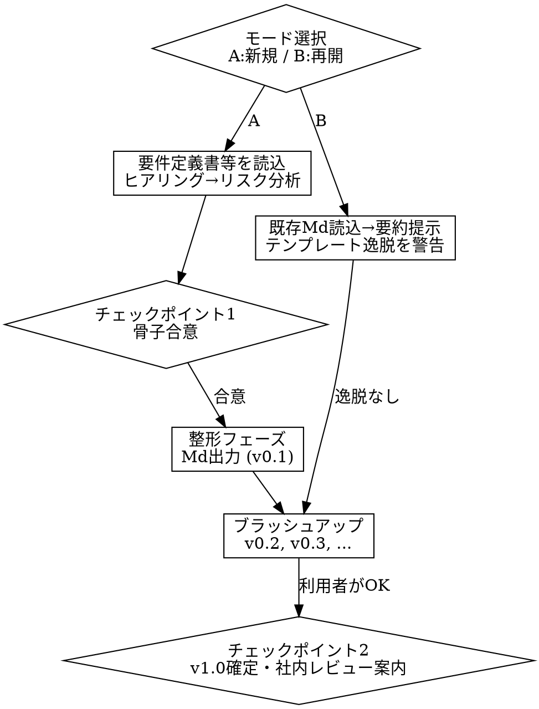

# qa-strategy — テスト戦略書 作成支援

## Overview

テスト戦略は「方針が明文化され、関係者間で合意されていること」自体に価値がある。テスト設計・実行の前に、
リスクベースで優先順位を決め、テストレベルごとの担保範囲と終了条件を数値で定義し、日々のテスト判断に使える
文書に仕上げる。判断はユーザーが行う——このスキルは要件定義書・設計書（改修案件なら既存コード）を根拠に、
質問と提案を通じてユーザーの意思決定を補佐する。

書きっぱなしの戦略書は誤った安心感を与える（150本のE2Eと52分のパイプラインを持つチームほど「カバレッジは十分」
と錯覚しやすい）。逆に一度も更新されない戦略書は形骸化する。このスキルは診断・数値目標・改訂トリガーをセットで
出力し、棚に飾られるだけの文書にしない。

## When to Use

- 要件定義書・設計書一式が揃っており、これからテスト戦略書を書き起こす
- 過去に作成した戦略書（vX.X）を読み込んで更新・ブラッシュアップしたい
- 「テストの優先順位が決められない」「単体でどこまで担保すべきか分からない」「リリース判断の根拠がない」
  「工数配分の根拠が説明できない」といった相談

**対象外：**
- 単一スプリント/リリース単位のテストケース設計 → `spec-test`
- 戦略書が確定した後の詳細テスト仕様書への落とし込み → `spec-test`
- 個別不具合の原因調査・再現手順の作成 → `cause-repro`
- 実装コードだけを根拠にしたテスト仕様書作成（要件定義書が無い場合）→ `dev-test`

## 前提

AIによるテスト実施を手動テストの前段に置き、静的解析（Linter/Formatter）を重めに設定することで、
テスト実行前の手戻りリスクを最小化する運用を既定とする。案件事情でこの前提が異なる場合はヒアリングで上書きする。

---

## 起動フロー

起動したら、最初にモードを1問だけ聞く。

> 「テスト戦略書の作成を始める。以下のどちらで進める？
> A. 新規作成（要件定義書・設計書から書き起こす）
> B. 既存ファイルから再開（過去の出力Mdを読み込んで続きから）」



### モードA: 新規作成

1. 要件定義書・設計書（改修案件なら既存コードも）を読み込む
2. **コンテキストヒアリング**（下記 Discovery Questions）— ドキュメントに答えがあれば聞かない。無い項目だけ**1問ずつ**質問し、回答に応じて深堀りする
3. チーム成熟度を把握し、テンプレートの重さを調整する（下記「チーム成熟度による調整」）
4. リスク分析（5×5マトリクス、`references/strategy-template.md` 参照）で優先順位の骨子を作る
5. 骨子をユーザーに提示 → **チェックポイント1**（骨子合意）
6. 合意が取れたら整形フェーズへ

### モードB: 既存ファイルから再開

1. 「既存のテスト戦略のファイルパスを教えて」と聞く
2. 読み込み、以下をメモリに展開して要約提示する：案件タイプ、現在のバージョン番号、リスク分析の骨子、
   参照している要件のFR-ID（`spec-req`等の出力から引用している場合）
3. テンプレート構造から逸脱した記述があれば警告する
4. ブラッシュアップサイクル（下記）から再開する

**参照ドキュメントが読み取れない場合**は「⚠ 内容未抽出」と明示し、利用者から口頭で概要を聞く。
参照ドキュメントは3〜5本程度を目安とし、それ以上ある場合は利用者に主要ドキュメントを事前選定してもらう。

---

## Discovery Questions

`.agents/qa-project-context.md` があれば先に読み、既に答えが分かっている項目は聞かない。無い項目のみ、
**1問ずつ**投げる。複数の質問を一度に投げない。

**プロダクト・ビジネス:** プロダクト種別／利用者層／ビジネスクリティカルなフロー／リリース頻度／コンプライアンス要件

**現状のテスト:** 各レベルの現状テスト数／使用フレームワーク／現在のカバレッジと目標／CIパイプラインの所要時間／
現在のフレーキー率

**課題・目標:** 最大の品質課題／直近3リリースで何が起きたか・本番に何が漏れたか／「十分な品質」の定義／
テスト基盤投資への予算感

**体制・制約:** チーム構成（開発者/QA/SDET/手動テスター）／自動化スキルレベル／予算制約／納期プレッシャー

> **チーム成熟度による調整**（`team_maturity` として記録）：
> - **startup** — 最小構成：単体テスト＋重要E2Eのみ。契約テストや厳密なKPIは後回し。フェーズ1は4週間以内
> - **growing** — フルピラミッド＋カバレッジ目標＋フレーキー閾値＋CIゲート。リスクベース優先順位を追加
> - **established** — SLA連動の品質ゲート、多環境カバレッジ、高度なツール（契約テスト、カオス、可観測性）、
>   正式なレビュー体制

---

## Core Principles

1. **網羅よりリスクベース優先順位。** 決済のバグと文言タイポでは損害が1000倍違う。コード量ではなくビジネスリスクに
   比例してテスト工数を配分する。リスクマトリクスが投資先を決める。
2. **テストピラミッドの形が先行指標。** 健全な構成は単体多・結合中・E2E少。逆三角形（アイスクリームコーン）は
   フィードバックが遅く保守コストが高いのに確信度は低い。プレスクライブの前に現状の形を診断する。
3. **シフトレフト。** 後工程で見つかるほど修正コストは指数関数的に増える。静的解析→単体→結合→契約テスト→E2E
   の順で早く倒す。設計レビューはテストでは見つからないアーキテクチャバグを拾う。
4. **すべての要素にKPIを紐づける。** 測れないものは改善できない。カバレッジ目標、フレーキー閾値、
   エスケープ率目標、MTTR上限——各セクションが数値と計測頻度を持つ。
5. **生きた文書。** 最低でも四半期ごとに見直す。改訂履歴、セクションごとの担当者、再評価トリガー
   （新規プロダクト領域、体制変更、重大インシデント、不具合の本番流出）を明記する。

---

## 数値の扱い（重要な運用ルール）

- **数値を推測で記載しない。** 未確定の金額・工数・期日・目標値は「⚠ 要確認」として明示する。もっともらしい
  想定値を埋めない。ヒアリングで確認できなかった数値は空欄より「⚠ 要確認」の方が安全——空欄は見落とされるが、
  マーカーは目に留まる。
- **個人名は匿名化する。** ドキュメント上で個人名を出す必要がある場合は「担当者A」「担当者B」等の役割表記を使う。
- **FR-IDは新規に振らない。** `spec-req`/`spec-basic`/`spec-detail` の出力にFR-IDが振られている場合、
  このスキルはそれを**引用するだけ**（リスクマトリクスやスコープ表でトレーサビリティのために参照する）。
  このスキル自身がFR-IDを採番する工程は無い。
- **質問は1問ずつ。** まとめて聞かない（`起動フロー`・`Discovery Questions`参照）。

これらは判断が難しい場面ほど破りたくなる。ヒアリングが長引く・納期が迫っている・ユーザーが急いでいる時ほど、
「今回だけ」「効率のため」の例外を作りたくなるが、その例外がリリース判断を誤らせる数値や、聞き漏らしによる
後工程の手戻りに直結する。

**よくある言い訳と対応：**

| 言い訳 | 対応 |
|---|---|
| 「急いでいるから質問をまとめて聞こう」 | 1問ずつ聞くコストは数十秒。まとめて聞くと回答を深堀りできず、聞き漏らしが結合テスト以降で発覚し手戻りが数倍になる |
| 「だいたいこのくらいの規模だろう」（数値の概算入力） | 推測値は見た目上「確認済みの数値」と区別がつかず、そのままリリース判断の根拠として使われてしまう。⚠ 要確認のままの方が安全 |
| 「後で確認すればいいから、今は仮の数値を入れておこう」 | 仮の数値は高確率でそのまま残る。未確定なら仮置きせず⚠ 要確認と書く |
| 「担当者名を書いた方が分かりやすいから、後で匿名化しよう」 | 書いた後の匿名化は忘れられる。最初から役割表記（担当者A等）で書く |

**Red Flags — この考えが浮かんだら手を止める：**
- 「時間が無いから」「効率のため」→ 質問をまとめようとしている兆候
- 「たぶん」「一般的には」「相場観だと」→ 推測値を数値として書こうとしている兆候
- 「後で直す」「一旦これで」→ 未確定値やフルネームをそのまま残そうとしている兆候

---

## 戦略書の構成

`references/strategy-template.md` に、無番号の表紙ヘッダーと本文17セクション（1〜17）から成る
コピー&ペースト可能なMarkdownスケルトン、リスクマトリクス・KPI表・ツール選定スコア表・環境戦略表を
収録している。ここでは骨格だけ示す（番号は`references/strategy-template.md`の見出し番号と一致させている）。

複雑度に応じて深さを調整する。5人のスタートアップに50ページは要らない。詳細な記入例・表フォーマットは
`references/strategy-template.md` を参照（ここでは目次のみ）。

| # | セクション | 要点 |
|---|---|---|
| - | 表紙 | 案件名・バージョン・日付・作成者（無番号ヘッダー） |
| 1 | テスト戦略の目的 | |
| 2 | 対象読者 | |
| 3 | 用語定義 | テストレベル／テストタイプ |
| 4 | プロジェクト概要・背景・前提 | 開発プロセス、技術スタック |
| 5 | スコープ | やること／**やらないこと（必須。範囲肥大化を防ぐ最重要項目）** |
| 6 | 品質目標 | 3〜5個、測定可能・期限付き |
| 7 | リスク分析 | Impact×Likelihoodの5×5マトリクス |
| 8 | テストレベル方針とピラミッド分析 | 現状比率／目標比率、フレームワーク、担当、実行頻度 |
| 9 | 環境戦略 | Local/CI/Staging/Production の目的・テスト種別・データ・デプロイトリガー |
| 10 | ツール選定根拠 | 重み付けスコア表——ツール名から入らず要件から選ぶ |
| 11 | エントリー/エグジット基準 | レベルごと・リリースごと |
| 12 | 品質ゲート | PR／マージ／デプロイ／夜間、それぞれ具体的な合否閾値 |
| 13 | 品質メトリクス・KPI | 定義・目標値・計測頻度 |
| 14 | テストプロセス | テストファースト、バグ管理、静的解析、レビュー観点の優先順位、自動化範囲 |
| 15 | 役割分担 | 設計／レビュー／承認／実行を誰がやるか |
| 16 | タイムライン・マイルストーン | |
| 17 | 改訂履歴 | |

---

## 整形フェーズ

チェックポイント1の合意後、`references/strategy-template.md` のテンプレートに流し込み、Mdファイルとして出力する。
出力後、ファイル名とバージョンを以下の規則で管理する。

### ファイル名・バージョン規則

```
テスト戦略_<案件名>_v<バージョン>_<YYYY-MM-DD>.md
```

| 状態 | バージョン例 | 備考 |
|---|---|---|
| 整形フェーズ初回出力 | v0.1 | 骨子を整形した直後 |
| ブラッシュアップ中 | v0.2, v0.3, ... | 修正のたびに自動インクリメント |
| FIX | v1.0 | 利用者が「OK」を出した時点で確定（**チェックポイント2**） |
| FIX後の追加修正 | v1.1, v1.2, ... | 顧客合意後の修正があった場合 |

保存先は利用者が指定する。案件フォルダ配下に保存するのが基本。

### ブラッシュアップサイクル

利用者が「これでOK」と言うまで、セクション単位で修正要望を受けて反映する。中間版（v0.2, v0.3...）では
チェックポイント2は発動しない——中間版を都度レビュー依頼すると運用が回らないため。

### チェックポイント2（v1.0確定時・必須）

利用者が「これでOK」を選択したら：

1. バージョンを **v1.0** に確定し、ファイル名も更新する
2. 次のメッセージを表示する：

> 「テスト戦略を v1.0 として確定した。**次工程への移行前に、社内でのレビュー（部長／QAリーダー等の該当担当者）を
> 必ず受けてください**。」

中間版では発動しない。v1.0確定という一回限りのイベントにのみ紐づく。

---

## Anti-Patterns

**100%カバレッジ目標。** 80%を超えると収穫逓減。残り20%を追うとgetterのテストに時間を溶かし、本当にバグが潜む
結合部分が手薄になる。カバレッジはモジュールごとにリスクベースで決める。

**アイスクリームコーン（逆三角形）。** E2Eが多すぎ単体が少なすぎる状態。症状：CIが45分以上、UI変更のたびに
テストが壊れる、誰もスイートを信用しない。E2Eの新規追加を凍結し、既存E2Eを単体に分解して直す。

**一度書いて終わりの戦略書。** 更新されない戦略書は無いより悪い——誤った安心感を与える。四半期レビュー、
インシデント後レビュー、新規プロダクト領域追加時、体制変更時の再評価トリガーを組み込む。

**ツール先行思考。**「Playwrightを使うべき」はツール選定であって戦略ではない。何を担保すべきかを先に決め、
それに合うツールを選ぶ。文書はツール選定を正当化する側であり、ツールから始めない。

**数値なき戦略。** 測定可能な目標が無い戦略書はただの願望リスト。数値で成功を定義できない項目は、
本当に戦略書に必要か疑う。

**すべて自動化しようとする。** 手動探索的テストには大きな価値がある、特に初期段階では。回帰は自動化し、
探索は手動に残す——何を手動にするかを戦略書で明示する。

**テンプレート流用時の未修正の分岐。** 別案件・別スキルのテンプレートを流用すると、存在しないモードへの言及や
定義されていないチェックポイント番号など「宙に浮いた参照」が残りやすい。整形フェーズの直後に、本文中で
参照している用語（モード名・チェックポイント番号・IDなど）がすべて本文内で定義済みか確認する。

---

## Verification

保存したMdファイルに対して実行する。

```bash
DOC=テスト戦略_案件名_v1.0_2026-01-01.md
# 1. 「やらないこと」が明記されているか
grep -niE 'やらないこと|対象外' "$DOC"
# 2. 「⚠ 要確認」で明示すべき未確定値が、数値として断定されていないか目視確認
grep -n '⚠ 要確認' "$DOC"
# 3. KPI表の各行にTarget（目標値）と計測頻度が入っているか目視確認
grep -nE '^\|' "$DOC" | grep -iE '目標|target|頻度'
# 4. 改訂履歴と担当者が存在するか
grep -niE '改訂履歴|担当者'  "$DOC"
```

リスクマトリクスは Impact(1-5) × Likelihood(1-5) の積が LOW/MED/HIGH/CRIT のどのバンドに落ちるか、
手で数点サンプルチェックする。テストピラミッドの目標比率は 単体%＋結合%＋E2E% が概ね100%になるか検算する。

## Done When

- [ ] モードA/Bいずれかで起動し、チェックポイント1（骨子合意）を経ている
- [ ] 「やらないこと」が明記されている
- [ ] リスク分析（5×5マトリクス）で機能ごとの優先順位が決まっている
- [ ] テストピラミッドの現状比率と目標比率、その差を埋める計画がある
- [ ] 未確定の数値がすべて「⚠ 要確認」で明示され、推測値で埋められていない
- [ ] 個人名が役割表記に匿名化されている
- [ ] ファイル名がバージョン規則（v0.1→v0.2...→v1.0→v1.1...）に沿っている
- [ ] v1.0確定時にチェックポイント2（社内レビュー案内）が発動している
- [ ] KPI表の各行にTargetと計測頻度が入っている
- [ ] 本文中で言及しているモード名・チェックポイント番号・IDがすべて本文内で定義されている

---

## Related Skills

- **spec-req** — 要件定義書の壁打ち・作成。FR-IDの採番元。このスキルの入力になる
- **spec-basic** / **spec-detail** — 基本設計書・詳細設計書の作成。同じくこのスキルの入力になる
- **spec-test** — 戦略書FIX後、単一スプリント/リリース単位のテスト仕様書へ落とし込む次工程
- **dev-test** — 要件定義書が無く実装コードのみが手がかりの案件では、こちらを使う
- **cause-repro** — 個別不具合の原因調査・再現手順作成
- **test-execute** / **test-verify** / **uat-verify** — 戦略書で定めたテストの実行・検証段階
- **xUnit** — 単体テストレベルの方針を実コードに落とし込む段階

## Reference Files

- **references/strategy-template.md** — 表紙＋17セクションのコピー&ペースト用テンプレート、リスクマトリクス、
  KPI表、ツール選定スコア表、環境戦略表、テストレベル別テーブル
